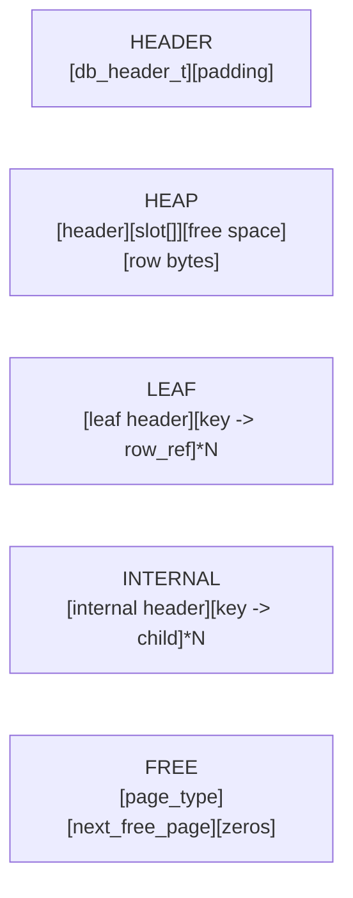
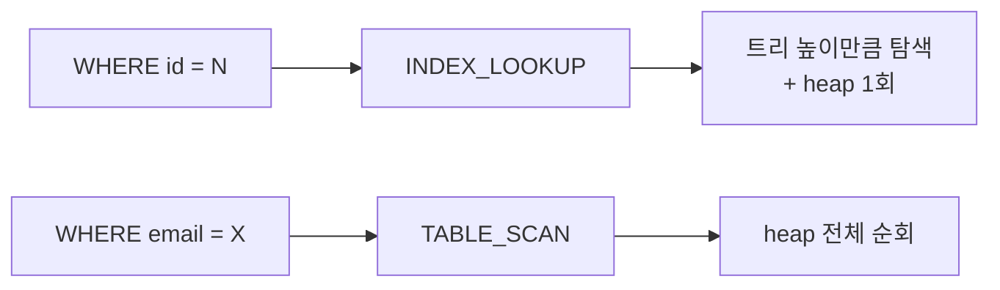
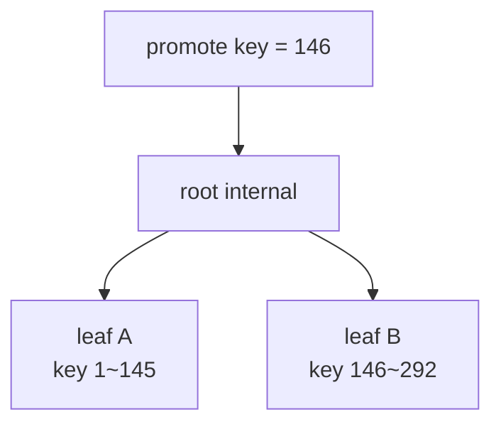

# MiniDB — 페이지 기반 SQL 엔진

MiniDB는 단일 `.db` 파일 위에서 동작하는 작은 디스크 기반 SQL 엔진이다.  
현재 구조는 **단일 테이블 + `id` 자동 인덱스(B+ Tree) + slotted heap + frame cache** 조합으로 구성되어 있다.

## 프로젝트 소개

- 모든 데이터는 고정 크기 페이지 단위로 디스크에 저장된다.
- 실제 행 데이터는 heap page에, `id -> row_ref` 인덱스는 B+ Tree leaf page에 저장된다.
- `WHERE id = ...`는 `INDEX_LOOKUP`, 그 외 조건은 `TABLE_SCAN`으로 실행된다.
- pager는 최대 256개 프레임을 LRU 방식으로 캐시하고 dirty page를 write-back 한다.
- 현재는 단일 테이블과 단일 `id` 인덱스만 지원한다.

## 저장 구조 개요

MiniDB의 디스크 파일은 페이지 배열로 구성된다.

| 페이지 타입 | 4KB 기준 레이아웃 예시                                      | 핵심 포인트                                                                                                                |
| ----------- | ----------------------------------------------------------- | -------------------------------------------------------------------------------------------------------------------------- |
| `HEADER`    | `[db_header_t][padding]`                                    | `page_size`, `root_index_page_id`, `first_heap_page_id`, `next_id`, `row_count`, `columns[]`를 담는 전역 메타데이터 페이지 |
| `HEAP`      | `[heap header 16B][slot 8B * N][free space][row bytes]`     | 슬롯 디렉터리는 앞에서 뒤로, row 데이터는 뒤에서 앞으로 자란다                                                             |
| `LEAF`      | `[leaf header 20B][leaf entry 14B * N][free space]`         | `key -> row_ref(page_id, slot_id)` 인덱스 엔트리를 저장한다                                                                |
| `INTERNAL`  | `[internal header 16B][internal entry 12B * N][free space]` | `key -> child page_id` 라우팅 정보만 저장한다                                                                              |
| `FREE`      | `[page_type 4B][next_free_page 4B][zeros...]`               | free page list에 연결되는 재사용 대기 페이지다                                                                             |



- header page는 "DB 전체 설명서" 역할을 한다.
- heap page는 앞쪽의 슬롯 디렉터리와 뒤쪽의 row 데이터가 서로 반대 방향으로 자란다.
- leaf/internal page는 모두 B+ Tree 노드이며, leaf만 실제 `row_ref`를 가진다.

**자세한 오프셋/용량/예시는 [01-페이지-시스템.md](docs/01-페이지-시스템.md)를 참고하면 된다.**

## 데이터 검색과 실행 경로

`SELECT`, `INSERT`, `DELETE`는 조건에 따라 서로 다른 페이지 경로를 탄다.

### `SELECT ... WHERE id = N`

- planner가 `INDEX_LOOKUP`을 선택한다.
- header의 `root_index_page_id`에서 시작해 internal/leaf를 따라 내려간다.
- leaf에서 `row_ref`를 얻은 뒤, heap page의 해당 slot에서 실제 row를 읽는다.

### `SELECT ... WHERE email = ...` 또는 `SELECT *`

- `id` 인덱스를 사용할 수 없으므로 `TABLE_SCAN`이 선택된다.
- `first_heap_page_id`부터 heap chain 전체를 순회한다.
- 각 페이지의 `ALIVE` slot을 역직렬화해 조건을 검사한다.

### `INSERT`

- `next_id`를 할당하고 row를 직렬화한다.
- heap page에 row를 저장하고, B+ Tree leaf에 `(id, row_ref)`를 삽입한다.
- heap 공간이 부족하면 새 heap page를 할당하고, leaf가 가득 차면 split이 발생할 수 있다.

### `DELETE WHERE id = N`

- 먼저 B+ Tree에서 `row_ref`를 찾는다.
- heap slot을 `FREE`로 바꿔 tombstone 처리하고, B+ Tree leaf에서 key를 제거한다.
- 비워진 slot은 이후 INSERT에서 재사용된다.




실제 디버그 출력 예시는 아래처럼 차이가 난다.

```text
minidb> select * from users where id = 100000
100000 | Amber Shin | user100000@test.com | 27
1행 조회 (INDEX_LOOKUP)
[debug] 소요: 2.73ms | 페이지 로드: 5 (히트: 1, 미스: 4) | 디스크 기록: 0

minidb> select * from users where email = user100000@test.com
100000 | Amber Shin | user100000@test.com | 27
1행 조회 (TABLE_SCAN)
[debug] 소요: 663.36ms | 페이지 로드: 20834 (히트: 0, 미스: 20834) | 디스크 기록: 0
```

실행 경로의 자세한 단계별 예시는 [02-데이터-검색-과정.md](docs/02-데이터-검색-과정.md)에 정리되어 있다.

## B+ Tree 인덱스 구조

MiniDB의 B+ Tree는 메모리 포인터 기반 노드가 아니라 **페이지 = 노드** 구조를 사용한다.

- leaf 노드는 `key -> row_ref`를 저장한다.
- internal 노드는 `key -> child page_id`만 저장한다.
- root는 header의 `root_index_page_id`로 관리된다.
- leaf가 꽉 차면 split 후 오른쪽 페이지의 첫 key를 부모로 승격한다.
- 루트가 분할되면 새 internal root가 만들어지고 트리 높이가 1 증가한다.

| 노드 타입  | 저장 데이터                                            | 목적                 |
| ---------- | ------------------------------------------------------ | -------------------- |
| `LEAF`     | `key`, `row_ref(page_id, slot_id)`                     | 실제 검색 결과 보관  |
| `INTERNAL` | `key`, `right_child_page_id`, `leftmost_child_page_id` | 다음 페이지로 라우팅 |



이 구조 덕분에 `id` 검색은 적은 수의 페이지 접근으로 끝난다. 리프 분할, 승격, 새 루트 생성의 자세한 예시는 [03-B+Tree-인덱스-구조.md](docs/03-B+Tree-인덱스-구조.md)를 참고하면 된다.

## 프레임 캐시와 dirty page

pager는 디스크 페이지의 메모리 복사본인 frame을 최대 256개 유지한다.

| 필드        | 의미                                         |
| ----------- | -------------------------------------------- |
| `page_id`   | 현재 프레임에 적재된 페이지 번호             |
| `is_valid`  | 유효한 페이지가 적재되어 있는지              |
| `is_dirty`  | 수정되어 디스크 기록이 필요한지              |
| `pin_count` | 현재 사용 중인 참조 수 (`> 0`이면 교체 불가) |
| `used_tick` | 마지막 접근 시점(LRU 기준)                   |

- cache hit이면 기존 frame을 바로 반환하고 `used_tick`만 갱신한다.
- cache miss이면 빈 frame 또는 LRU victim을 선택해 `pread()`로 새 페이지를 읽는다.
- dirty frame이 교체 대상이면 먼저 `pwrite()`로 디스크에 기록한 뒤 교체한다.
- `pager_mark_dirty()`는 수정된 페이지를 dirty로 표시한다.
- dirty frame이 많아지면 워터마크 기준으로 선제 flush가 일어난다.
- 종료 시 `pager_flush_all()`이 dirty frame과 header를 디스크에 기록한다.


이 캐시는 **write-back page cache**이며, 현재는 WAL이나 crash recovery는 지원하지 않는다. 프레임 상태, LRU, flush 타이밍의 자세한 설명은 [04-프레임-캐시-시스템.md](docs/04-프레임-캐시-시스템.md)에 있다.

## 테스트와 메타 명령어

### 테스트

```bash
make test
```

- 테스트 바이너리: `build/test_all`
- 현재 회귀 범위: schema, pager, heap, B+ Tree, parser, planner, persistence, delete/reuse

### 메타 명령어

| 명령어           | 설명                                      |
| ---------------- | ----------------------------------------- |
| `.stats`         | DB 통계 정보 출력                         |
| `.pages`         | 페이지 유형별 개수 및 free page list 출력 |
| `.btree`         | B+ Tree 구조 출력                         |
| `.debug`         | 쿼리 디버그 모드 ON/OFF                   |
| `.log`           | pager flush 로그 ON/OFF                   |
| `.flush`         | 모든 dirty 페이지를 즉시 디스크에 기록    |
| `.exit`, `.quit` | flush 후 종료                             |

## 추가 문서

- [01-페이지-시스템.md](docs/01-페이지-시스템.md)
- [02-데이터-검색-과정.md](docs/02-데이터-검색-과정.md)
- [03-B+Tree-인덱스-구조.md](docs/03-B+Tree-인덱스-구조.md)
- [04-프레임-캐시-시스템.md](docs/04-프레임-캐시-시스템.md)
