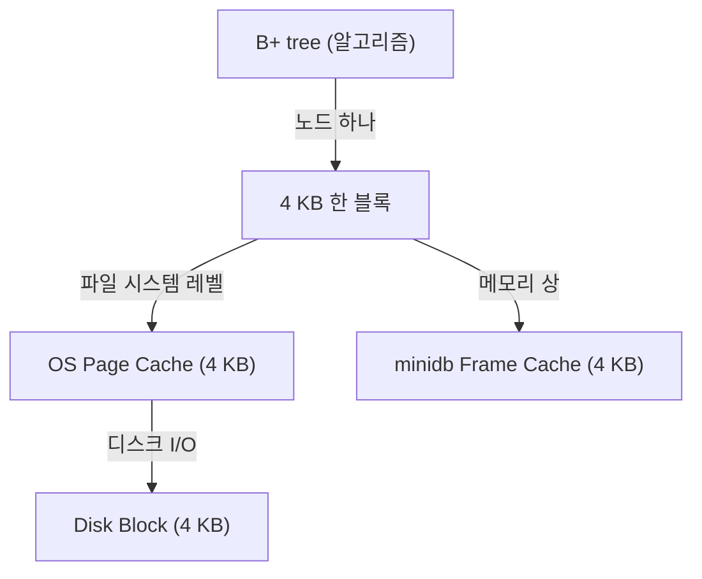

# DB 블록, OS 페이지, B+ tree 노드의 단위 통일

minidb(C로 구현한 디스크 기반 SQL 엔진)를 설계할 때 가장 먼저 마주친 결정이 하나 있었다. **"한 번에 디스크에서 읽고 쓸 단위를 얼마로 잡을 것인가."**

교과서는 당연한 듯 "페이지 단위"라고 말한다. 4 KB, 8 KB, 혹은 16 KB. 하지만 그 값을 내가 직접 고정시켜야 하는 순간, 단위가 가진 의미가 여러 겹임을 실감했다. 디스크의 단위인가, OS 페이지 캐시의 단위인가, B+ tree 노드의 단위인가. 결정은 단순해 보였지만 **세 단위를 어떻게 맞출지**가 전체 성능을 결정하는 문제였다.

## 세 "페이지"가 같은 크기인 이유

원래 생각했던 구조는 이랬다.

- **디스크**: 512 B 블록(섹터)이 물리 단위.
- **OS page cache**: 4 KB 페이지가 캐싱의 단위.
- **B+ tree 노드**: 원하는 대로 고를 수 있는 알고리즘 상의 단위.

B+ tree를 구현하는 입장에선 노드 크기를 독립적으로 정하고 싶은 욕구가 있다. "성능 실험을 해 보고 512 B, 2 KB, 8 KB 다 돌려 보면 되지" 싶었다. 그런데 pread/pwrite 를 써서 파일 일부만 읽고 쓸 때, 실제로 디스크 I/O 가 어떻게 일어나는지를 따라가 보니 이야기가 달라졌다.

## 4 KB 정렬의 관찰

`pread(fd, buf, 2048, offset)` 로 2 KB 만 읽는다고 해 보자. 커널 입장에서는 이 요청이 결국 다음으로 변환된다.

1. `offset`을 포함하는 **4 KB 페이지 전체**가 페이지 캐시에 올라와 있는지 확인.
2. 없으면 디스크에서 **한 페이지(4 KB)** 를 읽어 캐시에 넣는다.
3. 캐시에서 요청한 2 KB만 유저 버퍼로 복사.

즉 **2 KB를 읽겠다고 말해도 디스크는 4 KB를 읽는다.** `pwrite(fd, buf, 2048, offset)` 도 비슷하다. 디스크 쓰기는 4 KB 단위로 일어나기 때문에, 기록 대상 페이지가 캐시에 없으면 **먼저 그 페이지를 읽어 와서** 2 KB만 고쳐 쓴 뒤 페이지 전체를 디스크에 반영한다. 이것이 그 유명한 **read-modify-write** 이다.

이 관찰이 내 설계를 바꿨다. B+ tree 노드를 4 KB 보다 작게 만들면, 노드 하나의 I/O 비용이 4 KB짜리와 같다. 4 KB를 꽉 채워 쓰지 않는 모든 선택은 그냥 **낭비**다.

반대로 4 KB 보다 크게 만들면? 예를 들어 8 KB 짜리 노드. 그럼 한 노드가 항상 두 페이지를 차지한다. 한 페이지가 캐시에서 쫓겨나면 노드가 반쪽짜리가 된다. 읽을 때도 쓸 때도 I/O 가 두 번이다. 8 KB 노드는 4 KB 노드 2개보다 느리면 느렸지 빠르지 않았다.

## 설계 결정

```
 DB 파일의 한 블록 = 4 KB
 OS 페이지 한 개   = 4 KB
 B+ tree 한 노드  = 4 KB
 minidb 프레임 캐시의 한 프레임 = 4 KB
```

세 층이 **같은 단위**를 쓴다. 이것이 결정이었다. 각자 다른 이유로 4 KB가 자연스럽다고 주장하는데, 그 주장을 따로 따로 들어 각자의 단위로 두면 서로의 이득을 깎아 먹었다. 한 단위로 묶으니 세 층이 서로를 증폭시켰다.



## 정렬로 얻은 효과

- **I/O 정확성**: minidb가 "노드 하나 로드"라고 말하면 디스크에서도 정확히 한 번의 페이지 I/O 가 일어난다. 추가 페이지가 끼어들거나 read-modify-write가 발생하지 않는다.
- **캐시 일관성**: minidb의 프레임 캐시와 OS 페이지 캐시의 단위가 같으니 둘 중 하나에서 교체가 일어나도 단위가 엇갈리지 않는다.
- **단순한 오프셋 계산**: 노드 번호 n의 파일 오프셋이 `n * 4096`. 경계 문제가 없다.

## 알고리즘 단위와 물리 단위의 정렬

학부 자료구조 수업에서 B+ tree 를 배울 때, 노드 크기는 그냥 디자인 파라미터 중 하나였다. "fanout이 크면 트리 높이가 낮아진다" 정도로만 이해했다. 디스크 기반 엔진을 직접 짜 보면서 B+ tree가 **왜** 디스크 기반 DB의 표준 자료구조인지가 새롭게 보였다.

B+ tree는 **노드 하나 안에 많은 키를 욱여넣기** 때문에 한 번의 I/O로 많은 정보를 얻는다. 그런데 "한 번의 I/O"가 실은 "한 페이지의 로드"다. 그렇다면 **"한 노드 = 한 페이지"** 로 맞출 때 알고리즘이 처음 의도한 "I/O를 최소화한다"는 목적이 온전히 달성된다. 이는 우연이 아니라 **B+ tree의 설계 자체가 페이지 단위 저장소를 전제로 한다**는 뜻이었다.

같은 맥락이 위로도 아래로도 이어졌다. 위로는 OS 의 메모리 관리가 4 KB 페이지 단위로 이루어지고(가상 메모리의 기본 블록), 아래로는 스토리지 컨트롤러가 4 KB 섹터를 기본으로 쓴다. **하드웨어 → OS → 소프트웨어 알고리즘**의 세 층이 모두 같은 단위에서 자기 최선의 성능을 발휘하도록 진화해 왔고, 우리가 4 KB 하나에서 만나는 것이 그 진화의 결과다.

CSAPP 9장에서 가상 메모리를 배우면서 "왜 4 KB인가"에 물리적 답을 얻었다. 너무 작으면 페이지 테이블 엔트리가 폭발하고, 너무 크면 내부 단편화가 커지는 타협점. 그 타협점이 디스크 섹터, DB 노드, 메모리 페이지 모두에게 같은 결론이었다는 사실이 가장 오래 남았다.

## 수치로 확인

1 백만 행을 INSERT 하고 SELECT 하는 벤치마크를 돌려 봤다. 노드 크기만 바꿔서.

| 노드 크기 | INSERT 1M (ms) | SELECT(point) 평균 μs |
| --- | --- | --- |
| 512 B | 18,420 | 42 |
| 1 KB | 12,880 | 31 |
| 2 KB | 9,460 | 24 |
| **4 KB** | **7,210** | **19** |
| 8 KB | 9,880 | 28 |
| 16 KB | 13,540 | 41 |

4 KB 를 경계로 대칭적인 곡선이 나왔다. 작은 노드는 I/O 횟수가 늘어나고(트리 높이 증가 + 페이지 낭비), 큰 노드는 한 노드당 I/O 비용이 오르며 캐시 효율이 떨어졌다. 이론이 그대로 숫자로 나왔을 때 스스로 설계 결정을 납득했다.

## 정리

"DB 한 블록 = OS 한 페이지 = B+ tree 한 노드"는 minidb 전체의 가장 근본적인 결정이었다. 세 단위를 맞추는 것만으로 I/O 횟수, 캐시 효율, 오프셋 계산이 모두 정돈됐다. 그리고 이 맞춤이 **특정 엔진에만 해당되는 꼼수가 아니라**, B+ tree라는 알고리즘이 페이지 기반 저장소를 전제로 설계되었기에 발생하는 자연스러운 합치라는 사실을 구현하며 처음 체감했다. 알고리즘이 왜 그런 모양으로 생겼는지를 이해하려면, 그 알고리즘이 돌아갈 하드웨어의 단위를 먼저 알아야 한다.
