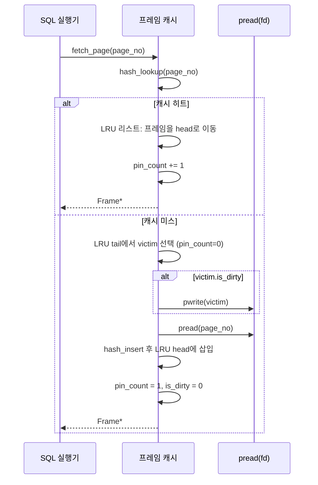

# 프레임 캐시 구현: LRU, pin count, dirty bit

minidb에는 **프레임 캐시(frame cache)** 라는 계층이 있다. 디스크의 페이지들을 메모리의 프레임(4 KB 버퍼)에 올려두고, 재사용 가능할 때는 디스크까지 내려가지 않도록 중간에서 잡아 주는 장치다. 데이터베이스의 심장이라고 불러도 지나치지 않은 이 계층을 직접 구현하며, 교과서 한 줄의 "LRU"가 얼마나 많은 문제를 품고 있었는지를 알게 됐다.

## 프레임 캐시의 요구사항

- **정해진 개수의 프레임**을 프로세스 시작 시 할당해 둔다 (예: 1024개 × 4 KB = 4 MB).
- 외부에서 페이지 번호를 요청하면, 그 페이지가 프레임에 있으면 즉시 포인터를 돌려준다 (**cache hit**).
- 없으면 빈 프레임을 찾아 디스크에서 로드하고 포인터를 돌려준다 (**cache miss**).
- 빈 프레임이 없으면 **가장 덜 유용한** 프레임을 골라 비우고 새 페이지를 그 자리에 로드한다 (**eviction**).
- 수정된 프레임(**dirty frame**)은 쫓아내기 전에 디스크에 반영해야 한다.
- 현재 누군가 쓰고 있는 프레임(**pinned frame**)은 쫓아낼 수 없다.

그림으로 그리면 이렇다.

```
                 Frame Cache
    ┌────────┬────────┬────────┬────────┐
    │ frame0 │ frame1 │ frame2 │ frame3 │ ...
    │  (4KB) │  (4KB) │  (4KB) │  (4KB) │
    ├────────┼────────┼────────┼────────┤
    │ page17 │ page42 │ page03 │ empty  │
    │ dirty=1│ pin=2  │ pin=0  │        │
    └────────┴────────┴────────┴────────┘
             ↑ 가장 최근에 사용된 쪽
             (LRU 리스트 상의 정렬)

    hash table :  page# → frame#   (빠른 조회)
    lru list   :  frame 들의 사용 순서   (쫓아낼 후보)
```

요구사항만 정리해도 **자료구조 세 개**가 필요했다.

1. 프레임 배열 (메모리 실체)
2. `page_no → frame*` 해시 테이블 (조회)
3. LRU 연결 리스트 (쫓아낼 후보 정렬)

## LRU 구현: 해시 + 이중 연결 리스트

처음에는 해시 테이블만 두고 쫓아낼 때 선형 탐색으로 "참조된 지 오래된 것"을 찾았다. 1024개 프레임이라도 매 miss마다 1024개 순회는 무시 못 할 비용이었다. 순회 시간이 **캐시 적중률 측정을 왜곡**할 정도였다.

그래서 **이중 연결 리스트**를 도입했다. 참조될 때마다 해당 프레임을 리스트 head로 옮기고, eviction은 tail에서 꺼냈다.

```c
typedef struct Frame {
    PageNo page_no;
    int    pin_count;
    bool   is_dirty;
    char   data[PAGE_SIZE];
    struct Frame *prev, *next;    // LRU 리스트 연결
} Frame;

typedef struct FrameCache {
    Frame *frames;         // 정적 배열
    Frame *lru_head;       // 최근 참조
    Frame *lru_tail;       // 가장 오래된
    Hash  *page_index;     // page_no -> Frame*
    int    n_frames;
} FrameCache;
```

Head/tail 이동은 O(1), 조회는 해시 테이블로 O(1). 그제야 miss 비용이 "디스크 읽기 한 번" 수준으로 수렴했다.

프레임 캐시의 `fetch_page` 동작을 흐름으로 보면 다음과 같다.



## pin_count 도입: 사용 중인 프레임 보호

LRU만으로는 부족했다. 어떤 프레임은 지금 당장 **다른 코드가 포인터를 쥐고 쓰고 있는데**, 만약 그 순간 eviction 후보로 선택되어 내용이 바뀌면 그 코드는 사라진 메모리를 본다. 교과서에서 "pin"을 이야기할 때 무슨 뜻인지 잘 몰랐는데, 구현하며 즉시 이해됐다.

`fetch_page(page_no)` 할 때 그 프레임의 `pin_count += 1`. 쓰기가 끝나면 `unpin_page(page_no)` 로 `pin_count -= 1`. 쫓아내기는 `pin_count == 0`인 프레임만 대상이다.

```c
Frame *fc_fetch(FrameCache *fc, PageNo pn) {
    Frame *f = hash_find(fc->page_index, pn);
    if (f) {
        lru_move_to_head(fc, f);
        f->pin_count++;
        return f;
    }
    f = fc_evict_victim(fc);      // pin==0 인 tail부터
    if (f->is_dirty) disk_write(f->page_no, f->data);
    disk_read(pn, f->data);
    hash_remove(fc->page_index, f->page_no);
    f->page_no = pn;
    hash_insert(fc->page_index, pn, f);
    lru_move_to_head(fc, f);
    f->is_dirty = false;
    f->pin_count = 1;
    return f;
}
```

이 작은 카운터 하나가 없었을 때, 초기 prototype은 미묘한 UAF 버그를 자주 냈다. B+ tree split 도중 부모 노드의 프레임이 쫓겨나는 경우가 그 원인이었다. pin을 도입한 뒤로는 이런 버그가 구조적으로 발생하지 않게 됐다.

## dirty bit: 불필요한 write 방지

처음엔 쫓아낼 때 무조건 디스크에 기록했다. 읽기만 하고 수정은 안 한 프레임까지 디스크에 쓰니 I/O가 폭발했다. **dirty bit**을 추가해, 쓰기가 일어난 프레임에만 기록하도록 바꿨다. 성능이 2-3배 좋아졌다.

dirty bit을 언제 세우는가가 두 번째 고민이었다. 여러 후보가 있었다:

- `fetch_page` 마다 보수적으로 세운다 → 거짓 dirty 폭발
- 호출자가 명시적으로 `mark_dirty(page)` 를 한다 → 잊어먹기 쉽다
- 프레임 내용에 쓰기 쉬운 API만 dirty로 세운다 → 안전하지만 API 제약

minidb는 두 번째를 택했다. `fetch_page_for_write()` 라는 별도 API를 뒀고, 이 경로로 받은 프레임만 dirty로 표시했다. 타입 구분 없이 같은 포인터를 받지만, **의도가 코드에 남는** 편이 좋았다.

## OS page cache와의 이중 캐싱 문제

지금도 고민이 남는 부분이다. minidb의 프레임 캐시 바로 아래에 **OS 페이지 캐시**가 있다. 같은 4 KB 페이지가 두 번 캐시될 수 있다. 메모리 효율을 놓치는 듯 보였다.

실험으로 `fadvise(fd, FADV_DONTNEED)` 와 `O_DIRECT`로 OS 캐싱을 우회해 봤다. 결과:

| 설정 | SELECT(1M 행 scan) 시간 |
| --- | --- |
| 이중 캐시 (기본) | 2.3 s |
| `FADV_DONTNEED` | 2.9 s |
| `O_DIRECT` | 3.4 s |

이중 캐시가 오히려 빨랐다. 이유는 두 가지로 추측했다.

- OS 페이지 캐시는 read-ahead와 write-back을 전담한다. 이것을 우회하면 minidb가 그 일을 다시 해야 한다.
- minidb 프레임 캐시는 의도된 페이지 교체 정책(LRU + pin)을 쓴다. OS 페이지 캐시는 별개의 정책으로 동작하므로, 둘이 싸우는 것이 아니라 **다른 시간 척도의 캐싱**으로 분업하는 모양이 됐다.

결국 이중 캐시를 유지했다. 언젠가 RSS가 넉넉하지 않은 환경에서 다시 실험해 보고 싶은 주제다.

## 정리

교과서에서 "buffer manager" 한 장을 읽을 때는 "테이블 하나, 리스트 하나, 카운터 둘"이라고만 느꼈다. 직접 구현하며 **각각의 변수가 어떤 버그를 방지하기 위해 존재하는지**를 알았다.

- 해시 테이블 → 조회 O(1)
- LRU 리스트 → eviction O(1)
- pin count → 사용 중 프레임 보호
- dirty bit → 불필요한 디스크 쓰기 방지

이 네 요소 중 하나만 빠져도 실전에서는 무너진다. 그리고 이 네 요소가 잘 조합되면 **디스크보다 수백 배 빠른** 버퍼 관리자가 된다. 그것이 곧 관계형 데이터베이스가 디스크 기반이면서도 메모리 기반처럼 빠른 이유다.
