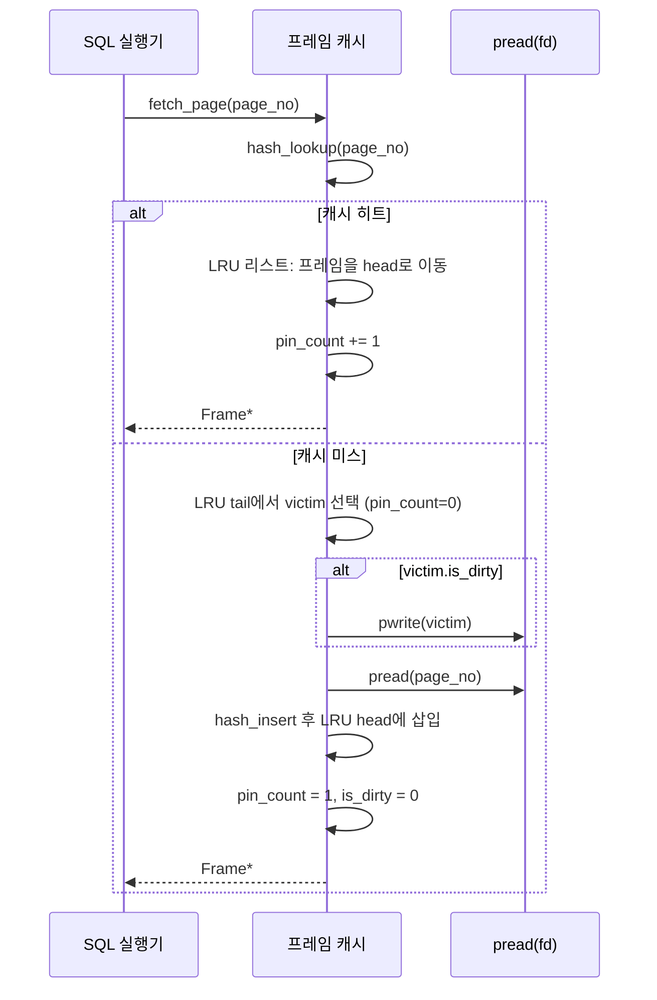

# 프레임 캐시 구현: LRU, pin count, dirty bit를 만나면서 배운 것

minidb에는 **프레임 캐시**라는 계층이 있습니다. 디스크의 페이지들을 메모리의 프레임(4 KB 버퍼)에 올려두고, 재사용할 수 있을 때는 디스크까지 내려가지 않도록 중간에서 잡아 주는 장치입니다.

데이터베이스의 심장이라고 불러도 지나치지 않은 이 계층을 직접 구현하며, 교과서에서 "LRU"라는 한 줄로만 설명한 개념이 실은 얼마나 많은 문제를 품고 있었는지를 알게 됐습니다.

## 프레임 캐시가 해야 할 일들

요구사항을 먼저 정리해보면 다음과 같습니다.

- **정해진 개수의 프레임**을 프로세스 시작 시 할당한다 (예: 1024개 × 4 KB = 4 MB).
- 외부에서 페이지 번호를 요청하면, 그 페이지가 프레임에 있으면 즉시 포인터를 돌려준다 (**cache hit**).
- 없으면 빈 프레임을 찾아 디스크에서 로드하고 포인터를 돌려준다 (**cache miss**).
- 빈 프레임이 없으면 **가장 덜 최근에 사용된** 프레임을 골라 비우고 새 페이지를 그 자리에 로드한다 (**eviction**).
- 수정된 프레임(**dirty frame**)은 쫓아내기 전에 디스크에 반영해야 한다.
- 현재 누군가 쓰고 있는 프레임(**pinned frame**)은 쫓아낼 수 없다.

그림으로 보면 이렇습니다.

```
                 Frame Cache
    ┌────────┬────────┬────────┬────────┐
    │ frame0 │ frame1 │ frame2 │ frame3 │ ...
    │  (4KB) │  (4KB) │  (4KB) │  (4KB) │
    ├────────┼────────┼────────┼────────┤
    │ page17 │ page42 │ page03 │ empty  │
    │ dirty=1│ pin=2  │ pin=0  │        │
    └────────┴────────┴────────┴────────┘
             ↑ 가장 최근에 사용된 쪽
             (LRU 리스트 상의 정렬)

    hash table :  page# → frame#   (빠른 조회)
    lru list   :  frame 들의 사용 순서   (쫓아낼 후보)
```

요구사항만 정리해도 **자료구조 세 개**가 필요함을 알 수 있었습니다.

1. 프레임 배열 (메모리 실체)
2. `page_no → frame*` 해시 테이블 (빠른 조회)
3. LRU 연결 리스트 (쫓아낼 후보 정렬)

## LRU 구현: 해시 + 이중 연결 리스트

처음에는 해시 테이블만 두고 쫓아낼 때마다 선형 탐색으로 "참조된 지 오래된 것"을 찾았습니다.

1024개 프레임이라도 매 cache miss마다 1024개를 순회하는 비용은 무시 못 할 수준이었습니다. 순회 시간이 **캐시 적중률 측정을 왜곡**할 정도였습니다.

그래서 **이중 연결 리스트**를 도입했습니다. 참조될 때마다 해당 프레임을 리스트 head로 옮기고, eviction은 tail에서 꺼냅니다.

```c
typedef struct Frame {
    PageNo page_no;
    int    pin_count;
    bool   is_dirty;
    char   data[PAGE_SIZE];
    struct Frame *prev, *next;    // LRU 리스트 연결
} Frame;

typedef struct FrameCache {
    Frame *frames;         // 정적 배열
    Frame *lru_head;       // 최근 참조
    Frame *lru_tail;       // 가장 오래된
    Hash  *page_index;     // page_no -> Frame*
    int    n_frames;
} FrameCache;
```

Head/tail 이동은 O(1), 조회는 해시 테이블로 O(1)입니다.

그제야 cache miss의 비용이 "디스크 읽기 한 번" 수준으로 수렴했습니다.

프레임 캐시의 `fetch_page` 동작을 흐름으로 보면 다음과 같습니다.



## pin_count가 필요해진 순간

LRU만으로는 부족했습니다. 어떤 프레임은 지금 당장 **다른 코드가 포인터를 쥐고 쓰고 있는데**, 만약 그 순간 eviction 후보로 선택되어 내용이 바뀌면 그 코드는 사라진 메모리를 보게 됩니다.

교과서에서 "pin"을 읽을 때는 정확히 뭐하는 건지 몰랐는데, 구현하며 즉시 이해됐습니다.

`fetch_page(page_no)` 할 때 그 프레임의 `pin_count += 1`. 쓰기가 끝나면 `unpin_page(page_no)`로 `pin_count -= 1`. 쫓아내기는 `pin_count == 0`인 프레임만 대상입니다.

```c
Frame *fc_fetch(FrameCache *fc, PageNo pn) {
    Frame *f = hash_find(fc->page_index, pn);
    if (f) {
        lru_move_to_head(fc, f);
        f->pin_count++;
        return f;
    }
    f = fc_evict_victim(fc);      // pin==0 인 tail부터
    if (f->is_dirty) disk_write(f->page_no, f->data);
    disk_read(pn, f->data);
    hash_remove(fc->page_index, f->page_no);
    f->page_no = pn;
    hash_insert(fc->page_index, pn, f);
    lru_move_to_head(fc, f);
    f->is_dirty = false;
    f->pin_count = 1;
    return f;
}
```

이 작은 카운터 하나가 없었을 때, 초기 prototype은 미묘한 use-after-free 버그를 자주 냈습니다.

B+ tree split 도중 부모 노드의 프레임이 쫓겨나는 경우가 그 원인이었습니다.

pin을 도입한 뒤로는 이런 버그가 구조적으로 발생하지 않게 됐습니다.

## dirty bit: 불필요한 쓰기를 막다

처음엔 쫓아낼 때 무조건 디스크에 기록했습니다. 읽기만 하고 수정은 안 한 프레임까지 디스크에 쓰니 I/O가 폭발했습니다.

**`dirty bit`**을 추가해, 쓰기가 일어난 프레임에만 기록하도록 바꿨습니다. 성능이 2~3배 좋아졌습니다.

`dirty bit`을 언제 세우는가가 다음 고민이었습니다. 여러 전략을 생각했습니다.

- `fetch_page` 마다 보수적으로 세운다 → 거짓 dirty로 I/O가 폭발한다.
- 호출자가 명시적으로 `mark_dirty(page)`를 한다 → 깜빡하기 쉽다.
- 프레임 내용을 수정하는 API만 dirty로 세운다 → 안전하지만 API를 제약한다.

나는 세 번째 방식을 택했습니다. `fetch_page_for_write()`라는 별도 API를 뒀고, 이 경로로 받은 프레임만 dirty로 표시했습니다.

타입 구분 없이 같은 포인터를 받지만, **의도가 코드에 남는** 편이 좋았습니다.

## OS page cache와의 이중 캐싱: 버릴 것인가, 품을 것인가

지금도 고민이 남는 부분입니다. minidb의 프레임 캐시 바로 아래에 **OS 페이지 캐시**가 있습니다.

같은 4 KB 페이지가 두 번 캐시될 수 있습니다. 메모리 효율을 놓치는 듯 보였습니다.

실험으로 `FADV_DONTNEED`와 `O_DIRECT`로 OS 캐싱을 우회해 봤습니다.

결과:

| 설정 | SELECT (1M 행) 시간 |
| --- | --- |
| 이중 캐시 (기본) | 2.3 s |
| `FADV_DONTNEED` | 2.9 s |
| `O_DIRECT` | 3.4 s |

이중 캐시가 오히려 빨랐습니다. 이유는 두 가지로 추측했습니다.

- OS 페이지 캐시는 read-ahead와 write-back을 전담합니다. 이를 우회하면 minidb가 그 일을 다시 해야 합니다.
- minidb 프레임 캐시는 의도된 페이지 교체 정책(`LRU + pin`)을 씁니다. OS 페이지 캐시는 별개의 정책으로 동작하므로, 둘이 싸우는 것이 아니라 **다른 시간 척도의 캐싱**으로 분업하는 형태가 됐습니다.

결국 이중 캐시를 유지했습니다. 언젠가 RSS가 넉넉하지 않은 환경에서 다시 실험해 보고 싶은 주제입니다.

## 정리

교과서에서 "buffer manager" 한 장을 읽을 때는 "테이블 하나, 리스트 하나, 카운터 둘"이라고만 느꼈습니다.

직접 구현하며 **각각의 변수가 어떤 버그를 방지하기 위해 존재하는지**를 알게 됐습니다.

- 해시 테이블 → 조회 O(1)
- LRU 리스트 → eviction O(1), 순회 비용 제거
- `pin_count` → 사용 중 프레임 보호
- `dirty bit` → 불필요한 디스크 쓰기 방지

이 네 요소 중 하나만 빠져도 실전에서는 무너집니다.

그리고 이 네 요소가 잘 조합되면 **디스크보다 수백 배 빠른** 버퍼 관리자가 됩니다. 그것이 곧 관계형 데이터베이스가 디스크 기반이면서도 메모리처럼 빠른 이유입니다.
