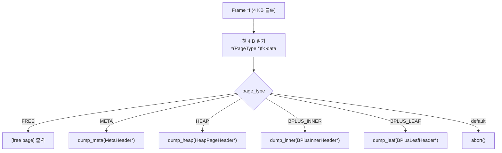

# `page_type` 태그 기반 다형성

C++·C#·Java를 주로 쓰던 배경에서 minidb를 C로 짤 때 가장 크게 막혔던 것은, **"다형성을 어떻게 표현할까"** 였다. B+ tree의 노드는 내부 노드(internal)일 수도 잎 노드(leaf)일 수도 있다. 디스크에 저장되는 페이지는 데이터 힙 페이지일 수도, B+ tree 노드 페이지일 수도, 메타데이터 페이지일 수도 있다. OOP에서라면 당연히 클래스 계층을 만들고 가상 함수 테이블에 맡겼을 일이다.

C에는 그게 없다. 처음에는 거부감이 컸다. "타입이 자기 자신을 모르면 어떻게 서로 다른 행동을 하지?" 그런데 minidb를 설계하다 보니 C가 오히려 더 담백한 답을 제시했다. **페이지 자체에 자기 타입을 새겨 넣는다.** 그게 전부였다.

## 결정: 모든 페이지의 첫 4바이트를 `page_type` 태그로 쓴다

```c
typedef enum : uint32_t {
    PAGE_TYPE_FREE         = 0,
    PAGE_TYPE_META         = 1,
    PAGE_TYPE_HEAP         = 2,
    PAGE_TYPE_BPLUS_INNER  = 3,
    PAGE_TYPE_BPLUS_LEAF   = 4,
} PageType;
```

모든 페이지 구조체의 **맨 앞에 같은 4바이트** 가 박힌다. 이 자리가 태그다.

```c
typedef struct {
    PageType type;      // 공통 헤더: 반드시 맨 앞
    uint16_t slot_count;
    uint16_t free_start;
    uint16_t free_end;
    uint16_t reserved;
    uint8_t  payload[PAGE_SIZE - 16];
} HeapPageHeader;

typedef struct {
    PageType type;      // 공통 헤더
    uint16_t n_keys;
    uint16_t is_root;
    uint32_t right_sibling;
    uint8_t  payload[PAGE_SIZE - 16];
} BPlusLeafHeader;

typedef struct {
    PageType type;      // 공통 헤더
    uint16_t n_keys;
    uint16_t is_root;
    uint32_t first_child;
    uint8_t  payload[PAGE_SIZE - 16];
} BPlusInnerHeader;
```

`__attribute__((packed))` 로 패딩을 막아 디스크 레이아웃을 고정시켰다.

## 디스패치는 `switch` 하나

페이지 하나를 처리하는 함수가 필요할 때, 가상 함수가 아니라 `switch` 로 분기했다.

```c
void page_dump(Frame *f) {
    PageType t = *(PageType *)f->data;
    switch (t) {
        case PAGE_TYPE_META:
            dump_meta((MetaHeader *)f->data); break;
        case PAGE_TYPE_HEAP:
            dump_heap((HeapPageHeader *)f->data); break;
        case PAGE_TYPE_BPLUS_INNER:
            dump_inner((BPlusInnerHeader *)f->data); break;
        case PAGE_TYPE_BPLUS_LEAF:
            dump_leaf((BPlusLeafHeader *)f->data); break;
        case PAGE_TYPE_FREE:
            printf("[free page]\n"); break;
        default:
            fprintf(stderr, "unknown page type: %u\n", t);
            abort();
    }
}
```

`switch` 기반 디스패치를 흐름으로 보면 다음과 같다.



OOP의 관점에선 "꼭 switch로 하네"라고 안타까워할 수 있다. 하지만 여기엔 다음의 성질이 있었다.

1. 모든 페이지 타입이 **같은 4 KB 블록**의 서로 다른 해석이다. 메모리상으로도 디스크상으로도 크기·위치·정렬이 동일하다.
2. 페이지 타입의 수는 소수이고 드물게 추가된다. V-table을 만들 정도의 확장성이 필요 없었다.
3. `switch` 안에서 각 case가 서로 다른 타입으로 **캐스팅**하지만, 그 캐스팅은 **해석의 변경**에 불과하다. 같은 바이트를 다른 스키마로 읽을 뿐이다.

## OOP가 추상화하던 것 vs C가 추상화하는 것

이 지점에서 깨달음이 왔다. **OOP가 추상화하는 대상과 C가 추상화하는 대상이 다르다.**

- **OOP**: 객체를 추상화한다. 각 클래스는 자기 데이터와 행동을 캡슐화하며, 같은 인터페이스를 구현하는 여러 구현 타입이 존재한다. 인터페이스라는 이름 뒤에 실제 타입이 숨는다.
- **C의 페이지 기반 설계**: **메모리 블록 자체**를 추상화한다. "4 KB 블록"이라는 공통 형태가 있고, 그 안의 첫 바이트들이 "이 블록은 지금 어떤 해석으로 읽혀야 하는가"를 말한다. 다형성은 **같은 바이트를 서로 다른 스키마로 읽을 수 있다**는 성질이다.

OOP의 추상 단위는 **"타입의 identity"** 다. 이 객체가 A 인가 B 인가. C의 이 설계에서 추상 단위는 **"블록의 해석"** 이다. 이 바이트 영역을 어떤 구조체로 볼 것인가.

## 그리고 이 차이는 근본적이다

OOP의 클래스 인스턴스는 **힙에 흩어진다**. 각각이 자기만의 주소를 갖고 자기만의 바이트를 소유한다. 객체끼리의 포인터 관계가 객체 그래프를 이룬다. 추상화는 이 그래프의 노드와 엣지 수준에서 작동한다.

페이지 기반 설계에서는 모든 것이 **같은 크기의 블록**이다. 메모리와 디스크 어디에서든 4 KB 블록의 배열이다. 객체라는 개념 자체가 해체되고, 남는 것은 "이 블록을 지금 무엇으로 해석할 것인가"뿐이다. 블록들 사이의 관계는 **페이지 번호(= 블록의 위치)** 로 표현된다. 그리고 이 표현은 **그대로 디스크에 직렬화된다.** 포인터 관계가 주소가 아닌 페이지 번호이기에, `memcpy` 한 번으로 디스크에 쓰고 `memcpy` 한 번으로 다시 읽어도 구조가 깨지지 않는다.

OOP의 객체 그래프를 디스크에 쓰려면 **직렬화**라는 별개의 작업이 필요하다. 포인터를 ID로 바꾸고, 관계를 기록하고, 읽을 때 다시 객체로 조립한다. 그 과정이 본질적으로 "영속성을 위한 변환"이다. 페이지 기반 설계에서는 영속성과 메모리 표현이 이미 같다. 변환이 필요 없다.

## 태그의 값은 디스크 위에서도 살아 있다

`page_type` 은 단순히 런타임 디스패치용이 아니다. 이 태그가 **디스크에 그대로 기록**되므로,

- 파일을 다시 열었을 때 각 페이지가 자기 종류를 스스로 알린다.
- 크래시 복구 시 파일을 스캔하며 각 페이지가 어떤 역할이었는지 바로 판정할 수 있다.
- `page_type == PAGE_TYPE_FREE` 로 표시된 페이지만 수집하면 빈 페이지 리스트가 즉시 복원된다.

메타데이터가 런타임 메모리와 디스크의 경계를 자연스럽게 건너간다. C++에서 이를 하려면 serializer 클래스를 따로 짜서 클래스 ID를 수동으로 써 넣어야 한다. 여기서는 같은 구조체의 첫 4바이트가 그 역할을 한다.

## 정리

C에는 클래스도 가상 함수도 없지만, 다형성을 **블록의 첫 바이트에 자기 종류를 새겨 넣는** 방식으로 표현할 수 있다. `page_type` 태그와 `__attribute__((packed))` 구조체, `switch` 디스패치. 이 세 가지의 조합이 B+ tree 노드와 힙 페이지와 메타 페이지를 같은 프레임 캐시 위에서 돌리고, 같은 `pread/pwrite` 로 디스크에 오갈 수 있게 한다.

OOP에서 거부감을 느꼈던 건 "C에는 추상화의 수단이 없다"는 오해였다. 실제로는 C가 다른 층위에서 추상화한다. **객체 단위가 아니라 메모리 블록 단위의 추상화.** 이 관점에 도달한 순간, C가 시스템 프로그래밍과 데이터베이스·커널 같은 영역에서 왜 오래 살아남는지를 이해하게 됐다.
