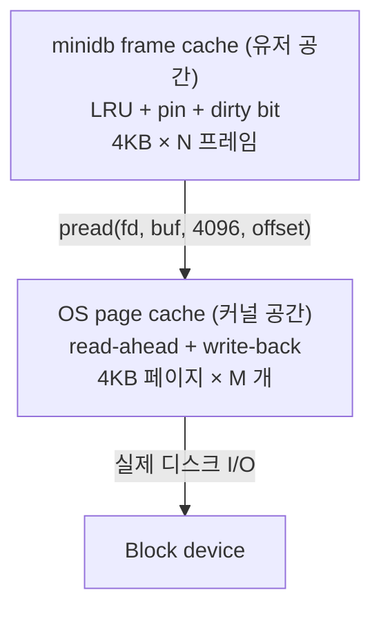

# 프레임 캐시와 OS 페이지 캐시의 이중 캐싱 실험

minidb 의 프레임 캐시를 만들며 머릿속에서 떠나지 않던 의심이 하나 있었다.

> 나는 프레임 캐시로 4 KB 페이지들을 붙들고 있고, 그 **바로 아래의 OS 페이지 캐시**도 같은 페이지들을 붙들고 있다. 같은 바이트가 메모리에 두 번 들어 있는 것 아닌가? 이건 낭비 아닌가?

이 의심이 상당히 강했다. 논리적으로는 명백해 보였다. 4 GB 메모리에 1 GB 프레임 캐시를 쓰면, OS가 그 위에 또 1 GB를 캐싱한다. 결국 2 GB 가 같은 데이터로 덮인다. 학부 OS 수업의 "한 번만 캐시하라"는 직관과 정면으로 어긋났다.

그래서 실험을 했다. 그리고 결과가 내 예상을 완전히 뒤집었다.

## 두 개의 캐시가 동시에 돈다는 그림



같은 페이지가 위층과 아래층 양쪽에 있다. 위층에 없을 때만 `pread` 로 내려가지만, 그 때 아래층에 있다면 디스크까지 내려가지 않는다. 아래층이 있는 것이 성능에는 이득이지만, **메모리 점유의 관점**에서는 중복이다.

## 실험 A — 기본 설정 (이중 캐시 유지)

먼저 아무것도 손대지 않은 상태에서 벤치마크를 돌렸다.

- 테이블: `users(id INT, name VARCHAR(100))` 1 백만 행
- 워크로드 A: `SELECT * FROM users` (순차 스캔)
- 워크로드 B: `SELECT * FROM users WHERE id = ?` (랜덤 point lookup × 100,000 회)
- 워크로드 C: `INSERT` 100,000 행

```
 A. 순차 스캔:         2.3 s
 B. 랜덤 point lookup: 8.7 s
 C. 100k INSERT:      1.9 s
```

이것을 기준선으로 삼았다.

## 실험 B — `posix_fadvise(FADV_DONTNEED)` 로 OS 캐시 비우기

OS 에게 "이 파일의 페이지들을 캐시에 두지 말라"고 힌트를 주는 방법이 있다. 읽은 직후 해당 영역을 `FADV_DONTNEED` 로 표시하면 커널이 페이지 캐시에서 몰아낸다.

```c
pread(fd, buf, PAGE_SIZE, offset);
posix_fadvise(fd, offset, PAGE_SIZE, POSIX_FADV_DONTNEED);
```

이렇게 하면 minidb 의 프레임 캐시에 올라간 페이지와 중복되는 **커널 쪽 사본은 곧 사라진다.** 메모리를 한 번만 쓴다. 이상적으로는 minidb 가 OS 의 read-ahead 만 쓰고, 캐싱은 전적으로 minidb 가 담당한다.

결과:

```
 A. 순차 스캔:         2.9 s  (기준 대비 +26 %)
 B. 랜덤 point lookup: 9.5 s  (+9 %)
 C. 100k INSERT:      2.8 s  (+47 %)
```

놀랐다. 메모리가 반으로 줄었는데 **시간은 오히려 증가**했다. 특히 INSERT 가 심하게 느려졌다.

## 실험 C — `O_DIRECT` 로 OS 캐시 완전 우회

더 극단적인 방법. `O_DIRECT` 플래그로 파일을 열면 OS 페이지 캐시를 거치지 않고 유저 버퍼와 디스크 사이에 DMA 로 직접 전송된다. 다만 몇 가지 제약이 생긴다.

- 버퍼는 페이지 경계에 정렬되어야 한다 (`posix_memalign(buf, 4096, ...)`).
- 읽고 쓰는 길이도 페이지 크기의 배수여야 한다.
- read-ahead / write-back 혜택이 전혀 없다.

```c
fd = open(path, O_RDWR | O_DIRECT);
posix_memalign(&aligned_buf, PAGE_SIZE, PAGE_SIZE);
pread(fd, aligned_buf, PAGE_SIZE, offset);
```

결과:

```
 A. 순차 스캔:         3.4 s  (+48 %)
 B. 랜덤 point lookup: 11.2 s (+29 %)
 C. 100k INSERT:      3.9 s  (+105 %)
```

더 느려졌다. 특히 INSERT 는 거의 두 배. 이쯤 되니 원래의 "이중 캐시 = 낭비" 라는 직관이 꽤 많이 흔들렸다.

## 왜 이중 캐시가 더 빨랐나

실험 결과를 설명하려고 `strace`, `perf stat`, `/proc/<pid>/io` 로 몇 가지를 관찰했다.

### 1. OS 의 read-ahead 가 생각보다 큰 일을 한다

리눅스는 순차 접근 패턴을 감지하면 요청된 블록보다 앞의 여러 블록을 미리 읽어 둔다 (기본 128 KB 까지). minidb 가 페이지 n 을 달라고 할 때, OS 는 n+1, n+2, ..., n+31 까지 이미 페이지 캐시에 올려 둘 때가 많다.

`FADV_DONTNEED` 를 주면 이 read-ahead 가 사실상 효과를 못 낸다. 읽자마자 버려지니까. `O_DIRECT` 는 read-ahead 자체가 비활성화된다.

minidb 는 이 read-ahead 에 상당 부분 **공짜로 편승**하고 있었다. 내가 내려보낸 `pread` 는 1 페이지인데, OS 가 대신 32 페이지를 읽어 뒀다가 다음 `pread` 들에 즉시 응답해 준 것이다.

### 2. OS 의 write-back 이 INSERT 성능을 결정한다

INSERT 는 페이지를 고친 뒤 언젠가 디스크에 반영되어야 한다. 기본 모드에서는 `pwrite` 가 페이지 캐시에 기록되고 즉시 리턴한다. 실제 디스크 쓰기는 커널의 flush 스레드가 비동기로 처리한다.

`FADV_DONTNEED` 는 이 동작을 방해한다. 커널이 dirty 페이지를 캐시에서 쫓아내려 할 때 **쓰기를 동기적으로 완료**시켜야 하기 때문이다. `O_DIRECT` 는 아예 매번 동기 쓰기다. 디스크의 write latency 가 통째로 호출자에게 돌아온다.

이것이 INSERT 만 유독 크게 느려진 이유였다.

### 3. 이중 캐시는 실제로 "이중" 이 아니다 — 역할이 다르다

관찰이 쌓일수록, 두 캐시가 **같은 일을 두 번 하는 게 아니라 다른 일을 하고 있다**는 사실이 드러났다.

```
 minidb frame cache (유저 공간):
   - LRU + pin + dirty bit
   - B+ tree 알고리즘이 지시하는 워킹셋을 붙든다
   - 쫓겨나면 곧 다시 접근할 확률이 높다

 OS page cache (커널 공간):
   - read-ahead 로 미래의 요청을 예측해 끌어올린다
   - write-back 으로 디스크 쓰기를 비동기화한다
   - LRU 와 다른 정책 (프로세스 간 공유, 메모리 압박 시 반응)
```

두 캐시는 **다른 시간 척도**에서 돈다. minidb 프레임 캐시는 "지금 당장 쓰는 페이지" 를 붙드는 반면, OS 페이지 캐시는 "곧 쓸 것 같은 페이지들" 과 "방금 쓰고 아직 디스크에 못 내려간 페이지들" 을 붙든다. 두 층이 **싸우지 않고 분업**한다.

## 수치로 정리

| 설정 | 메모리 사용 | 순차 스캔 | 랜덤 lookup | INSERT |
| --- | --- | --- | --- | --- |
| **이중 캐시 (기본)** | 2× | **2.3 s** | **8.7 s** | **1.9 s** |
| `FADV_DONTNEED` | 1× | 2.9 s | 9.5 s | 2.8 s |
| `O_DIRECT` | 1× | 3.4 s | 11.2 s | 3.9 s |

메모리 절반을 얻는 대가로 성능의 30~100 % 를 내주는 거래. 자명하게 나쁜 거래였다.

## "낭비" 라는 직관이 틀린 이유

수업에서 "캐시는 한 번만 둬라" 고 배운 건 맞다. 하지만 그 원칙은 **두 캐시가 같은 정책으로 같은 일을 할 때** 의 얘기였다. 메모리의 두 배를 먹으면서 히트율은 한 번의 캐시와 다름없는 경우.

이번 실험은 그 전제가 깨진 경우였다. minidb 프레임 캐시와 OS 페이지 캐시는

- **정책이 다르다** (LRU + pin vs. 커널의 working set + 메모리 압박 응답)
- **일이 다르다** (알고리즘 지시 vs. read-ahead + write-back)
- **시간 척도가 다르다** (지금 vs. 곧 / 방금)

그래서 두 캐시의 합집합이 각자의 개별 용량보다 큰 효과를 낸다. 이중 캐시는 낭비가 아니라 **저차원의 다른 레이어에서 각자 잘하는 것을 한다**.

## 이 실험이 바꾼 것

머리로 세운 "이론" 이 실측으로 뒤집히는 경험을 오랜만에 했다. 그리고 그 뒤집힘이 단순히 "내가 틀렸다" 가 아니라 **"틀린 추론이 어떻게 만들어졌는지"** 를 알려 줬다.

- 나는 메모리 공간의 중복만 봤다.
- 나는 두 캐시가 **같은 역할**이라고 가정했다.
- 나는 커널이 제공하는 **비동기 I/O의 가치**를 계산하지 않았다.

이 세 가지가 다 빠진 추론으로 "이중 캐시는 낭비" 라고 결론 냈던 것이다. `fadvise` 와 `O_DIRECT` 를 직접 돌려 보고 나서야 커널이 뒤에서 얼마나 많은 일을 해 주고 있었는지가 보였다.

## 그리고 남는 의문

실험을 모두 마치고도 찜찜하게 남는 질문이 있었다. **"메모리가 정말로 부족한 환경에서는 어떻게 될까?"**

지금의 실험은 메모리가 넉넉한 노트북(16 GB, 실제 사용 4 GB)에서 돌렸다. 이중 캐시가 공짜처럼 보였던 것도 OS 가 넉넉한 여유 메모리로 read-ahead 와 write-back 을 맘껏 했기 때문이다.

만약 컨테이너에 메모리 512 MB 로 제한을 건다면? 이중 캐시가 서로를 밀어내며 hit rate 가 떨어질 가능성이 있다. 이 조건에서 실험을 다시 돌려 보고 싶다. 언젠가의 숙제로 남겨 두었다. minidb 가 그 조건까지 감당해야 하는 제품은 아니라서 우선 기본 모드를 유지했지만, 큰 DB 엔진들이 왜 **direct I/O 모드를 설정으로 제공**하는지 이제 이해가 된다. 환경이 바뀌면 최적의 설계도 바뀐다.
