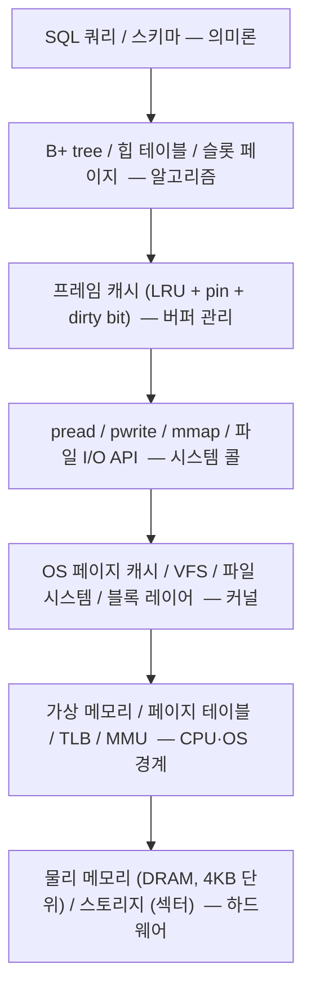

# 하드웨어에서 SQL까지: 4KB 페이지를 중심으로 한 수직 통합

이번 주의 주제는 "메모리"였다.
CSAPP 9장 (가상 메모리)을 읽고, 같은 주에 minidb (C로 만든 디스크 기반 SQL 엔진)를 설계·구현했다.
두 활동이 따로 돌아가는 듯 보였지만, 마지막 날 정리하며 보니 한 수직 축 위에서 서로를 떠받치고 있었다.

이 글은 그 수직 축을 한눈에 보이게 그려 두려는 기록이다.

## 7개 계층의 수직 구조

여섯 층이 모두 같은 단위 — 4 KB 페이지 — 를 중심으로 정렬되어 있었다.
이것이 이번 주의 가장 큰 통찰이었다.
알고리즘이 그 단위를 택한 것이 우연이 아니라, 모든 층이 같은 결정을 내리도록 진화해 왔기 때문이었다.

## 계층별 4 KB의 의미

### 하드웨어 — 왜 처음 4 KB가 정해졌나

DRAM의 물리적 단위는 4 KB가 아니다.
행/열 버퍼, 프리페치 단위 등이 더 작다.
스토리지의 섹터는 원래 512 B였고, 현대 SSD는 4 KB 네이티브.
그럼 왜 OS와 응용이 4 KB를 단위로 삼는가?

CSAPP 9장의 답은 타협점이다.
페이지가 너무 작으면 페이지 테이블 엔트리가 폭발하고, 너무 크면 내부 단편화가 커진다.
4 KB는 이 둘의 균형점.
이 균형이 1980년대 x86 이후로 유지됐다.

### CPU·OS 경계 — MMU가 번역하는 단위

가상 주소 → 물리 주소 번역은 페이지 단위로 이뤄진다.
x86-64의 4단계 페이지 테이블 (PML4/PDPT/PD/PT) 모두 한 엔트리가 4 KB 영역을 커버한다.
TLB 역시 이 단위로 캐싱한다.

이 층에서 4 KB가 고정되어 있으니, 위층들이 다른 단위를 쓰면 경계 불일치로 손해를 본다.
`pread`로 2 KB를 읽으려 해도 커널은 어차피 4 KB 페이지를 통째로 끌어올린다 (application/01에서 관찰).

### 커널 — OS 페이지 캐시와 read-ahead

커널은 파일의 일부를 읽을 때 4 KB 페이지를 페이지 캐시에 적재한다.
`read-ahead`가 이어진 32 페이지 (128 KB)를 앞서 읽어 둔다.
쓰기는 `write-back`으로 비동기화된다.
이 전체 기계가 4 KB 페이지를 전제로 설계되어 있다.

내가 직접 실험해 본 것도 이 층이었다.
application/06에서 `fadvise(FADV_DONTNEED)`와 `O_DIRECT`로 이 기계를 건너뛰어 보니 성능이 오히려 30-100% 나빠졌다.
커널의 4 KB 기반 인프라에 편승하는 편이 이득이었다.

### 시스템 콜 — pread/pwrite의 페이지 정렬

`pread(fd, buf, N, offset)`에서 N과 offset이 4 KB의 배수일 때 가장 효율적이다.
특히 `O_DIRECT`는 이 정렬을 필수로 요구한다.
시스템 콜 자체가 페이지를 언어로 말한다.

### 버퍼 관리 — 프레임 캐시의 한 프레임

minidb의 프레임 캐시는 한 프레임 = 4 KB.
OS의 페이지 크기와 맞춘다.
이 크기를 다르게 잡으면 프레임 하나 로드에 두 번의 페이지 I/O가 들어가거나, 페이지 하나로 두 프레임을 만들며 공간 낭비가 생긴다.
한 프레임 = 한 페이지가 모든 계산을 단순화시킨다.

### 알고리즘 — B+ tree 노드가 4 KB인 이유

B+ tree는 교과서에서 "노드 하나에 많은 키를 담는 트리"로 소개된다.
그 "많은 키"의 실제 최적값이 한 페이지에 꽉 차는 만큼이다.
B+ tree의 설계 철학 — I/O를 최소화 — 가 페이지 기반 저장소와 맞물려 있기 때문이다.
application/01의 벤치마크가 이를 수치로 보여 줬다 (4 KB에서 SELECT가 가장 빠름, 그보다 작거나 크면 모두 느려짐).

### 의미론 — SQL과 페이지의 만남

"SELECT는 몇 번의 페이지 읽기를 유발하는가"라는 질문이 의미를 갖는 층이다.
SQL의 옵티마이저가 실제로 평가하는 비용 지표가 페이지 수다.
`EXPLAIN`에서 나오는 수치도 결국 예상 페이지 I/O 횟수.
사용자가 쓴 한 줄의 쿼리가 페이지 단위의 물리적 행위로 번역된다.

## 이번 프로젝트에서 얻은 세 가지 감각

한 주를 마치며 새로 얻은 감각 세 개.

### 1. "단위를 맞추면 세 층이 서로를 증폭시킨다"

같은 물리적 단위를 여러 층이 공유할 때, 그 단위에서 각자 잘하는 최적화가 곱해져서 나타난다.

- 하드웨어: DMA가 4 KB 단위로 효율적
- OS: 페이지 캐시가 4 KB 정렬된 요청에 `read-ahead`를 건다
- minidb: 프레임 캐시가 4 KB 단위로 pin/LRU를 관리한다
- 알고리즘: B+ tree가 4 KB 노드에서 최대 fanout을 얻는다

각 층이 따로따로 이득을 보는 게 아니라, 이전 층의 최적화가 다음 층에 그대로 전달된다.
단위가 어긋나면 이 전달이 끊긴다.

### 2. "알고리즘은 그 알고리즘이 돌아갈 하드웨어를 알고 설계된다"

B+ tree가 페이지 기반 저장소를 전제로 설계된 것처럼, 해시 테이블도 캐시 라인을 전제로 하고, 양자 컴퓨팅의 알고리즘도 큐비트의 물리를 전제로 한다.

학부 자료구조 수업에서 "시간 복잡도 O(log n)"같은 추상적 척도로만 배울 때는 이 전제가 보이지 않았다.
실제 구현을 해 보니 알고리즘의 형태가 하드웨어의 형태를 따르고 있다는 사실이 또렷해졌다.

이 감각은 다른 알고리즘을 공부할 때도 적용될 것 같다.
"이 자료구조는 어떤 하드웨어를 전제로 하는가?"를 묻는 습관.

### 3. "추상화의 층은 문제를 풀기 위한 도구이지, 문제를 감추기 위한 것이 아니다"

같은 주에 application/03, application/09에서 C의 추상화에 대해 생각을 정리하며 이 감각이 생겼다.

OOP는 도메인 복잡성을 추상화하는 층이다.
이 층이 너무 잘 작동하기 때문에, OOP 언어만 써 온 개발자는 추상화 이전의 세계를 잊는다.
객체라는 편리한 단위 뒤에 가려진 메모리·페이지·시스템 콜을 모른 채로도 많은 일을 할 수 있다.

그런데 그 층이 성능이나 예측 가능성의 이유로 꿰뚫어 봐야 하는 문제가 있다.
DB 엔진, 커널, 실시간 시스템.
이때는 C가 제공하는 "더 얇은 추상화"가 오히려 도구가 된다.
문제를 감추지 않고 드러내는 언어.

이 두 언어 계열이 공존하는 이유는 서로 다른 층의 문제가 공존하기 때문이었다.

## 남은 질문들

이번 주에 답을 얻었지만, 같이 열린 질문들도 남는다.

- 페이지 크기가 언젠가 바뀔까? ARM64는 16 KB/64 KB 페이지를 지원한다. 이것이 디폴트가 되면 모든 층의 디폴트가 바뀔 것이다.
- B+ tree 외의 다른 자료구조는? LSM tree는 쓰기 최적화된 다른 타협점이다. 이 역시 페이지 기반이지만 I/O 패턴이 다르다 (순차 쓰기). 다음 주에 공부해 보고 싶다.
- `WAL`과 복구는? application/07에서 언급만 했다. 원자성 보장의 세부는 다음 주의 주제로.
- 동시성 제어 — MVCC, 락, 스냅샷 격리? 페이지 위에 여러 트랜잭션의 시간적 레이어를 얹는 문제. 공간 축 (메모리)이 이번 주였다면, 다음 주는 시간 축이 될 것 같다.

## 마무리

가장 감사한 건 CSAPP과 minidb가 같은 주에 맞물렸다는 우연이었다.
책만 읽었다면 "페이지 테이블"이 추상적 용어로 남았을 것이고, 코드만 짰다면 "왜 4 KB가 매직 넘버인지"를 모르고 외웠을 것이다.
두 활동이 맞물려, 위에서는 "왜 이 단위가 자연스러운가", 아래에서는 "그 단위 위에 무엇을 얹으면 되는가"가 동시에 답을 냈다.

한 주의 마지막 날에 느낀 감각은 단순했다.
아래 층을 이해해야 위 층이 자연스러워진다.
데이터베이스를 제대로 이해하려면 메모리를 이해해야 하고, 메모리를 이해하려면 CPU와 OS의 경계를 이해해야 한다.
지식은 위에서 아래로 흐르지 않고, 아래에서 위로 쌓였을 때 비로소 안정된다.
이번 주의 이 경험이 앞으로 다른 주제를 공부할 때도 비슷한 방식으로 접근하게 할 것 같다.

먼저 하드웨어를 본다.
그 다음에 OS.
그 다음에 알고리즘.
그리고 마지막에 의미론.
아래에서 위로.
