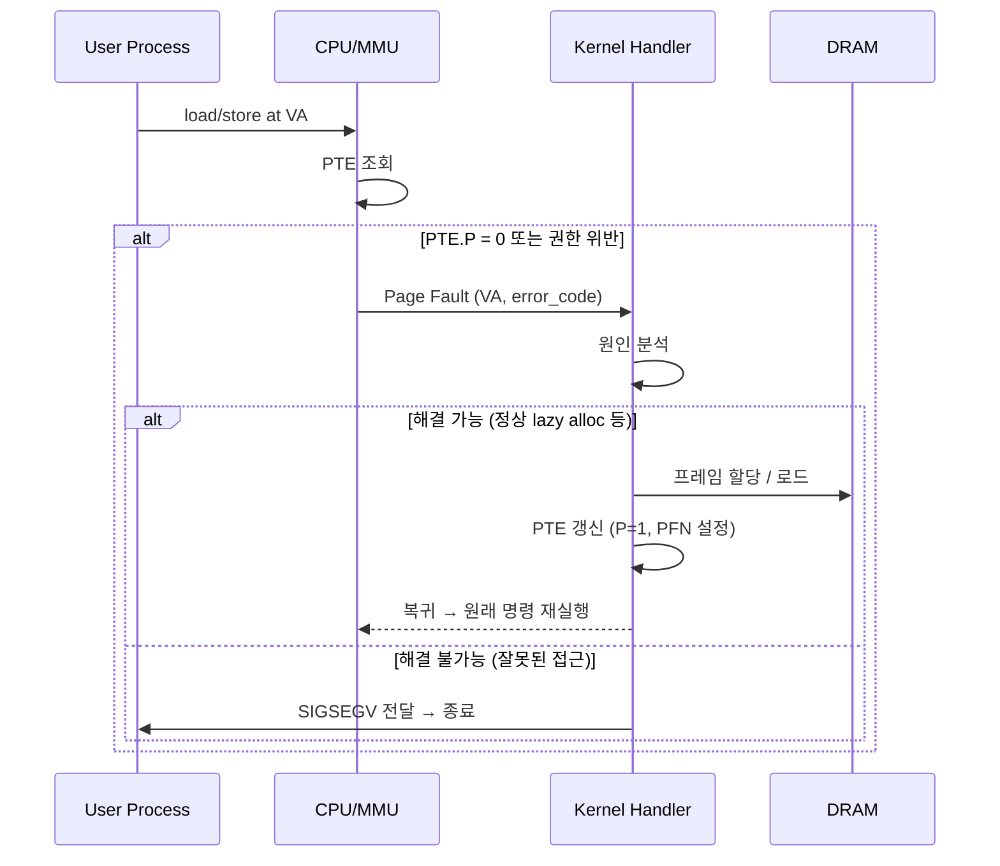
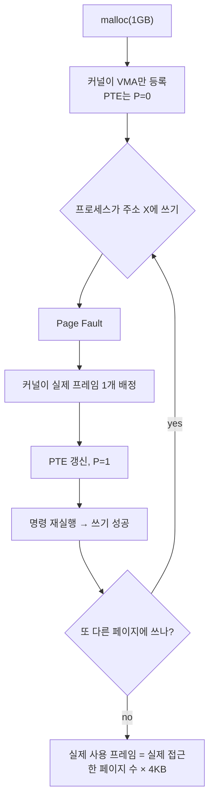

# Page Fault와 Demand Paging

프로세스는 자기 주소 공간의 어떤 바이트든 자유롭게 읽고 쓸 수 있다고 믿는다. 그러나 운영체제는 그 바이트가 실제 물리 프레임에 배정되어 있는 상태로 언제나 준비해 두지 않는다. 매핑만 만들어 두고, **실제 접근이 일어나는 순간**에 비로소 프레임을 붙이는 전략을 쓴다. 이 전략이 **요구 페이징(Demand Paging)** 이며, 그 발화 장치가 **페이지 폴트(Page Fault)** 다.

## 페이지 폴트란 무엇인가

CPU가 가상 주소에 접근했을 때, MMU가 페이지 테이블을 따라 내려가다가 문제를 만나면 페이지 폴트 예외를 발생시킨다. CPU는 현재 명령어 실행을 중단하고, 레지스터 상태와 **폴트를 일으킨 가상 주소**를 저장한 뒤, 커널의 **페이지 폴트 핸들러(Page Fault Handler)** 로 제어를 넘긴다.



페이지 폴트는 "버그"가 아니라 **CPU와 커널 사이에 약속된 정상 신호**다. 커널은 이 신호를 받아 상황에 맞게 처리하고, 문제가 없으면 중단된 명령어를 그대로 **재실행**한다. 프로세스 입장에서는 아무 일도 없었던 것처럼 보인다.

## 폴트의 세 가지 종류

같은 "페이지 폴트"라도 원인에 따라 처리가 완전히 다르다. 리눅스는 크게 세 종류로 구분한다.

### Minor Fault — 디스크 접근 없이 해결

페이지의 **내용은 이미 메모리 어딘가에 있지만**, 해당 프로세스의 PTE에는 아직 연결되지 않은 경우다.

```
예) fork 직후의 공유 페이지
    - 내용은 DRAM에 있음
    - PTE는 아직 "없음" 상태
    - fault 시 연결만 해주면 됨
```

디스크 I/O가 없으므로 수 μs 이내에 처리된다. 성능적으로 큰 부담이 아니다.

### Major Fault — 디스크에서 페이지를 읽어야 함

페이지의 내용이 **디스크**(실행 파일, 스왑 파일, mmap된 파일)에 있어서 **읽어 와야** 하는 경우다.

```
예) 프로그램 로딩
    - .text 섹션이 아직 DRAM에 없음
    - 첫 실행 시 fault → ELF 파일에서 4 KB 읽어 프레임에 채움
    - PTE 갱신 후 복귀
```

수 ms 수준의 디스크 접근이 필요하므로 minor fault보다 수천 배 느리다. major fault 빈도는 시스템의 전반적 성능에 직접 영향을 준다.

### Invalid Fault — 정말 잘못된 접근

폴트 주소가 어떤 VMA에도 속하지 않거나, 속하더라도 접근 권한이 맞지 않는 경우다.

```
예) NULL 역참조
    - 주소 0은 어떤 VMA에도 매핑되어 있지 않음
    - 커널은 이를 "버그"로 판정하고 SIGSEGV 전달
    - 프로세스 종료
```

커널은 "이 폴트는 정상적 lazy alloc/COW가 아니며, 정당화할 근거가 없다"고 결론 내리고 프로세스를 종료시킨다. 우리가 보는 `Segmentation fault`가 바로 이 경로다.

| 종류         | 디스크 I/O | 처리 비용  | 결과                |
| ------------ | ---------- | ---------- | ------------------- |
| Minor Fault  | 없음       | ~μs       | 연결 후 재실행      |
| Major Fault  | 있음       | ~ms       | 로드 후 재실행      |
| Invalid Fault| 없음       | ~ms       | SIGSEGV, 프로세스 종료 |

## Demand Paging — "실제로 쓸 때만 준다"

요구 페이징은 이 폴트 메커니즘을 **전략적으로 활용**하는 설계다. 커널은 할당이 요청될 때마다 실제 프레임을 붙이는 대신,

1. **가상 주소만** 예약한다 (VMA 등록).
2. **페이지 테이블 엔트리는 만들지 않거나**, `P=0` 상태로만 만들어 둔다.
3. 프로세스가 그 주소에 실제로 접근하는 순간에야 폴트를 통해 프레임을 배정한다.

이 지연의 결과는 크다.

- **`malloc`으로 1 GB를 요청했지만 1 KB만 실제로 썼다면** 물리 DRAM은 1 KB만 소비된다. 나머지 가상 주소는 PTE가 `P=0`인 상태로 남아 있을 뿐 프레임이 없다.
- **실행 파일이 100 MB여도** 실제 실행하는 코드가 5 MB뿐이라면 그 5 MB만 major fault로 메모리에 올라온다.
- **fork** 직후 자식 프로세스는 부모의 주소 공간을 복제한 것처럼 보이지만, 실제로는 페이지 내용을 공유한 채로 시작한다. 쓰기가 일어나는 페이지만 새 프레임을 받는다(COW).



이 전략은 세 가지 결과를 준다.

- **DRAM 사용 효율**: 실제 필요한 만큼만 소비된다. 커다란 가상 주소 공간이 공짜로 유지된다.
- **프로그램 시작 시간 단축**: 실행 파일 전체를 미리 메모리에 올릴 필요가 없다. 첫 명령어만 폴트로 가져오면 실행이 시작된다.
- **쓰지 않는 자원은 영원히 할당되지 않는다**: 오류 경로 코드, 예외 처리 루틴, 쓰지 않는 정적 배열은 끝내 폴트를 한 번도 일으키지 않고 끝난다.

## 첫 접근 지연과 워밍업

요구 페이징은 "첫 접근은 느리다"는 단점을 함께 준다. 막 시작한 프로세스가 코드의 새로운 부분을 실행할 때마다 major fault가 한 번씩 나고, `malloc`으로 받은 영역을 처음 쓸 때마다 minor fault가 한 번씩 난다. 그래서 성능 측정은 **워밍업(warm-up)** 이후의 상태에서 해야 의미 있다. 또한 지연에 민감한 시스템은 의도적으로 **페이지를 미리 터치**해서 폴트를 선지불하기도 한다(`mlock`, 일부러 한 바이트씩 쓰기).

## 정리

페이지 폴트는 에러가 아니라 **하드웨어와 커널이 약속한 통신 채널**이다. 커널은 이 채널을 통해 "실제 접근이 일어날 때만 프레임을 준다"는 게으른 전략을 구현한다. Minor·major·invalid 세 종류의 폴트를 상황에 맞게 처리함으로써, 거대한 가상 주소 공간을 실제 DRAM 용량을 훨씬 초과해 제공할 수 있다. **없는 것을 있는 척하는 일**이 이렇게 정교한 예외 처리 시스템으로 가능해졌다는 사실이, 가상 메모리라는 설계의 핵심 통찰이다.
