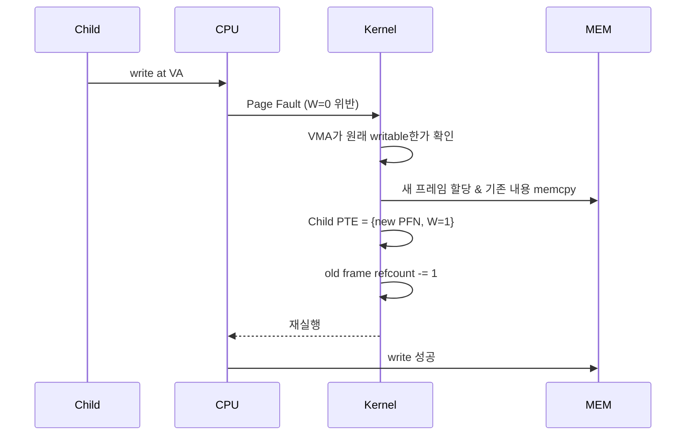

# fork와 Copy-on-Write의 결합

`fork`는 유닉스의 프로세스 생성 원리다. 한 호출로 호출한 프로세스와 **거의 동일한 자식 프로세스**를 만들어 낸다. "거의 동일"이라는 말에는 주소 공간·열린 파일·신호 처리기·환경 변수가 모두 복제된다는 뜻이 담긴다. 그러나 구현은 순진한 복사가 아니다. `fork`는 내부적으로 **Copy-on-Write(COW)** 와 결합해, 공유로 시작하고 쓰기가 일어난 페이지만 분리하는 방식으로 동작한다. 이 결합이 수많은 프로세스 생성이 가능할 만큼 빠르고 가벼운 근본 이유다.

## fork의 서명

```c
pid_t fork(void);
```

한 번 호출하면 두 번 반환한다. 부모에게는 자식의 PID가, 자식에게는 0이 반환된다. 그 이후 두 프로세스는 서로 독립적으로 실행된다.

```c
pid_t pid = fork();
if (pid == 0) {
    // 자식 코드 경로
} else if (pid > 0) {
    // 부모 코드 경로, pid는 자식 PID
} else {
    perror("fork");
}
```

## 순진한 구현의 비용

`fork`가 주소 공간을 **완전히 복사**한다고 해 보자. 부모가 1 GB의 메모리를 쓰고 있다면 자식을 위해 1 GB의 물리 메모리가 새로 필요하고, 그 내용을 전부 `memcpy` 해야 한다. 대부분의 자식은 `fork` 직후 바로 `execve`를 부르므로 **방금 복사한 1 GB는 버려진다.** 이 낭비는 감당할 수 없다.

## COW와의 결합

실제 구현은 다르다. `fork`는 자식의 주소 공간을 **부모와 공유**하는 상태로 만들고, 쓰기가 일어나는 페이지에 한해 그 순간에 복사한다. 단계는 다음과 같다.

1. 자식용 `task_struct`를 만들고 부모의 것을 대부분 복제한다.
2. 자식용 `mm_struct`를 새로 만든다. 그러나 이 `mm_struct` 안의 **VMA 리스트는 부모 것을 복제**하고, **페이지 테이블은 부모와 같은 PFN을 가리키도록** 복사한다. 즉 PTE가 같은 프레임을 가리킨다.
3. **양쪽(부모·자식) PTE를 모두 `W=0`** 으로 표시해 쓰기가 일어나면 fault가 나도록 만든다. VMA의 `vm_flags`에는 원래 쓰기 가능했음을 기록해 둔다.
4. 공유된 물리 프레임들의 **참조 횟수(refcount)** 를 증가시킨다.

이 과정에서 실제로 이동한 데이터는 페이지 테이블의 엔트리들뿐이다. 페이지 내용은 한 바이트도 복사되지 않는다.

```
 fork 직후

 부모 PTE: [PFN=100, W=0]  ─┐
 자식 PTE: [PFN=100, W=0]  ─┴─▶ 물리 프레임 #100  (refcount=2)

 부모 PTE: [PFN=200, W=0]  ─┐
 자식 PTE: [PFN=200, W=0]  ─┴─▶ 물리 프레임 #200  (refcount=2)
 ...
```

## 쓰기가 일어나면 분리

부모든 자식이든 쓰기를 시도하는 순간이 오면, `W=0` 때문에 하드웨어가 페이지 폴트를 발생시킨다. 커널의 폴트 핸들러는:

1. 폴트 주소가 속한 VMA가 원래 쓰기 가능한 영역이었는지 확인한다 (COW 판별).
2. 새 물리 프레임을 할당해 기존 프레임의 내용을 복사한다.
3. 쓰기를 시도한 쪽의 PTE를 **새 프레임**을 가리키도록 바꾸고 `W=1`로 복원한다.
4. 기존 프레임의 refcount를 감소시킨다. refcount가 1이 되면, 마지막 소유자의 PTE도 `W=1`로 되돌려 이후엔 폴트 없이 쓸 수 있게 한다.
5. 폴트 명령을 재실행한다.



즉 복사가 완전히 없어지는 것이 아니라 **실제 필요해지는 페이지 수만큼으로 축소**된다.

## fork의 세 가지 자주 쓰이는 경로

`fork`는 통상 세 패턴 중 하나로 이어진다.

1. **`fork` + `execve`**: 자식이 곧바로 다른 프로그램으로 변한다. 공유되던 페이지 대부분은 쓰기 한 번 없이 `exec` 단계에서 버려진다. COW의 이득이 극대화된다.
2. **`fork` + 독립 작업**: 웹 서버나 데몬이 연결마다 자식을 만들고 공유 상태를 기반으로 작업을 수행한다. 쓰는 페이지만 분리되므로 메모리 사용량이 급증하지 않는다.
3. **`fork` + 즉시 종료**: 테스트·일회성 작업. 대부분의 공유 프레임이 refcount만 증감할 뿐 복사가 일어나지 않는다.

이 세 경우 모두, 부모의 메모리를 미리 전부 복사했다면 엄청난 낭비였을 것이다.

## fork가 복제/공유하는 것의 정리

자식이 **복제** 하는 것:
- 주소 공간(COW로 지연 복사)
- 열린 파일 디스크립터 (같은 file description을 공유. offset 공유됨)
- 신호 처리기, 환경 변수, 작업 디렉터리
- `mm_struct` 자체는 별도의 사본

자식이 **공유하지 않는** 것:
- PID, PPID
- 자원 사용 누적치(`rusage`)
- 진행 중이던 타이머, 알람
- 미해결 신호 목록

자식이 **같이 쓰는** 것:
- 물리 프레임 (COW가 깨뜨리기 전까지)
- 파일 오프셋(파일 디스크립터가 공유되므로)

## 한계와 최근의 대안

COW fork도 단점은 있다.

- 자식이 **많은 페이지에 쓰는** 워크로드라면 COW가 결국 대부분 복사를 일으킨다. 그런 경우 `fork`가 오히려 느리다.
- `fork` 자체가 프로세스 수만큼 페이지 테이블을 복제해야 하므로, **거대한 주소 공간**을 가진 프로세스(수백 GB RSS의 DB 등)는 `fork`만으로도 수 초가 걸릴 수 있다.
- `fork` 이후 자식에서 **비동기 시그널 안전하지 않은 함수**를 호출하면 미정의 동작이 된다. `malloc`이 잠금을 쥔 상태에서 fork가 일어나면 자식 쪽에서 그 잠금이 절대 풀리지 않는다.

그래서 현대 시스템은 `fork` 대신 **`posix_spawn`**, **`vfork`**, **`clone3`** 의 특정 플래그(`CLONE_VM` 등) 같은 더 가벼운 창구를 선호하는 경우가 늘고 있다. 하지만 COW fork는 여전히 "가장 유닉스다운 프로세스 생성"의 상징이다.

## 정리

`fork`는 주소 공간을 통째로 복사하는 것처럼 보이지만, 실제로는 **페이지 테이블의 엔트리만** 복제하고 내용은 공유한다. `W=0` 비트로 덧씌운 이 공유는 첫 쓰기 순간의 페이지 폴트에서 진짜 복사로 바뀐다. 이 "약속된 게으름"이 있기에 웹 서버·쉘·데몬이 수천 번의 `fork`를 매초 감당한다. fork의 성능은 COW의 성능이고, COW의 성능은 PTE의 단순함에서 나온다.
