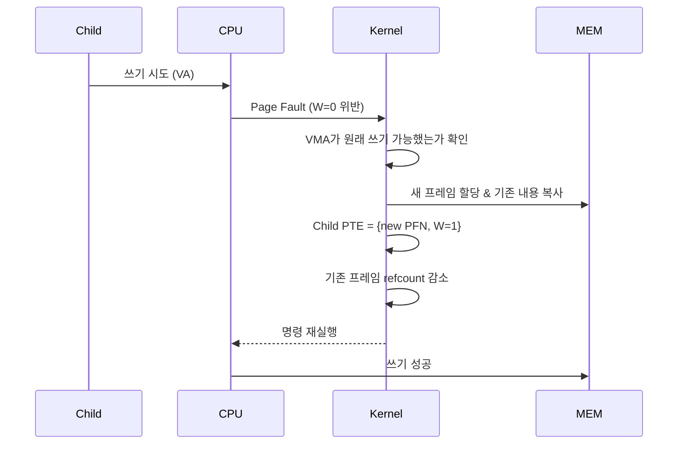

# fork와 Copy-on-Write의 결합

`fork`는 유닉스 프로세스 생성의 기본이다.
한 호출로 호출한 프로세스와 거의 똑같은 자식 프로세스가 나온다.
주소 공간·열린 파일·신호 처리기·환경 변수가 모두 복제된다는 뜻이다.

그런데 구현은 단순한 복사가 아니다.
내가 놀랐던 부분은, `fork`가 실제로는 **Copy-on-Write(COW)** 와 짝을 이룬다는 점이었다.
공유로 시작하고, 쓰기가 일어난 페이지만 그 순간에 분리한다.
이 약속된 게으름 덕분에 수많은 프로세스 생성이 빠르고 가볍다.

## fork의 시그니처

```c
pid_t fork(void);
```

한 번 호출하면 두 번 반환된다.
부모에게는 자식의 PID가, 자식에게는 0이 반환된다.
그 이후로 두 프로세스는 독립적으로 실행된다.

```c
pid_t pid = fork();
if (pid == 0) {
    // 자식 코드 경로
} else if (pid > 0) {
    // 부모 코드 경로, pid는 자식 PID
} else {
    perror("fork");
}
```

## 단순 복제의 비용

만약 `fork`가 주소 공간을 **완전히 복사**한다면 어떻게 될까?
부모가 1 GB의 메모리를 쓰고 있으면 자식용으로 새로운 1 GB의 물리 메모리가 필요하다.
그 내용을 전부 `memcpy`해야 한다.

그런데 웹 서버 같은 곳에서는 `fork` 직후 바로 `execve`를 부른다.
방금 복사한 1 GB는 버려진다.
이 낭비는 감당할 수 없다.

## COW와의 결합

실제 구현은 다르다.
`fork`는 자식의 주소 공간을 부모와 **공유**하는 상태로 만들고, 쓰기가 일어나는 페이지만 그 순간에 복사한다.

**1단계**: 자식용 `task_struct`를 만들고 부모 것을 대부분 복제한다.

**2단계**: 자식용 `mm_struct`를 새로 만드는데, VMA 리스트는 부모 것을 복제한다.
페이지 테이블은 부모와 **같은 PFN을 가리키도록** 복사한다.
즉 PTE가 같은 프레임을 가리킨다.

**3단계**: 양쪽(부모·자식) PTE를 모두 `W=0`으로 표시한다.
쓰기 시도 시 fault가 발생하도록 한 것이다.
VMA의 `vm_flags`에는 원래 쓰기 가능했음을 기록해 둔다.

**4단계**: 공유된 물리 프레임들의 **참조 횟수(refcount)** 를 증가시킨다.

이 과정에서 실제로 옮겨진 데이터는 페이지 테이블 엔트리들뿐이다.
페이지 내용은 한 바이트도 복사되지 않는다.

```
 fork 직후

 부모 PTE: [PFN=100, W=0]  ─┐
 자식 PTE: [PFN=100, W=0]  ─┴─▶ 물리 프레임 #100  (refcount=2)

 부모 PTE: [PFN=200, W=0]  ─┐
 자식 PTE: [PFN=200, W=0]  ─┴─▶ 물리 프레임 #200  (refcount=2)
 ...
```

## 쓰기 시 페이지 분리

부모든 자식이든 쓰기를 시도하는 순간이 오면, `W=0` 때문에 하드웨어가 `page fault`를 발생시킨다.
커널의 폴트 핸들러는 이렇게 작동한다:

1. 폴트 주소의 VMA가 원래 쓰기 가능했는지 확인한다. (COW 판별)
2. 새 물리 프레임을 할당해 기존 내용을 복사한다.
3. 쓰기를 시도한 쪽의 PTE를 새 프레임으로 바꾸고 `W=1`로 복원한다.
4. 기존 프레임의 refcount를 감소시킨다.
   refcount가 1이 되면, 마지막 소유자의 PTE도 `W=1`로 되돌려 이후엔 폴트 없이 쓸 수 있다.
5. 폴트 명령을 다시 실행한다.



복사가 완전히 없어지는 게 아니라 **실제로 필요한 페이지 수만큼만** 일어난다.

## fork의 주요 사용 패턴

`fork`는 보통 세 가지 패턴으로 이어진다.

**1. `fork` + `execve`**
자식이 곧바로 다른 프로그램으로 변한다.
공유되던 페이지 대부분은 쓰기 한 번 없이 `exec` 단계에서 버려진다.
COW의 이득이 극대화된다.

**2. `fork` + 독립 작업**
웹 서버나 데몬이 연결마다 자식을 만들고, 공유 상태를 기반으로 작업한다.
쓰는 페이지만 분리되므로 메모리 사용량이 급증하지 않는다.

**3. `fork` + 즉시 종료**
테스트·일회성 작업.
대부분의 공유 프레임이 refcount만 증감할 뿐 복사는 일어나지 않는다.

세 경우 모두, 만약 부모의 메모리를 미리 전부 복사했다면 엄청난 낭비였을 것이다.

## fork의 복제 대상과 공유 대상

자식이 **복제** 하는 것:
- 주소 공간(COW로 지연 복사)
- 열린 파일 디스크립터 (같은 file description을 공유. offset 공유됨)
- 신호 처리기, 환경 변수, 작업 디렉터리
- `mm_struct` 자체는 별도의 사본

자식이 **공유하지 않는** 것:
- PID, PPID
- 자원 사용 누적치(`rusage`)
- 진행 중이던 타이머, 알람
- 미해결 신호 목록

자식이 **같이 쓰는** 것:
- 물리 프레임 (COW가 깨뜨리기 전까지)
- 파일 오프셋(파일 디스크립터가 공유되므로)

## 한계와 최근의 대안

COW fork도 한계는 있다.

- 자식이 **많은 페이지에 쓰는** 워크로드라면 COW가 결국 대부분 복사를 일으킨다.
  그런 경우 `fork`가 오히려 느리다.

- `fork` 자체가 페이지 테이블 전체를 복제해야 하므로, **거대한 주소 공간**을 가진 프로세스(수백 GB의 데이터베이스 등)는 `fork`만으로도 수 초가 걸릴 수 있다.

- `fork` 이후 자식에서 **비동기 시그널 안전하지 않은 함수**를 호출하면 문제가 된다.
  `malloc`이 잠금을 쥔 상태에서 fork가 일어나면, 자식 쪽에서 그 잠금이 절대 풀리지 않는다.

그래서 요즘 시스템은 `fork` 대신 `posix_spawn`, `vfork`, `clone3` 같은 더 가벼운 옵션을 선호하는 경향이 늘고 있다.
하지만 COW fork는 여전히 "가장 유닉스다운 프로세스 생성"의 상징이다.

## 정리

`fork`는 주소 공간을 통째로 복사하는 것처럼 보인다.
그러나 실제로는 페이지 테이블 엔트리만 복제하고 내용은 공유한다.
`W=0` 비트로 덧씌운 이 공유는 첫 쓰기 순간의 `page fault`에서 진짜 복사로 바뀐다.

이 "약속된 게으름" 덕분에 웹 서버·쉘·데몬이 매초 수천 번의 `fork`를 감당한다.
`fork`의 성능은 COW의 성능이고, COW의 성능은 PTE의 단순함에서 나온다.
