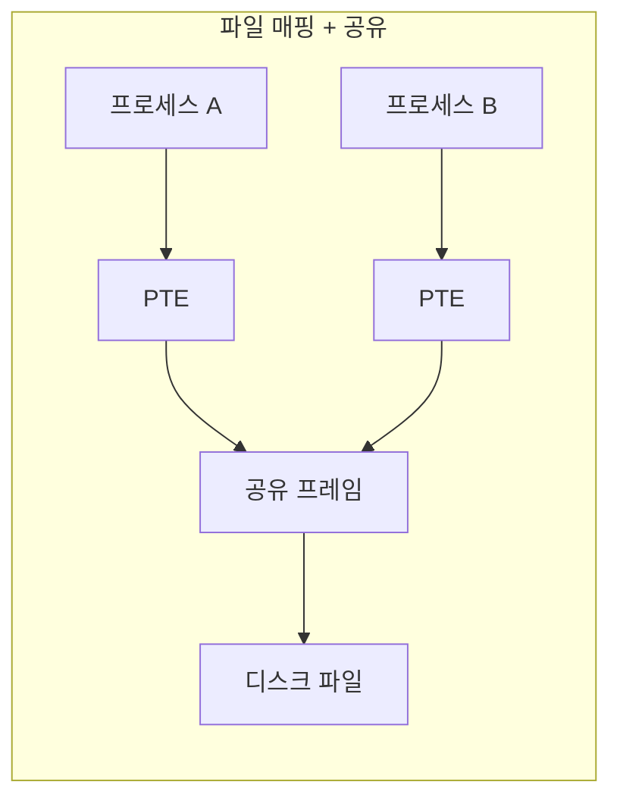
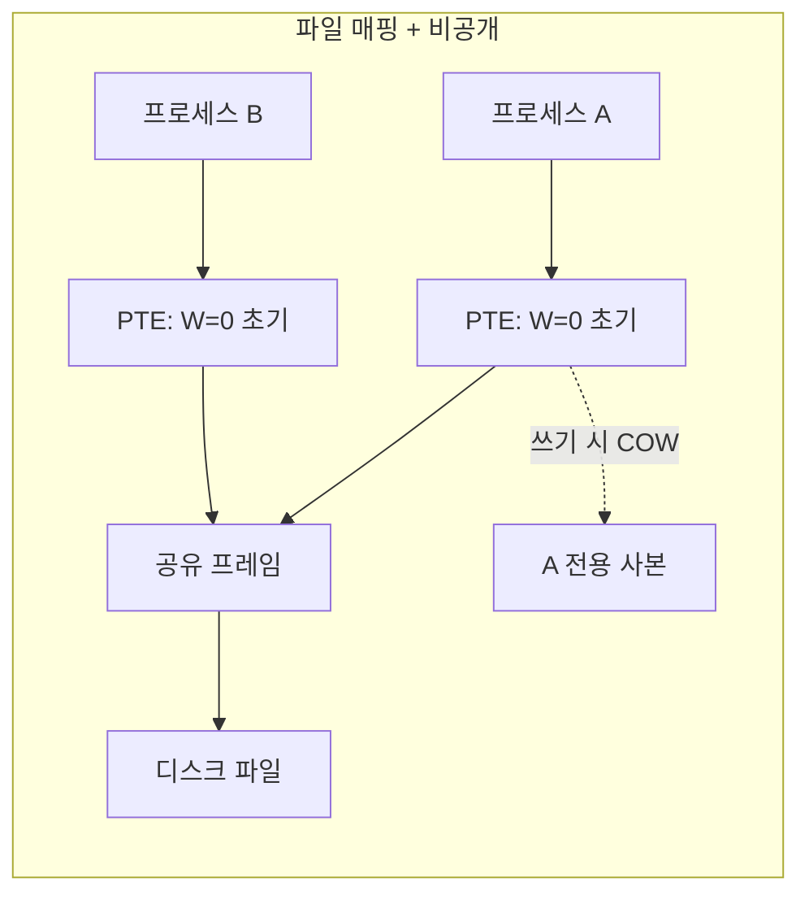
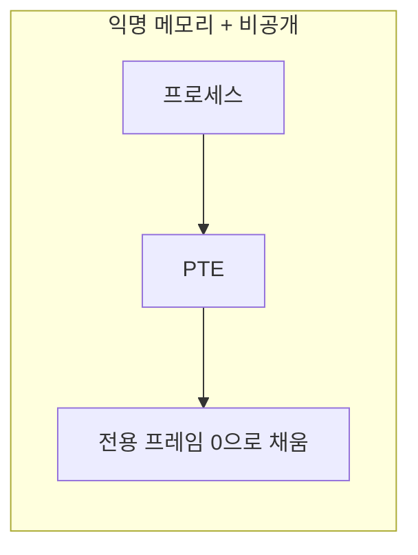
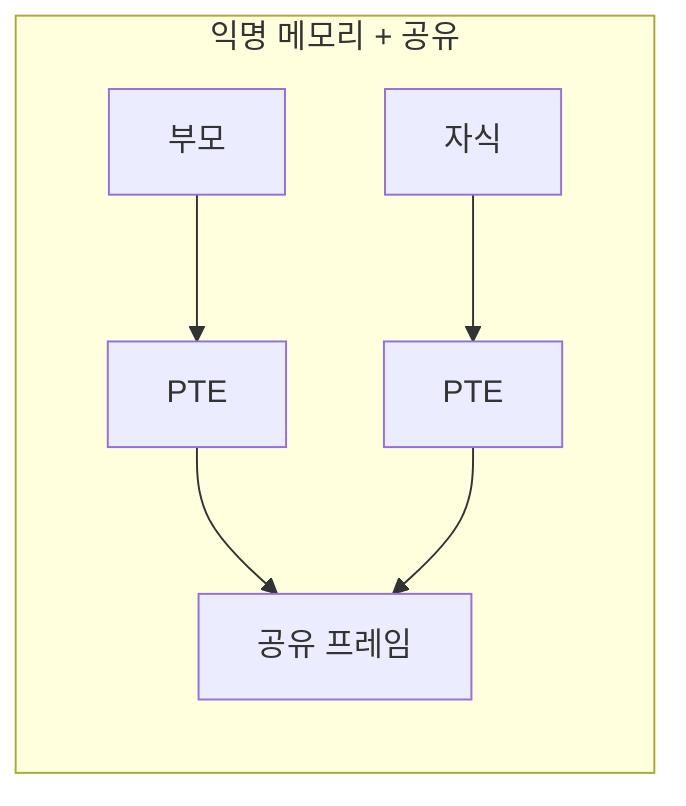

# mmap의 네 가지 매핑 조합

`mmap`은 파일이나 익명 메모리를 프로세스의 가상 주소 공간에 **매핑**하는 시스템 콜이다. `read`·`write`와 달리 커널-유저 사이의 데이터 복사가 없고, 프로세스는 매핑된 주소를 보통의 메모리처럼 접근한다. `mmap`의 의미는 두 축—**file-backed vs anonymous**와 **shared vs private**—의 네 가지 조합에 의해 결정된다.

## mmap의 시그니처

```c
void *mmap(void *addr, size_t length,
           int prot, int flags,
           int fd, off_t offset);
```

- `prot`: `PROT_READ | PROT_WRITE | PROT_EXEC` 등 접근 권한
- `flags`: 매핑의 종류를 결정하는 핵심 인자
- `fd`: 매핑할 파일 디스크립터 (익명 매핑이면 무시 또는 `-1`)
- `offset`: 파일에서 어디서부터 매핑할지(페이지 경계)

이 호출은 내부적으로 현재 프로세스의 `mm_struct`에 새 VMA 하나를 추가한다. 실제 페이지 테이블은 비어 있는 상태로 놓이고, 접근 시 페이지 폴트를 통해 페이지가 채워진다.

## 파일/익명, 공유/비공개 두 축

### File-backed vs Anonymous

```
 File-backed (MAP_FILE 또는 fd 지정):
   매핑이 디스크의 파일과 연결된다.
   매핑된 주소를 읽으면 파일 내용이 페이지 단위로 로드된다.

 Anonymous (MAP_ANONYMOUS + fd=-1):
   매핑이 어떤 파일과도 연결되지 않는다.
   처음 접근 시 0으로 채워진 새 프레임이 배정된다.
```

### Shared vs Private

```
 MAP_SHARED:
   매핑된 페이지에 대한 쓰기가 다른 프로세스(같은 매핑을 공유하는)
   에도 즉시 보이고, 파일에도 동기화된다.

 MAP_PRIVATE:
   매핑된 페이지에 대한 쓰기는 COW로 처리된다.
   쓰기가 일어나는 순간 그 프로세스만의 사본이 만들어지고,
   파일에는 반영되지 않는다.
```

## 네 가지 매핑 조합

| 조합 | 주 용도 | 쓰기 시 동작 |
| --- | --- | --- |
| **File-backed + Shared** (`MAP_SHARED`) | 파일을 메모리처럼 수정 / 프로세스 간 파일 공유 | 파일에 반영, 다른 프로세스에도 보임 |
| **File-backed + Private** (`MAP_PRIVATE`) | 실행 파일 로딩, 읽기 전용 데이터 매핑 | COW로 쓴 쪽만 사본 생성, 파일은 불변 |
| **Anonymous + Private** (`MAP_ANONYMOUS \| MAP_PRIVATE`) | `malloc`의 큰 할당 / 스레드 스택 | 일반 쓰기, 프로세스 전용 |
| **Anonymous + Shared** (`MAP_ANONYMOUS \| MAP_SHARED`) | 부모·자식 간 공유 메모리 | 공유된 모든 프로세스에 즉시 반영 |

## 조합별 동작 구조









## 조합별 실제 사용 사례

### File-backed + Private — 실행 파일 로딩의 기반

프로그램이 `execve`로 시작되면 커널은 ELF의 text·rodata·data 세그먼트를 **file-backed + private**으로 매핑한다. 읽기는 파일에서 바로 올라오고(major fault), 쓰기가 가능한 data 영역은 처음 쓸 때 COW로 분리되어 파일 원본은 변하지 않는다. 같은 실행 파일을 여러 번 실행하면 text 프레임들이 **물리적으로 공유**되므로 메모리 사용량이 줄어든다.

```c
// 커널 내부에서 개념적으로:
// LOAD 세그먼트 하나당 이런 식의 mmap과 동등
mmap(vaddr, size, PROT_READ|PROT_EXEC,
     MAP_PRIVATE | MAP_FIXED,
     elf_fd, file_offset);
```

### File-backed + Shared — 메모리로 파일 I/O

```c
int fd = open("data.bin", O_RDWR);
char *p = mmap(NULL, LEN, PROT_READ | PROT_WRITE,
               MAP_SHARED, fd, 0);
p[100] = 0xAB;   // 파일 오프셋 100 바이트가 0xAB로 바뀐다
msync(p, LEN, MS_SYNC);  // 디스크에 강제 동기화
munmap(p, LEN);
```

`write`·`read`를 계속 부르는 대신 **파일을 메모리처럼 다룬다**. 같은 파일을 `MAP_SHARED`로 매핑한 다른 프로세스는 같은 물리 프레임을 보므로, 한쪽의 쓰기가 즉시 보인다. 이 성질이 데이터베이스의 버퍼 풀, 로그 파일 공유 등에서 활용된다.

### Anonymous + Private — malloc의 일부

glibc의 `malloc`은 작은 요청에는 `brk`를 쓰지만, 큰 요청(기본적으로 128 KB 이상)에는 **anonymous + private** `mmap`을 쓴다.

```c
// malloc의 일부 경로
void *p = mmap(NULL, size, PROT_READ|PROT_WRITE,
               MAP_PRIVATE | MAP_ANONYMOUS, -1, 0);
```

이 매핑은 호출 즉시 0으로 채워진 가상 주소 공간을 제공한다. `free` 시점에 `munmap`으로 돌려줄 수 있기에 **큰 할당을 해제하면 그 주소 공간이 완전히 OS로 반환**된다. 힙의 `brk`로 받은 메모리는 반환이 쉽지 않은 것과 대비된다.

### Anonymous + Shared — fork 후 공유 메모리

부모 프로세스가 `fork` 전에 anonymous+shared로 매핑을 만들면, 그 영역은 자식에서도 **같은 물리 프레임**을 가리킨다. COW가 적용되지 않으므로 쓰기가 즉시 공유된다. 프로세스 간 공유 변수, 세마포어 등에 쓸 수 있다.

```c
int *counter = mmap(NULL, sizeof(int),
                    PROT_READ | PROT_WRITE,
                    MAP_SHARED | MAP_ANONYMOUS,
                    -1, 0);
if (fork() == 0) {
    // 자식
    (*counter)++;  // 부모가 즉시 본다
}
```

## PTE 동작 요약

| 조합 | 읽기 시 | 쓰기 시 |
| --- | --- | --- |
| File-backed + Shared | 필요 시 major fault로 파일에서 로드 | 그대로 쓰고, 주기적으로 디스크 동기화(dirty bit) |
| File-backed + Private | 필요 시 major fault로 파일에서 로드 | 첫 쓰기 때 COW (자기 사본 분리) |
| Anonymous + Private | 첫 접근 시 0-fill 프레임 배정 | 그 프레임에 그대로 쓰기 |
| Anonymous + Shared | 첫 접근 시 0-fill 공유 프레임 | 공유 프레임에 그대로 쓰기 |

네 경우 모두 **페이지 폴트를 통한 게으른 실현**을 쓴다. 유저는 매핑만 만들어 두고, 실제 프레임은 접근 시점에 붙는다.

## 정리

`mmap`은 "파일/익명"과 "공유/사적"의 두 축을 교차시켜 네 가지 의미를 만들어 낸다. 실행 파일 로딩도, `malloc`의 일부도, 프로세스 간 공유 메모리도, 데이터베이스의 파일 매핑도 모두 이 네 가지 조합 중 하나다. 시스템 콜 하나가 이렇게 넓은 스펙트럼의 작업을 감당할 수 있는 이유는, 네 조합 모두 결국 **VMA 등록 + 지연 매핑 + 적절한 권한**이라는 공통 기반 위에 서 있기 때문이다.
