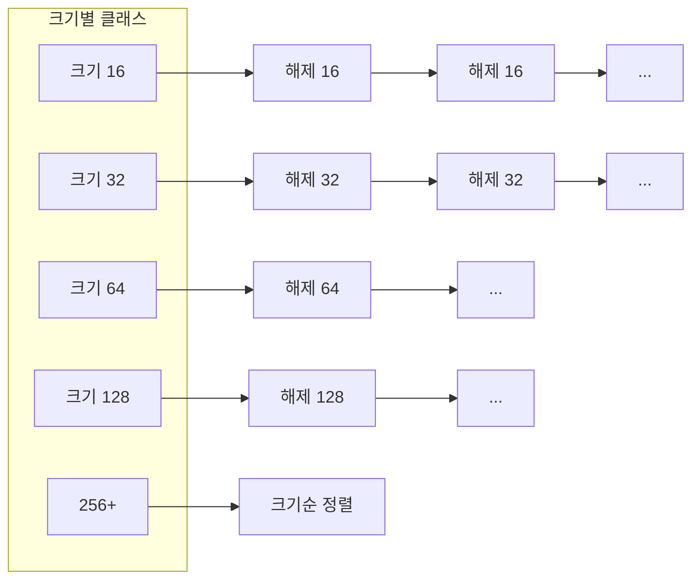

# Heap Allocator의 내부 구조

`malloc(32)`을 호출하면 32바이트짜리 연속 메모리의 시작 주소가 돌아온다. 그러나 할당기는 그 32바이트만을 관리하지 않는다. 각 덩어리 주위에 **헤더**와 정렬용 패딩을 덧붙이고, 덩어리들을 연결 리스트로 엮고, 경계에서 쪼개고 합치는 복잡한 내부 장치를 돌린다. 이 장치 전체를 **힙 할당기(Heap Allocator)** 라 한다. 할당기의 설계 선택이 프로그램의 메모리 사용량·속도·단편화를 결정한다.

## 힙 블록의 구조

할당기는 유저에게 줄 바이트 앞뒤에 자신의 사정을 기록한다.

```
   Block (할당 상태)
 ┌────────────┬──────────────────────────────────────┐
 │   Header   │         Payload (user data)          │
 │   4~8 B    │              N bytes                 │
 └────────────┴──────────────────────────────────────┘
       ↑
       malloc이 반환하는 포인터는 Header 바로 다음부터


   Block (해제 상태)
 ┌────────────┬──────────┬──────────┬──────────────┬──────────┐
 │   Header   │  prev*   │  next*   │ (빈 공간)    │  Footer  │
 └────────────┴──────────┴──────────┴──────────────┴──────────┘
       ↑                                                 ↑
  크기 + 상태 비트                          앞뒤 병합용 경계 태그
```

- **Header**: 이 블록의 **전체 크기**(payload + header)와 **할당 여부(alloc bit)** 를 담는다.
- **Payload**: `malloc` 사용자에게 반환되는 공간.
- **Free 블록의 prev/next**: free list에 엮기 위한 포인터. 할당된 블록에서는 이 자리가 payload로 덮인다.
- **Footer (boundary tag)**: 블록 끝에도 같은 크기/상태를 저장해, **앞뒤 블록과 병합** 할 때 상수 시간에 이웃을 알아보게 한다.

## 하위 3비트에 크기와 플래그를 함께 담는 방법

블록의 크기는 항상 8바이트(혹은 16바이트)의 배수여야 한다. 이는 포인터 정렬 요구(double, 구조체의 자연 정렬) 때문이다. 크기를 8의 배수로 강제하면 **그 값의 하위 3비트는 언제나 0**이다. 이 "버려지는 3비트"를 상태 플래그로 재활용한다.

```
   Header (8 bytes, little-endian 가정)

   63                           3 │  2  │  1  │  0  │
   ┌─────────────────────────────┬─────┬─────┬─────┐
   │    Block Size (8-aligned)   │  P  │  ?  │  A  │
   └─────────────────────────────┴─────┴─────┴─────┘

     A (bit 0): Allocated (1) / Free (0)
     ? (bit 1): 구현마다 다름 (mmap 영역인지 등)
     P (bit 2): Previous block Allocated (경계 합침 플래그)
```

한 워드로 **크기 + 상태 + 이전 블록 상태**가 모두 저장된다. 포인터를 쓸 때는 마스크로 하위 비트를 지워 실제 크기만 뽑는다 (`size = header & ~0x7`).

## Free List: 해제된 블록의 관리

`free`된 블록들을 연결해 둬야 다음 `malloc` 때 빠르게 찾을 수 있다. 이 연결 방식이 할당기의 성격을 결정한다.

### Implicit Free List

모든 블록을 선형 순회. Free 블록 자체의 위치는 메타데이터로만 구분한다.

```
 [alloc 32] [free 48] [alloc 16] [free 64] [alloc 24] ...
                순회 시간 O(블록 총 수)
```

간단하지만 많은 블록이 있으면 매 `malloc`마다 선형 탐색이다. 실제 시스템에서는 거의 쓰이지 않고 교과서 수준.

### Explicit Free List

Free 블록만 이중 연결 리스트로 엮는다. 할당된 블록은 리스트에 없다.


탐색 시간이 **free 블록 수에 비례**하므로 훨씬 빠르다. 포인터는 free 블록의 payload 공간에 숨겨진다.

### Segregated Free List (Segregated Fit)

크기별로 **여러 free list**를 나눠 관리한다. 요청이 오면 그 크기 클래스의 리스트에서만 찾는다.



작은 요청은 **상수 시간**에 가까운 속도로 찾는다. glibc의 `ptmalloc`, Google의 `tcmalloc`, jemalloc 등 실제 할당기 대부분이 이 구조를 기본으로 한다.

## Placement Policy: 블록 선택 전략

free 리스트에서 요청 크기를 만족하는 블록을 고르는 방식이다.

- **First Fit**: 처음 만나는 "들어가는" 블록을 쓴다. 빠르지만 리스트 앞쪽에 작은 파편이 쌓이기 쉽다.
- **Next Fit**: 직전에 썼던 위치에서 탐색을 이어간다. First Fit의 편향을 피한다.
- **Best Fit**: 전체에서 **가장 작은 적합 블록**을 고른다. 외부 단편화가 줄지만 리스트를 끝까지 훑어야 한다.

segregated list의 "해당 클래스에서 아무거나"는 사실상 best-fit 근사를 상수 시간에 달성한다. 그래서 현대 할당기는 대개 **segregated + first-fit within class** 조합을 쓴다.

## Split과 Coalesce

할당기의 두 핵심 연산이다.

### Split

free 블록이 요청 크기보다 크면, 앞쪽만 떼어 주고 **나머지를 새 free 블록으로** 만든다.

```
 Before:  [free 96]
 Request: 32

 After:   [alloc 32] [free 64]
```

분할 결과의 자투리가 너무 작으면(헤더+푸터 공간도 안 남으면) 분할하지 않고 그대로 할당한다.

### Coalesce

`free` 호출 시 방금 해제된 블록의 **앞뒤 이웃이 free**라면 하나로 합친다. 외부 단편화를 줄이는 핵심 기능.

```
 Before:  [free 32] [alloc→free 48] [free 64]
                          ↑ 방금 free

 After:   [free 144]
```

Footer(boundary tag)가 있으면 현재 블록의 시작에서 헤더 크기를 빼서 이전 블록의 끝(= 이전 푸터)을 바로 읽을 수 있다. 이전 블록의 상태와 크기를 **상수 시간**에 알 수 있기에 병합이 효율적이다.

## Fragmentation: 내부 단편화와 외부 단편화

단편화는 두 종류다.

### Internal Fragmentation

블록 내부에 **사용되지 않는 바이트**가 있는 경우. 정렬과 최소 블록 크기 때문에 생긴다.

```
   malloc(17) 요청
   실제 블록: [header 8][payload 24][...]
                 ↑ 17바이트 요청 + 7바이트 패딩 = 내부 단편화
```

작은 할당을 많이 할수록, 정렬 요구가 클수록 내부 단편화가 커진다.

### External Fragmentation

free 블록의 **총 바이트는 충분하지만**, **연속된 단일 블록**으로는 요청을 못 맞추는 상태.

```
 [alloc 32] [free 16] [alloc 32] [free 16] [alloc 32]
    총 free 32 바이트가 있지만, 24바이트 요청을 줄 수 없다
```

외부 단편화는 coalesce로 완화되지만 완전히 없앨 수는 없다. 긴 수명의 할당이 짧은 수명의 블록 중간에 박혀 있으면 경계를 넘어 병합할 방법이 없기 때문이다.

## 할당기의 성능 지표

- **처리량(Throughput)**: 단위 시간당 `malloc`/`free` 호출 수.
- **메모리 이용도(Memory Utilization)**: 유저가 실제로 쓰는 바이트 / 할당기가 OS로부터 받은 바이트.

두 지표는 자주 상충한다. 공간을 아끼기 위해 best-fit으로 일일이 탐색하면 처리량이 떨어지고, 처리량을 위해 큰 여유를 미리 확보하면 이용도가 떨어진다. 할당기 설계의 대부분이 **이 트레이드오프의 위치 조정**이다.

## 실전 할당기의 고급 기법

- **Thread-local caching**: 스레드마다 작은 free list를 가진다. 잠금 없이 쓸 수 있어 멀티스레드 성능 ↑ (`tcmalloc`, `jemalloc`).
- **Arena 분할**: 여러 `malloc` 풀을 두고 스레드마다 다른 arena를 쓴다 (glibc `ptmalloc`).
- **큰 할당은 mmap**: 일정 크기 이상은 개별 VMA로 받아 `free` 시 `munmap`.
- **Slab allocator**: 같은 크기의 객체만 빠르게 할당. 리눅스 커널이 `kmem_cache`로 쓰는 방식.

## 정리

힙 할당기는 "메모리를 준다"는 단순한 일을 위해, 블록 메타데이터·free 리스트·split/coalesce·배치 정책·단편화 관리라는 여러 층의 장치를 유지한다. 사용자에게 반환되는 포인터 뒤에는 이 모든 구조가 숨어 있다. **할당기의 성능은 처리량과 메모리 이용도의 균형** 이며, 그 균형은 free list의 조직, 배치 정책, 크기 클래스의 선택으로 조율된다. 할당기의 내부를 알게 되면, "왜 내 프로그램의 RSS가 생각보다 크지", "왜 free 해도 메모리가 OS로 안 돌아가지" 같은 질문이 설명된다.
