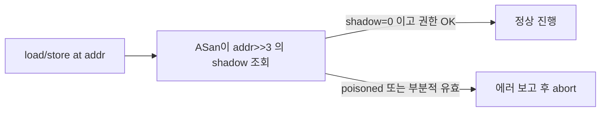

# 메모리 버그의 근본 원인: 포인터의 메타데이터 부재

C와 C++은 메모리를 다루는 데 강력한 자유를 주는 만큼, 그 자유가 깨지는 순간 프로그램이 침묵하거나 거짓말을 한다. "Segmentation fault"부터 "왜 이 값이 이상하게 바뀌었지?"까지의 모든 메모리 버그는 결국 한 문장으로 귀결된다. **C의 포인터는 자기가 가리키는 대상에 대해 아무것도 모른다.** 이 무지가 있기에 할당기·컴파일러·운영체제는 버그를 사전에 막을 방법이 없다.

## 포인터가 모르는 것들

C의 포인터는 기계어 수준에서 **64비트 정수** 하나다. 이 값은 다음 중 어느 것도 **내재적으로** 담고 있지 않다.

- 가리키는 블록의 **크기**는 얼마인가
- 가리키는 블록이 **여전히 유효**한가 (이미 free된 것은 아닌가)
- 가리키는 바이트가 **초기화**되었는가
- 그 위치에 **어떤 타입**이 놓여 있는가

자바스크립트의 객체 핸들이나 러스트의 `Box<T>`에는 이 정보의 일부가 실린다. C는 그러지 않는다. 포인터는 그냥 숫자다. 런타임에 그 숫자를 역참조하는 순간, 그 주소의 바이트를 "요청한 타입의 값"으로 해석한다. 거기 있는 것이 당신이 저장한 값인지, 다른 무언가가 덮어쓴 값인지, 해제된 블록의 잔해인지—컴파일된 코드는 구분할 수 없다.

이 구조적 사실이 메모리 버그의 모든 얼굴이다.

## 일곱 가지 얼굴

### 1. Out-of-Bounds (OOB)

배열이나 버퍼의 경계를 넘는 접근.

```c
int arr[10];
arr[10] = 0;   // 인덱스 0..9만 유효
```

컴파일러는 대부분 경고도 주지 않는다. 런타임에도 메모리는 그냥 그 주소에 쓰기를 허용하고, **우연히 그 자리에 있던 다른 변수가 덮어써진다.** 그 변수가 언제 이상해지는지는 실행 패턴마다 달라, 버그가 재현되지 않는 것처럼 보인다.

### 2. Use-After-Free (UAF)

이미 `free`된 블록에 계속 접근.

```c
char *p = malloc(16);
free(p);
printf("%s\n", p);   // 이 블록은 이미 free list에 들어갔을 수 있다
```

할당기는 free 블록의 payload 자리에 free list 포인터를 저장한다. 따라서 free된 블록을 읽으면 그 자리에 있던 **할당기의 내부 메타데이터**를 읽게 된다. 운이 좋으면 segfault로 죽고, 나쁘면 이상한 문자열이 출력된 뒤 한참 뒤에 크래시가 난다. 심지어 그 블록이 즉시 다른 `malloc` 호출에게 재할당되면, 두 포인터가 같은 메모리를 공유하게 되어 **예측 불가능한 상호 파괴**가 시작된다.

### 3. Double Free

한 블록을 두 번 해제.

```c
free(p);
free(p);   // p가 여전히 같은 주소를 가리키고 있으면
```

할당기는 두 번째 `free`가 무효임을 모를 수 있다. free list의 같은 노드를 두 번 집어넣게 되어 **리스트 자체가 사이클**을 가진 상태가 된다. 다음 `malloc`이 이상하게 작동하거나, free list 순회가 무한 루프에 빠진다.

### 4. Memory Leak

`free`를 잊어 블록이 영원히 할당된 채 남는 상태.

```c
while (1) {
    void *p = malloc(1024);
    // free(p) 빠짐
}
```

당장은 죽지 않고, 시간이 지나 RSS가 부풀어 오르다가 결국 OOM killer에 의해 종료된다. 장기 실행 서버에서 가장 은밀한 버그.

### 5. Dangling Pointer

가리키는 대상이 이미 사라진 포인터.

```c
char *p;
{
    char local[16];
    p = local;
}
// p는 이제 사라진 스택 프레임을 가리킨다
```

스택 프레임이 되감기거나 블록이 `free`된 직후에도 포인터 자체는 여전히 같은 값을 가지고 있다. 그것을 역참조하면 UAF의 친척이 된다.

### 6. Uninitialized Read

`malloc`으로 받은 메모리나 지역 변수를 초기화 없이 읽기.

```c
int x;
if (x > 0) { ... }   // x는 이전 스택 프레임의 잔해를 담고 있을 수 있다
```

`malloc`이 반환하는 바이트는 이전 소유자가 쓴 잔해 그대로다(`calloc`이 아니라면). 유효한 메모리이기에 프로그램은 크래시 없이 계속 실행되지만, 결과는 실행마다 다르고 재현되지 않는다.

### 7. Stack Overflow

스택이 자신의 VMA 끝을 넘어서 자라는 상태.

```c
void recurse(void) { recurse(); }   // 무한 재귀
int huge[1 * 1024 * 1024];          // 지역 배열로 4 MB 잡기
```

리눅스는 스택 VMA 바로 아래에 **가드 페이지**를 두어 스택 넘침을 페이지 폴트로 잡아낸다. 하지만 한 프레임이 한 번에 여러 페이지를 뛰어넘을 정도로 크면 가드를 건너뛰어 다른 VMA를 침범할 수 있다.

## 모든 버그의 공통 분모

일곱 가지 얼굴을 한 발짝 떨어져 보면, 원인은 셋 중 하나의 조합이다.

- **경계를 모른다**: 포인터가 자기 블록의 크기를 몰라서 OOB·stack overflow가 가능.
- **수명을 모른다**: 포인터가 자기 대상의 생사를 몰라서 UAF·double free·dangling pointer가 가능.
- **내용을 모른다**: 포인터가 자기 대상의 초기화 여부를 몰라서 uninitialized read가 가능.

컴파일러·할당기·OS는 이 세 가지 정보 모두를 각자의 장부에 가지고 있다. 그러나 그 장부는 **포인터 자체와 연결되어 있지 않다**. 포인터는 여전히 단지 숫자이고, 역참조는 그 숫자가 가리키는 바이트를 읽거나 쓸 뿐이다.

## 도구가 개입하는 지점

이 구조적 한계를 우회하기 위해, 외부 도구는 포인터가 없는 메타데이터를 따로 관리한다.

### AddressSanitizer (ASan) — Shadow Memory

ASan은 컴파일 타임에 모든 메모리 접근 앞뒤로 **섀도우 메모리** 검사 코드를 삽입한다. 섀도우 메모리는 실제 메모리 8바이트당 1바이트를 가지며, 이 1바이트가 **"이 8바이트 중 어디까지 유효한가"** 를 표현한다.

```
 실제 주소 공간  :  [ payload 8B ] [ payload 8B ] [ payload 8B ]
 섀도우 메모리   :  [ 1 byte ]     [ 1 byte ]     [ 1 byte ]

 섀도우 값:  0   → 8바이트 모두 유효
             k   → 앞쪽 k바이트만 유효 (k=1..7)
             -1  → 이 영역은 free 되었음(poisoned)
```

`malloc` 시 ASan은 블록 전후에 **레드존(redzone)** 을 만들고 그 자리의 섀도우를 poisoned로 표시한다. 경계를 넘어서는 접근이 있으면 섀도우 조회에서 걸려 즉시 보고된다. `free` 시 블록 전체의 섀도우를 poisoned로 바꿔 UAF도 잡는다.



ASan이 있으면 버그가 **나자마자** 보고된다. 런타임 오버헤드는 2~3배 수준.

### Valgrind — 해석 실행

Valgrind의 Memcheck는 프로그램을 VM 위에서 실행하며 모든 메모리 접근을 추적한다. 컴파일 재빌드 없이도 쓸 수 있지만, 속도가 10~30배 느려진다.

### Guard Page, MALLOC_PERTURB_

glibc의 일부 디버그 기능은 `free` 시 바이트를 특정 패턴으로 채워 UAF가 읽을 때 눈에 띄게 한다.

## 정리

C의 메모리 버그는 프로그래머의 개인적 부주의가 아니라 언어 설계의 **구조적 선택**이 만들어낸 결과다. 포인터가 메타데이터를 들고 다니지 않는 한, 경계·수명·초기화는 언제나 프로그래머의 머릿속에서만 추적된다. ASan·Valgrind 같은 도구는 포인터 바깥에 그 정보를 외주로 두어 버그를 잡지만, 언어 수준에서 이 문제를 근본적으로 푸는 쪽은 Rust나 관리형 런타임처럼 **포인터에 의미를 되돌려 주는** 설계다. C로 짜는 한 이 한계는 상수이며, 할당기와 도구와 규율로 보완할 수밖에 없는 조건이다.
