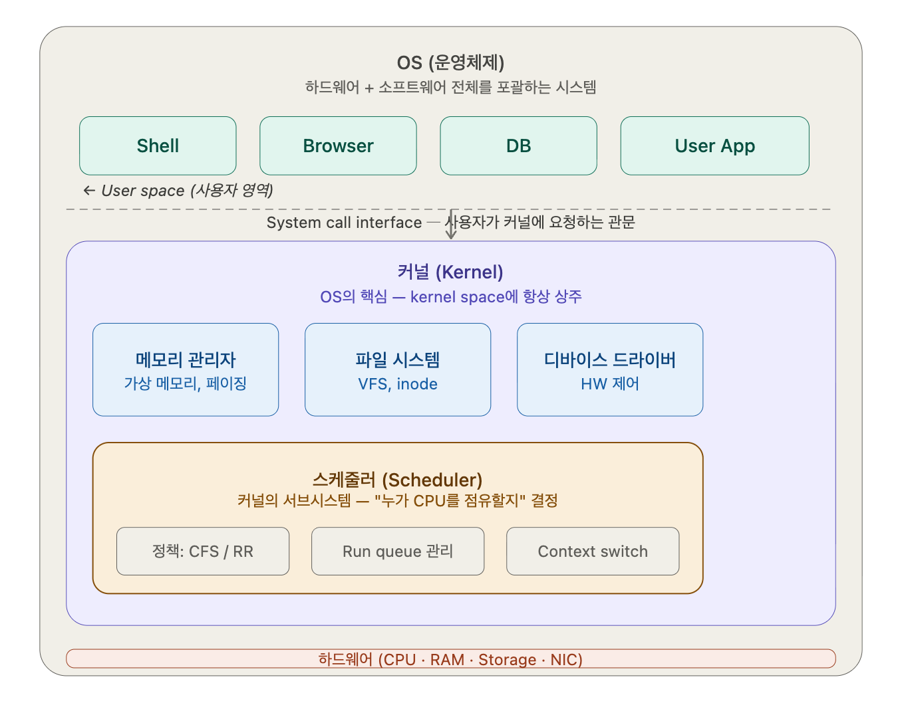

# 발표 3. Process, Kernel, Mapping, 메모리 획득 경로

## 이 발표의 역할

이 파트는 앞선 두 발표의 paging 메커니즘을 실제 OS 실행 모델 위에 올려놓는 역할이다.
즉 프로세스와 커널이 어떤 관계인지, 커널은 언제 개입하는지, 프로그램은 어떤 경로로 메모리를 받는지를 설명한다.

## 한 줄 흐름

`OS / kernel / process / thread` -> `kernel mode entry` -> `process별 page table` -> `global variable의 경로` -> `mmap` -> `sbrk vs mmap`

## 담당 질문 순서

1. [Q17. OS·커널·스케줄러·프로세스·스레드 한번에 정리](../q17-os-kernel-process-thread.md)
   전체 실행 주체를 먼저 정리한다. 이 질문이 있어야 Q18과 Q12의 설명이 흔들리지 않는다.

2. [Q18. 커널 모드 진입 경로 3가지와 커널 스레드](../q18-kernel-mode-entry.md)
   커널이 언제 사용자 코드 흐름에 개입하는지 설명한다. syscall, interrupt, exception이 모두 메모리 관리와 연결된다.

3. [Q12. CR3·프로세스별 페이지 테이블·물리 페이지 공유](../q12-cr3-page-sharing.md)
   각 프로세스가 자기 page table을 가진다는 사실과, 그런데도 물리 page는 공유될 수 있다는 점을 정리한다.

4. [Q6. 전역 변수의 일생 — 소스 → 디스크 → 가상공간 → 물리프레임](../q06-global-variable-lifecycle.md)
   메모리 개념을 실제 프로그램 객체 하나에 적용하는 질문이다. 컴파일러, 링커, 로더, 커널, MMU가 한 번에 연결된다.

5. [Q15. mmap — file-backed vs anonymous, shared vs private](../q15-mmap.md)
   프로그램이 메모리를 받는 또 하나의 핵심 경로를 설명한다. 파일과 메모리의 경계가 흐려지는 지점이다.

6. [Q16. sbrk vs mmap — malloc이 두 경로를 쓰는 이유](../q16-sbrk-vs-mmap.md)
   사용자 공간 allocator가 결국 어떤 커널 인터페이스를 통해 heap을 확장하는지 설명하면서 다음 발표로 넘긴다.

## 발표 마무리 문장

이 발표가 끝나면 청중은 "메모리 관리가 단지 MMU 이야기만이 아니라, 프로세스 구조와 커널 진입, 파일 매핑, allocator의 시스템 호출 경로까지 포함하는 시스템 전반의 이야기"라는 점을 이해하게 된다.
다음 발표는 그 위에서 사용자 공간 allocator 내부와 메모리 버그를 설명하면 된다.

## 학습 정리

### OS, 커널, 스케줄러 계층 정리

- OS: 커널 + shell + GUI + 시스템 라이브러리 (glibc 등) + 유틸리티 프로그램까지 포함
- 커널: OS의 코어 엔진, 항상 메모리의 상주
  - 프로세스 관리: 생성/종료, PCB 유지
  - 메모리 관리: 페이지 테이블, 가상 -> 물리 메모리 매핑
  - 파일 시스템: VFS, inode, 디스크 I/O
  - 디바이스 관리: 드라이버를 통한 HW 제어
- 스케줄러: 커널 안의 서브 시스템 중 하나
  - 정책(Policy): Linux 기본은 CFS(Completely Fair Scheduler) 프로세스마다 vruntime을 추적해 가장 덜 실행 된 것을 선택
  - Run Queue 관리: READY 상태인 프로세스 / 스레드 목록을 유지
  - Context Switch 실행: 스케줄러가 다음 실행 스레드를 결정하면 커널이 현재 프로세스의 레지스터・PC를 PCB에 저장하고 실행 스레드의 상태를 복원

### 프로세스의 스레드들의 Shared Area, Private Area

하나의 프로세스의 스레드들은 해당 프로세스의 가상 메모리를 공유하면서 사용한다.

- Shared Area: 코드 세그먼트, 데이터 세그먼트, 힙, Open file/Resource
- Private Area: 스택 영역, 레지스터 세트, 프로그램 카운터

### sbrk() vs mmap()

- sbrk()는 힙의 마지막 포인터를 늘려 메모리를 확보하는 방식
- mmap()은 독립적인 가상 메모리 영역을 새로 확보하여 매핑하는 방식
  - 익명 매핑 (malloc)
    - malloc에서 큰 메모리를 요청하면, OS는 힙영역이 아닌 'Memory Mapping Segment'라는 빈공간에 적당한 가상 메모리 주소를 찾는다.
    - 해당 공간을 zerofill을 진행해 초기화 해준다.
    - 페이지 테이블을 업데이트 한다.
  - 파일 매핑
    - 파일 내용을 메모리로 직접 불러와서 변수를 읽고 쓰듯이 파일을 다룰 수 있게하는 기능
    - 하드디스크의 특정 파일을 프로세스의 가상 메모리 주소와 다이렉트로 연결
    - read(), write() 같은 함수를 호출해서 디스크를 들락날락할 필요 없이, 메모리 주소에 값을 쓰면 OS가 알아서 dirty bit를 읽고 파일 변경 사항을 저장한다.

- mmap()의 장점: sbrk()에서 발생하는 외부 단편화 문제를 줄일 수 있다.
  - 파일 처리
    - read(), write() 일반 동작
      1. 파일 처리 함수 호출
      2. 파일을 가져와 커널 버퍼에 저장 (복사1)
      3. 요청한 내용을 프로세스 메모리, UserSpace로 복사 (복사2)
    - mmap()
      1. mmap() 함수 호출
      2. 가상 주소 공간에 특정 크기만큼 예약
      3. OS 커널 내부 자료구조에 메타데이터 저장
      4. 메모리 최초 접근시 Page fault 발생
      5. OS 커널이 mmap으로 연결된 합당한 주소인지 체크
      6. 커널은 디스크에서 해당파일의 블록을 읽어와 물리 메모리 영역인 페이지 캐시에 적재
      7. 프로세스의 페이지 테이블 Update
      8. 프로세스는 커널의 개입이나 시스템콜 없이 물리메모리에 직접 읽고 쓰기
