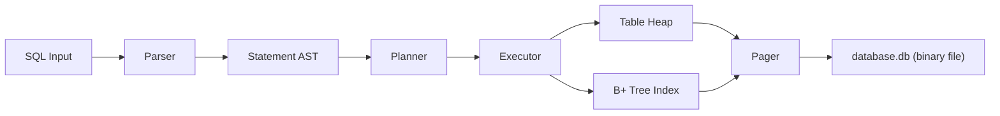

# 디스크 기반 SQL + B+ 트리 구현 계획

## 1. 이 과제의 본질

이번 과제의 본질은 단순한 메모리 자료구조 구현이 아니다.
핵심은 `SQL 입력 -> 실행 계획 -> 디스크 저장 구조 -> 인덱스 활용` 흐름이
이어지는 작은 DB 엔진을 만드는 것이다.

추가로 이번 주 구현은 아래 전제를 가진다.

- 저장 엔진(pager, heap, B+ tree)은 처음부터 새로 만든다.
- parser는 6주차 구조를 참고하되, 이번 과제에 필요한 최소 문법으로 간소화한다.
  parser는 이번 과제의 핵심이 아니라 저장 엔진이 핵심이므로,
  parser에 시간을 과도하게 쓰지 않는다.
- parser / planner / executor / pager / heap / B+ tree
  경계를 명확히 드러내는 것을 우선한다.
- 팀 분업이 아니라, 1인 또는 전원이 같은 프롬프트로 전체를 함께 만든다.
  목표는 "분업으로 빠르게 완성"이 아니라 "전 과정을 이해하며 구현"이다.

따라서 이번 구현의 중심은 아래 두 가지다.

1. `바이너리 파일`에 테이블과 인덱스를 저장하고 다시 불러올 수 있어야 한다.
2. `WHERE id = ?` 일 때 `B+` 트리를 통해 디스크 페이지 수를 줄여야 한다.

즉, 이번 주 결과물은 "메모리에서만 동작하는 B+ 트리 데모"가 아니라
"디스크에 저장되는 SQL 엔진의 최소 구현"이어야 한다.

## 2. 이번 주 최종 목표

### 반드시 보여줘야 할 것

- `.db` 바이너리 파일 생성
- 프로그램 재시작 후 기존 데이터 load
- `INSERT` 시 자동 증가 `id` 부여
- row를 디스크 page에 저장
- `id -> row 위치` 를 `B+` 트리에 저장
- `SELECT ... WHERE id = ?` 는 인덱스 사용
- `SELECT ... WHERE name = ?` 같은 다른 필드는 테이블 스캔
- `DELETE` 후 tombstone, free slot, free page 재사용
- `EXPLAIN`, `.btree`, `.pages` 로 내부 구조 설명
- 1,000,000건 이상 insert 후 성능 비교

### 발표에서 보여주면 좋은 장면

1. 빈 파일 생성
2. 몇 건 insert
3. 프로그램 종료
4. 다시 실행해서 같은 데이터 select
5. `WHERE id = ?` 와 `WHERE other_field = ?` 성능 차이 비교

이 흐름이 있어야 "SQL 엔진 + 디스크 기반 인덱스" 구현이라는 메시지가 선다.

## 3. 범위 정의

### 이번 주에 구현할 범위

- 단일 `.db` 파일 기반 저장소
- 고정 크기 page 기반 pager
- 고정 길이 row + slotted heap page
- 단일 테이블 중심 구현
- `INSERT`
- `SELECT`
- `DELETE`
- `EXPLAIN`
- `WHERE id = value`
- `WHERE non_id_field = value`
- `id` 단일 인덱스용 `B+` 트리
- `B+` 트리 search / insert / split / delete / merge
- 파일 열기 / 파일 생성 / 파일 메타데이터 load
- dirty page flush
- free slot / free page 재사용
- `DB` 전역 `RW lock`
- `.btree`, `.pages`, `.stats`

### 이번 주에는 제외할 범위

- 트랜잭션
- crash recovery
- WAL
- `UPDATE`
- 다중 인덱스
- multi-table 일반화
- 가변 길이 row
- cost-based SQL optimizer 일반화
- page-level latch coupling
- `VACUUM` 실제 구현

핵심은
`디스크 저장 + SQL 경계 유지 + id 인덱스 적용 + 삭제/재사용 경로 설명 가능`
이다.

## 4. 최소 스펙이지만 SQL답게 설계하는 기준

최소 스펙으로 가더라도 아래 구조는 유지해야 한다.



### 이 구조를 유지해야 하는 이유

- parser는 문장을 해석한다.
- planner는 인덱스를 탈지 결정한다.
- executor는 table/index/pager를 호출한다.
- pager는 메모리가 아니라 디스크 page를 다룬다.

이렇게 해야 지금은 `id` 인덱스 하나만 구현하더라도,
나중에 `WHERE age = ?` 나 range scan을 추가할 수 있다.

## 5. 핵심 설계 결정

### 결정 1. 저장소는 메모리 덩어리가 아니라 디스크 page 단위다

- 모든 읽기/쓰기는 `PAGE_SIZE` 기준으로 일어난다.
- page 크기는 OS page size를 `sysconf(_SC_PAGESIZE)`로 읽어 결정한다 (보통 4096B).
- row page와 index node page를 같은 파일 안에 저장한다.

### 결정 2. row와 index를 분리한다

- row 전체는 heap page에 저장한다.
- B+ 트리 leaf에는 row 전체를 넣지 않고 `row_ref` 만 넣는다.

이유:

- 인덱스 페이지 fan-out이 커진다.
- 테이블 스캔과 인덱스 조회 역할이 분리된다.
- SQL 엔진 구조가 더 자연스럽다.

### 결정 3. row 포인터 대신 디스크 위치를 저장한다

```c
typedef struct {
    uint32_t page_id;
    uint16_t slot_id;
} row_ref_t;
```

이 구조가 중요한 이유:

- 프로그램을 재실행해도 유효하다.
- 포인터를 파일에 저장하는 실수를 피할 수 있다.
- B+ 트리와 heap table을 느슨하게 결합할 수 있다.

### 결정 4. heap은 slotted page + tombstone 방식으로 간다

- row는 heap page에 저장한다.
- page 안에는 slot directory를 둔다.
- `DELETE` 는 row를 즉시 재배치하지 않고 slot 상태만 `DEAD` 로 바꾼다.
- 이후 insert는 free slot을 우선 재사용한다.

이 선택이 중요한 이유:

- row 이동 없이 삭제를 처리할 수 있다.
- `row_ref(page_id, slot_id)` 안정성을 유지하기 쉽다.
- 메모리 친화성과 공간 재사용을 함께 다룰 수 있다.

### 결정 5. 삭제와 파일 압축은 분리한다

- `DELETE` 시 파일 전체를 다시 정렬하지 않는다.
- 대신 tombstone, free slot, free page list로 재사용을 관리한다.
- 파일 전체 재배치는 나중의 `VACUUM` 개념으로 분리한다.

이유:

- row 이동은 인덱스 정합성을 깨뜨리기 쉽다.
- delete path에 compaction까지 넣으면 구현 난이도와 오류 위험이 크게 오른다.
- 실제 DBMS도 삭제 즉시 파일 전체를 재정렬하지 않는 경우가 많다.

## 6. 바이너리 파일 구조

권장 파일 이름 예:

- `test.db`
- `benchmark.db`

권장 파일 구조:

```text
page 0   : database header page
page 1   : first heap page
page 2+  : heap page 또는 index node page
```

더 구체적으로는 아래 구성이 좋다.

```text
page 0   : DB header
page 1   : heap root / first heap page
page 2   : B+ tree root page
page 3+  : 추가 heap/index/free pages
```

### 6.1 DB header page

header page에는 최소한 아래 정보가 필요하다.

```c
typedef struct {
    char magic[8];
    uint32_t version;
    uint32_t page_size;
    uint32_t root_index_page_id;
    uint32_t first_heap_page_id;
    uint32_t next_page_id;
    uint32_t free_page_head;
    uint64_t next_id;
    uint64_t row_count;
} db_header_t;
```

이 헤더가 있어야 다음이 가능하다.

- 기존 DB 파일인지 검증
- 프로그램 시작 시 루트 페이지 찾기
- 마지막 heap page 찾기
- auto increment `id` 복구
- 총 row 수 확인

### 6.2 Heap page

이번 프로젝트의 권장 heap page는 slotted page 구조다.
fixed-length row를 쓰되, 삭제와 재사용을 위해 slot directory를 둔다.

```c
typedef struct {
    uint32_t page_type;
    uint16_t slot_count;
    uint16_t free_slot_count;
    uint16_t free_space_offset;
    uint16_t reserved;
} heap_page_header_t;

typedef struct {
    uint16_t offset;
    uint16_t length;
    uint16_t status;
    uint16_t reserved;
} slot_t;
```

배치 예:

```text
[heap_header][slot0][slot1][slot2]...[free space]...[row payloads]
```

이 방식의 장점:

- `slot_id` 기반 `row_ref` 를 유지할 수 있다.
- tombstone과 free slot 재사용을 지원할 수 있다.
- row payload를 즉시 재배치하지 않아도 된다.

### 6.3 B+ tree leaf page

leaf는 key와 row 위치를 가진다.

```c
typedef struct {
    uint64_t key;
    row_ref_t row_ref;
} leaf_entry_t;
```

권장 leaf header:

```c
typedef struct {
    uint32_t page_type;
    uint32_t is_root;
    uint32_t parent_page_id;
    uint32_t key_count;
    uint32_t next_leaf_page_id;
} leaf_page_header_t;
```

배치 예:

```text
[leaf_header][entry0][entry1][entry2]...[entryN]
```

### 6.4 B+ tree internal page

internal node는 separator key와 child page id를 가진다.

```c
typedef struct {
    uint64_t key;
    uint32_t right_child_page_id;
} internal_key_t;
```

internal node는 보통 아래 개념으로 저장한다.

```text
[internal_header][leftmost_child][key1,right_child1][key2,right_child2]...
```

권장 internal header:

```c
typedef struct {
    uint32_t page_type;
    uint32_t is_root;
    uint32_t parent_page_id;
    uint32_t key_count;
    uint32_t leftmost_child_page_id;
} internal_page_header_t;
```

## 7. SQL 관점에서의 핵심 개념

이번 문서에서 가장 중요한 질문은 이것이다.

`WHERE id = ?` 라는 SQL 조건이 어떻게 디스크 인덱스 조회로 바뀌는가?

답은 아래 흐름이다.

1. parser가 `SELECT ... WHERE id = 123` 을 파싱한다.
2. statement는 `predicate_kind = ID_EQ` 를 가진다.
3. planner는 `ID_EQ` 면 `INDEX_LOOKUP` plan을 만든다.
4. executor는 `bptree_search(123)` 을 호출한다.
5. B+ 트리는 leaf page까지 내려가 `row_ref` 를 찾는다.
6. executor는 `row_ref` 로 heap page에서 row를 읽는다.

반대로 `WHERE name = 'alice'` 면 아래처럼 간다.

1. parser가 `FIELD_EQ(name)` 로 해석한다.
2. planner는 `TABLE_SCAN` plan을 만든다.
3. executor는 모든 heap page를 순회하며 row를 비교한다.

즉 SQL의 본질은 "문자열을 해석해서 저장소 접근 전략으로 바꾸는 것"이다.

## 8. 추천 SQL 실행 구조

### 8.1 statement

```c
typedef enum {
    STMT_INSERT,
    STMT_SELECT,
    STMT_DELETE,
    STMT_EXPLAIN
} statement_type_t;

typedef enum {
    PREDICATE_NONE,
    PREDICATE_ID_EQ,
    PREDICATE_FIELD_EQ
} predicate_kind_t;

typedef struct {
    statement_type_t type;
    predicate_kind_t predicate_kind;
} statement_t;
```

### 8.2 plan

```c
typedef enum {
    ACCESS_PATH_TABLE_SCAN,
    ACCESS_PATH_INDEX_LOOKUP,
    ACCESS_PATH_INDEX_DELETE
} access_path_t;

typedef struct {
    access_path_t access_path;
} plan_t;
```

### 8.3 planner 규칙

- `INSERT` -> `EXEC_INSERT`
- `SELECT` + `WHERE id = ?` -> `INDEX_LOOKUP`
- `SELECT` + `WHERE other = ?` -> `TABLE_SCAN`
- `SELECT` + no predicate -> `TABLE_SCAN`
- `DELETE` + `WHERE id = ?` -> `INDEX_DELETE`
- `DELETE` + `WHERE other = ?` -> `TABLE_SCAN` 후 per-row delete
- `EXPLAIN` -> plan 출력

여기서 중요한 것은 parser가 직접 저장소 함수를 부르지 않는 것이다.
SQL 구조를 오래 가져가려면 planner를 반드시 분리해야 한다.

## 9. 디스크 I/O 설계

### 9.1 추천 I/O 방식

가능하면 `pread()` / `pwrite()` 를 쓰는 편이 좋다.

이유:

- page 단위 랜덤 접근이 자연스럽다.
- file offset 계산이 명확하다.
- stdio buffer에 덜 의존한다.

기본 offset 계산:

```c
off_t offset = (off_t)page_id * PAGE_SIZE;
```

### 9.2 pager가 책임질 일

- page 읽기
- page 쓰기
- 새 page 할당
- free page 재사용
- page cache 관리
- dirty flag 관리
- 종료 시 flush

### 9.3 이번 주 pager 최소 스펙

- `pread`/`pwrite` 기반 I/O (mmap 아님, 프로세스 단 직접 관리).
- page size는 `sysconf(_SC_PAGESIZE)`로 동적 결정.
- 메모리에 page frame cache 배열(MAX_FRAMES)을 둔다.
- 처음 접근한 page는 디스크에서 읽어온다.
- 수정된 page는 dirty로 표시한다.
- commit/종료 시 dirty page를 일괄 flush한다 (statement 단위 아님).
- free page list를 통해 빈 page 재사용 경로를 확보한다.

이 정도면 "디스크 기반" 이면서도 구현 복잡도를 통제할 수 있다.
상세 API 설계는 [implementation-spec.md](./implementation-spec.md) 참조.

## 10. INSERT 실행 계획

`INSERT` 의 실제 순서는 아래가 좋다.

1. header에서 `next_id` 를 읽는다.
2. row에 `id = next_id` 를 채운다.
3. free slot이 있는 heap page를 찾는다.
4. 없으면 새 heap page를 할당한다.
5. row를 heap page의 slot에 기록한다.
6. `row_ref(page_id, slot_id)` 를 얻는다.
7. `B+` 트리에 `(id, row_ref)` 를 삽입한다.
8. `next_id`, `row_count` 를 갱신한다.
9. dirty page들을 flush한다.

이 순서를 추천하는 이유:

- row의 실제 디스크 위치가 먼저 정해져야 인덱스에 넣을 수 있다.
- 인덱스가 row 전체를 들지 않아도 된다.
- 프로그램 재시작 후에도 `id -> row_ref` 관계가 유지된다.
- delete 후에도 free slot 재사용 경로를 만들 수 있다.

## 11. SELECT 실행 계획

### 11.1 `WHERE id = ?`

1. root index page load
2. internal page를 따라 leaf까지 이동
3. leaf에서 key 검색
4. `row_ref` 획득
5. heap page read
6. slot 위치 row 반환

이 경로의 장점은 읽는 page 수가 적다는 점이다.

### 11.2 `WHERE other_field = ?`

1. first heap page부터 시작
2. 모든 heap page 순회
3. page 내부 row 순회
4. predicate 비교
5. 일치 row 반환

이 경로는 느리지만, 인덱스가 없는 조건에서는 SQL 엔진의 기본 동작이다.

### 11.3 `DELETE WHERE id = ?`

1. planner가 `INDEX_DELETE` 경로를 선택한다.
2. B+ tree에서 `id` 를 검색한다.
3. leaf에서 `row_ref` 를 얻는다.
4. heap slot을 tombstone 처리한다.
5. free slot list 또는 free space metadata를 갱신한다.
6. B+ tree에서 해당 key를 삭제한다.
7. 필요하면 borrow / merge / root shrink를 수행한다.
8. 비게 된 page는 free page list에 반환한다.

핵심은 `heap 삭제`, `index 삭제`, `공간 재사용` 이 함께 움직여야 한다는 점이다.

## 12. B+ 트리 구현 범위

### 이번 주에 꼭 필요한 기능

- search
- insert
- leaf split
- internal split
- root split
- delete
- borrow / redistribution
- merge
- root shrink
- parent update
- next leaf 연결

### 이번 주에 제외할 기능

- duplicate key
- multi-column key
- secondary index
- page-level latch coupling

이번 과제의 핵심은 `unique id index` 를 insert-only 데모에서 끝내지 않고,
delete와 재사용 경로까지 설명 가능한 수준으로 올리는 것이다.

## 13. 추천 모듈 구조

```text
include/
  sql/
    parser.h
    statement.h
    planner.h
    executor.h
  storage/
    pager.h
    db_file.h
    table.h
    row.h
    bptree.h
    page_format.h

src/
  sql/
    parser.c
    planner.c
    executor.c
  storage/
    pager.c
    db_file.c
    table.c
    bptree.c
    page_format.c
  main.c

tests/
  unit/
    test_pager.c
    test_table.c
    test_bptree.c
    test_planner.c
  integration/
    test_insert_select.c
    test_persistence.c
    test_benchmark.c
```

이 구조의 핵심은 `SQL` 과 `storage` 를 분리하는 것이다.

## 14. 구현 단계

아래는 큰 단위 5단계로 정리한 것이다.
실제 구현 순서는 7단계로 세분화한
[week7-bptree-sql-blueprint.md](../../plans/week7-bptree-sql-blueprint.md) 를 따른다.
blueprint에는 각 단계별 "이 단계에서 이해할 것"과 malloc 연결 포인트가 포함되어 있다.

### 1단계. DB 파일 열기/생성

- `.db` 파일이 없으면 새로 만든다.
- header page를 초기화한다.
- 첫 heap page와 index root page를 만든다.

완료 기준:

- 빈 DB를 생성하고 재실행 시 정상적으로 연다.

### 2단계. Heap table 저장

- row struct 확정
- heap page format 확정
- row serialize/deserialize 구현
- slotted page insert 구현
- row fetch 구현
- tombstone delete 구현
- free slot reuse 구현

완료 기준:

- row가 파일에 저장되고 재시작 후 다시 읽힌다.
- delete 후에도 row_ref 규칙이 유지된다.
- 재삽입 시 free slot이 재사용된다.

### 3단계. B+ 트리 on-disk 구현

- leaf search
- leaf insert
- leaf split
- internal insert
- internal split
- root split
- delete
- borrow / merge
- root shrink

완료 기준:

- 파일에 저장된 index page로 search가 된다.
- 프로그램 재시작 후에도 index가 그대로 동작한다.
- delete 후에도 key 검색 결과가 일관된다.

### 4단계. SQL 처리기 연결

- parser -> statement
- planner -> access path
- executor -> table/index 호출
- `EXPLAIN` 추가
- debug meta command 추가

완료 기준:

- `SELECT ... WHERE id = ?` 가 index lookup 경로를 탄다.
- `SELECT ... WHERE name = ?` 가 table scan 경로를 탄다.
- `DELETE ... WHERE id = ?` 가 index delete 경로를 탄다.

### 5단계. 대량 데이터 및 성능 실험

- 1,000,000건 insert
- 프로그램 종료
- 재실행 후 sample lookup
- id lookup 반복 측정
- non-id lookup 반복 측정
- delete + reinsertion 동작 확인
- `.btree`, `.pages`, `EXPLAIN` 결과 검증

완료 기준:

- persistence와 성능 차이를 함께 증명한다.
- 삭제와 재사용 정책도 함께 설명할 수 있다.

## 15. 구현 전에 필요한 지식

### 15.1 반드시 이해해야 할 개념

- page 기반 저장
- binary file format
- fixed-length row serialization
- `pread` / `pwrite`
- B+ tree split / merge 규칙
- `id -> row_ref` 인덱스 구조
- slotted heap page와 tombstone
- free slot / free page 재사용
- parser / planner / executor 분리 이유

### 15.2 구현 전 확정 사항 (모두 결정 완료)

- row schema: 스키마 문법(`CREATE TABLE`)으로 컬럼별 바이트 수 정의 (기본 타입만)
- 단일 테이블 중심 고정
- page size: OS page size를 `sysconf(_SC_PAGESIZE)`로 동적 로드
- flush 시점: commit/종료 시 dirty page 일괄 flush
- delete: tombstone + free slot 필수, free page list 확장 설계
- lock: DB 전역 RW lock
- benchmark: cold start / warm cache 모두 측정

상세 설계는 [implementation-spec.md](./implementation-spec.md) 참조.

### 15.3 학습 우선순위

1. 디스크 page 구조
2. slotted heap + row serialization
3. B+ tree insert/delete/split/merge
4. SQL planner 개념
5. 성능 측정과 방어 코드

## 16. 보조 관점 정리

아래 관점들은 주제가 아니라 보조 설계 기준으로만 사용한다.

### 디스크 I/O

- 이번 과제의 핵심 관점이다.
- page를 얼마나 적게 읽고 쓰는지가 성능에 직결된다.

### CPU 연산

- index lookup은 적은 비교로 끝난다.
- table scan은 row 수에 비례해 비교한다.

### 메모리

- page cache 크기를 제한해야 한다.
- 전체 파일을 메모리에 올리는 방식은 피한다.

### malloc/free

- page cache, parser buffer, free list metadata 정도만 동적 할당한다.
- row마다 heap allocation 하지 않는다.

### 가상메모리

- 구현 주제가 아니다.
- 다만 `page` 라는 추상화가 왜 자연스러운지 이해하는 배경 지식이다.

### 동시성

- 이번 주는 page-level latch가 아니라 coarse-grained concurrency로 간다.
- `DB` 전역 `RW lock` 으로 multi-reader / single-writer 모델을 구현한다.
- 핵심은 "실제 동시성 메시지"를 가져가되 복잡도를 통제하는 것이다.

## 17. 검증 계획

## 17.1 단위 테스트

### pager

- 새 DB 파일 생성
- 기존 DB 파일 reopen
- page read/write 일치
- header 값 저장/복구 확인

### table

- row serialize/deserialize 일치
- heap page에 여러 row insert
- page 넘침 시 새 page 생성
- row_ref로 row fetch 성공
- tombstone delete 후 scan에서 제외
- free slot reuse 확인

### B+ tree

- 단일 key insert/search
- 다수 key insert/search
- leaf split
- internal split
- root split
- key delete
- borrow / merge
- root shrink
- 재실행 후 search 성공

### planner

- `WHERE id = ?` -> `INDEX_LOOKUP`
- `WHERE name = ?` -> `TABLE_SCAN`
- `DELETE WHERE id = ?` -> `INDEX_DELETE`

## 17.2 기능 테스트

- `INSERT` 후 바로 `SELECT WHERE id = ?`
- 여러 건 insert 후 `SELECT WHERE name = ?`
- `DELETE WHERE id = ?` 후 동일 id 재조회 실패
- 삭제 후 재삽입 시 free slot 재사용
- 프로그램 종료 후 재실행
- 재실행 후 `SELECT WHERE id = ?`
- 존재하지 않는 id 조회

## 17.3 성능 테스트

반드시 아래 두 축을 나눠서 본다.

1. `id` 기준 인덱스 조회
2. non-id 기준 테이블 스캔
3. delete 후 재삽입 비용과 page 재사용

권장 시나리오:

1. 1,000,000건 insert
2. 프로그램 종료
3. 다시 실행해서 DB reopen
4. 임의 id 10,000회 조회
5. 임의 name 1,000회 조회
6. 평균 시간 비교

기록할 항목:

- 총 row 수
- page size
- row size
- 파일 크기
- id lookup 평균 시간
- non-id lookup 평균 시간
- delete / reinsertion 후 파일 크기 변화

## 17.4 안정성 검증

- `-Wall -Wextra -Werror`
- `-fsanitize=address,undefined`
- 가능하면 `valgrind` 또는 leak check

이 검증은 "AI가 생성한 코드도 검증했다"는 발표 근거가 된다.

## 18. 발표용 메시지

발표에서 가장 강하게 전달해야 할 문장은 아래다.

`우리는 SQL 문장을 파싱해 실행 계획으로 바꾸고, row와 B+ 트리를 같은 .db 바이너리 파일에 page 단위로 저장했으며, WHERE id = ? 는 디스크 기반 B+ 트리 인덱스를 통해 더 적은 page 접근으로 처리했습니다.`

추가로 저장엔진 심화 방향을 강조하려면 아래 문장도 좋다.

`삭제는 row를 즉시 당겨 정렬하지 않고 tombstone과 free list로 관리했고, B+ 트리도 delete와 merge를 지원하도록 만들어 공간 재사용과 인덱스 정합성을 함께 유지했습니다.`

## 19. 최종 권장 결론

이번 주 최종 권장 조합은 아래와 같다.

- 단일 `.db` 바이너리 파일
- OS page size 동적 로드 (보통 `4096B`)
- slotted heap table
- on-disk `B+` tree for `id`
- tombstone + free slot / free page reuse
- `DELETE` + B+ tree delete / merge / root shrink
- parser / planner / executor / pager 분리
- `pread` / `pwrite` 기반 page I/O
- `DB` 전역 `RW lock`
- `EXPLAIN`, `.btree`, `.pages`
- persistence 검증 + 성능 비교 포함

이 구조는 단순 조회 데모를 넘어서
"메모리 친화적 저장 엔진을 만들었다"고 말할 수 있는
가장 설득력 있는 구현 범위다.

## 20. B+ Tree와 디스크 page의 관계

이번 과제에서 가장 중요한 개념적 연결이다.
상세 설명은 [why-bptree-and-disk-pages.md](./why-bptree-and-disk-pages.md) 에 별도 정리했다.

핵심만 요약하면 아래와 같다.

### DB의 성능은 파일을 몇 번 읽느냐로 결정된다

100만 건, row 128바이트 기준:

- Table Scan: heap page 약 33,334개를 전부 읽어야 한다.
- B+ Tree: root → internal → leaf → heap = page 4개만 읽으면 된다.

### B+ Tree의 노드 = 파일의 page

메모리 기반 B+ Tree는 자식을 포인터로 가리킨다.
디스크 기반 B+ Tree는 자식을 page 번호로 가리킨다.

포인터는 프로그램 종료 시 사라지지만,
page 번호는 파일에 영구 보존된다.

### fan-out이 핵심이다

B+ Tree 노드 하나(= page 하나)에 key가 수백 개 들어간다.
이 fan-out 덕분에 100만 건도 높이 3으로 커버된다.

BST는 fan-out이 2라서 높이가 20이다.
같은 100만 건에서 page 20개 vs 3개.

### malloc 경험과의 연결

- page 할당 = `malloc()`, page 반환 = `free()`
- free page list = explicit free list
- split = 새 블록 할당, merge = 인접 블록 합치기

## 21. 구현 착수 체크리스트

- [ ] DB header struct 정의
- [ ] page type enum 정의
- [ ] heap page format 정의
- [ ] B+ tree leaf/internal page format 정의
- [ ] `row_ref_t` 정의
- [ ] pager read/write API 정의
- [ ] row serialize/deserialize 구현
- [ ] slotted heap page insert/delete/reuse 구현
- [ ] B+ tree unit test 작성
- [ ] B+ tree delete/merge 테스트 작성
- [ ] planner에서 `id` 조건 분기 구현
- [ ] planner에서 `DELETE WHERE id = ?` 분기 구현
- [ ] persistence integration test 작성
- [ ] `.btree`, `.pages`, `EXPLAIN` 확인
- [ ] 1M benchmark 스크립트 작성
