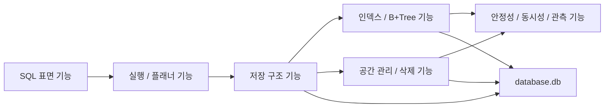

# SQL 기능 선택 가이드

## 1. 이 문서의 목적

이 문서는 이번 프로젝트의 구현 계획을 바꾸기 위한 문서가 아니다.
이미 정리된 구현 계획을 유지한 채,
`무엇을 이번 주에 넣고 무엇을 다음 단계로 미룰지`
선택하기 위한 범위 결정 가이드다.

즉 이 문서는 아래 질문에 답하기 위해 만든다.

- 지금 우리 팀이 구현할 수 있는 SQL/DBMS 기능은 무엇이 있는가?
- 각 기능은 어떤 저장 구조나 실행 구조에 의존하는가?
- 그 기능을 구현하면 무엇을 배우게 되는가?
- 실제 DBMS에서는 그 기능이 어떻게 쓰이는가?
- 이번 주 일정에서 무엇을 우선 구현하는 것이 가장 설득력 있는가?

## 2. 읽는 방법

이 문서는 아래 순서로 읽는 것을 권장한다.

1. 먼저 전체 기능 지도를 보고,
   어떤 축의 기능들이 있는지 큰 그림을 이해한다.
2. 다음으로 기능 카탈로그를 보며,
   각 기능의 의존성, 난이도, 학습 가치를 비교한다.
3. 마지막으로 추천 패키지 3개 중 하나를 선택해
   이번 주 개발 범위를 결정한다.

기본 추천 범위는 `Package 2. 저장엔진 심화형` 이다.
이 패키지가 현재 팀의 우선순위인
`메모리 친화성`, `삭제 경로`, `방어 코드`, `B+ 트리 이해`
에 가장 잘 맞는다.

## 3. 한 눈에 보는 기능 지도

### 3.1 SQL 표면 기능

이 축은 사용자가 직접 입력하는 명령과
그 명령이 어떤 기능을 노출하는지에 관한 영역이다.
이 축을 구현하면 "SQL이 단순한 문자열이 아니라
엔진 기능을 호출하는 인터페이스"라는 점을 이해하게 된다.

### 3.2 실행 / 플래너 기능

이 축은 parser, statement, planner, executor 같은
논리적 처리 단계를 다룬다.
이 축을 구현하면
`문법 해석` 과 `저장소 접근 전략 결정` 을 분리하는 이유를 배우게 된다.

### 3.3 저장 구조 기능

이 축은 `.db` 파일, page, pager, row layout, heap page를 다룬다.
이 축을 구현하면
CSAPP 9장의 page 관점이 실제 데이터 저장 엔진으로
어떻게 이어지는지를 이해하게 된다.

### 3.4 인덱스 / B+Tree 기능

이 축은 `WHERE id = ?` 를 빠르게 만들기 위한
탐색/삽입/삭제/분할/병합 기능을 다룬다.
이 축을 구현하면
왜 실제 DBMS가 해시 대신 B+ 트리를 많이 쓰는지,
그리고 page 단위 fan-out이 왜 중요한지를 배우게 된다.

### 3.5 공간 관리 / 삭제 기능

이 축은 tombstone, free slot, free page, allocator, vacuum을 다룬다.
이 축을 구현하면
"삭제는 단순히 row를 지우는 행위가 아니라
공간 재사용 정책을 설계하는 문제"임을 이해하게 된다.

### 3.6 안정성 / 동시성 / 관측 기능

이 축은 file magic, page 검증, corruption detection, lock, debug 명령을 다룬다.
이 축을 구현하면
"동작하는 프로그램"과 "망가졌을 때도 설명 가능한 엔진"의 차이를 배우게 된다.

## 4. 기능 카탈로그

각 기능은 동일한 기준으로 정리한다.

- 무엇인가
- 왜 필요한가
- 선행 의존성
- 구현 시 배우는 것
- 실제 SQL/DBMS에서 어떻게 쓰이는가
- 예상 난이도
- 예상 리스크/에러 포인트
- 발표/데모 효과
- 권장 시점

## A. SQL 표면 기능

### A.1 REPL / SQL 파일 실행

- 무엇인가: 대화형 입력과 `.sql` 파일 일괄 실행을 지원하는 입구다.
- 왜 필요한가: 테스트, 벤치마크, 데모를 모두 같은 인터페이스로 돌릴 수 있다.
- 선행 의존성: 기본 command loop, tokenizer 호출 구조.
- 구현 시 배우는 것: 입력 스트림 처리, statement 구분, 에러 복구 흐름을 배운다.
- 실제 SQL/DBMS에서 어떻게 쓰이는가: `psql`, `sqlite3`, MySQL CLI 같은 클라이언트가 같은 역할을 한다.
- 예상 난이도: 하.
- 예상 리스크/에러 포인트: 세미콜론 분리, 멀티라인 입력, 에러 후 세션 상태 꼬임.
- 발표/데모 효과: 높음. 같은 엔진으로 직접 입력과 스크립트 실행을 둘 다 보여줄 수 있다.
- 권장 시점: 가장 먼저.

### A.2 `CREATE TABLE`

- 무엇인가: 테이블 이름과 컬럼 정의를 받아 schema metadata를 만드는 기능이다.
- 왜 필요한가: row layout, heap 저장, column name 해석의 시작점이 된다.
- 선행 의존성: parser, schema metadata 저장 구조.
- 구현 시 배우는 것: 스키마가 SQL 문법이 아니라 저장 형식의 설계도라는 점을 이해하게 된다.
- 실제 SQL/DBMS에서 어떻게 쓰이는가: 실제 DBMS도 `CREATE TABLE` 을 카탈로그 엔트리와 storage metadata 생성으로 연결한다.
- 예상 난이도: 중.
- 예상 리스크/에러 포인트: 중복 컬럼명, 타입 파싱, 스키마 영속화 형식 결정.
- 발표/데모 효과: 높음. 엔진이 단순 key-value 저장소가 아니라는 인상을 준다.
- 권장 시점: REPL 직후.

### A.3 `INSERT`

- 무엇인가: 입력 row를 schema에 맞춰 검증하고 heap page에 저장하며 필요하면 인덱스를 갱신하는 기능이다.
- 왜 필요한가: 실제 데이터 흐름이 시작되는 핵심 DML이다.
- 선행 의존성: row layout, heap insert, auto-increment id, B+Tree insert.
- 구현 시 배우는 것: SQL 입력이 page write와 index update로 번역되는 과정을 배운다.
- 실제 SQL/DBMS에서 어떻게 쓰이는가: 실제 DBMS는 row 저장과 인덱스 유지 비용 때문에 insert path를 매우 중요하게 다룬다.
- 예상 난이도: 중.
- 예상 리스크/에러 포인트: type mismatch, page overflow, duplicate key, partial failure 정합성.
- 발표/데모 효과: 매우 높음. 인덱스와 영속성 데모의 출발점이다.
- 권장 시점: `CREATE TABLE` 직후.

### A.4 `SELECT *`

- 무엇인가: 전체 row와 전체 컬럼을 읽어 반환하는 가장 단순한 조회다.
- 왜 필요한가: 저장된 데이터가 정상인지 확인하는 기본 검증 도구다.
- 선행 의존성: heap scan, row deserialize, result formatter.
- 구현 시 배우는 것: page 안의 raw bytes가 다시 row로 복원되는 과정을 배운다.
- 실제 SQL/DBMS에서 어떻게 쓰이는가: 가장 단순한 full table scan 경로이며 디버깅과 관리 작업에서 자주 쓰인다.
- 예상 난이도: 하.
- 예상 리스크/에러 포인트: row decode 오류, tombstone row 노출, 출력 포맷 깨짐.
- 발표/데모 효과: 중.
- 권장 시점: `INSERT` 와 거의 동시에.

### A.5 Projection Select

- 무엇인가: 전체 row 중 일부 컬럼만 선택해서 반환하는 기능이다.
- 왜 필요한가: SQL이 단순 row dump가 아니라 column projection을 지원함을 보여준다.
- 선행 의존성: schema metadata, column name resolution, result formatter.
- 구현 시 배우는 것: logical row와 physical row layout을 분리해서 생각하는 법을 배운다.
- 실제 SQL/DBMS에서 어떻게 쓰이는가: 실제 엔진은 projection을 통해 불필요한 payload 처리 비용을 줄인다.
- 예상 난이도: 중.
- 예상 리스크/에러 포인트: 컬럼 인덱스 계산 실수, 출력 순서 오류.
- 발표/데모 효과: 중.
- 권장 시점: `SELECT *` 다음.

### A.6 `WHERE id = ?`

- 무엇인가: 자동 증가 `id` 또는 primary-like key에 대해 equality lookup을 수행하는 조회다.
- 왜 필요한가: B+ 트리를 도입하는 가장 직접적 이유가 된다.
- 선행 의존성: planner, B+Tree search, `row_ref`, heap fetch.
- 구현 시 배우는 것: SQL predicate가 인덱스 탐색으로 바뀌는 과정을 배운다.
- 실제 SQL/DBMS에서 어떻게 쓰이는가: primary key lookup은 실제 시스템에서 가장 대표적인 indexed access path다.
- 예상 난이도: 중.
- 예상 리스크/에러 포인트: key not found 처리, row_ref 무효화, index/heap 불일치.
- 발표/데모 효과: 매우 높음. 선형 탐색과의 속도 차이를 보여주기 좋다.
- 권장 시점: B+Tree search 구현 직후.

### A.7 `WHERE field = ?`

- 무엇인가: 인덱스가 없는 일반 컬럼을 조건으로 선형 탐색하는 조회다.
- 왜 필요한가: 인덱스 경로와 스캔 경로의 차이를 비교할 수 있게 해 준다.
- 선행 의존성: heap scan, predicate evaluator, schema metadata.
- 구현 시 배우는 것: 인덱스가 없는 조건이 얼마나 많은 page read와 비교를 요구하는지 체감하게 된다.
- 실제 SQL/DBMS에서 어떻게 쓰이는가: 옵티마이저가 적절한 인덱스를 못 찾거나 없을 때 table scan을 선택한다.
- 예상 난이도: 중.
- 예상 리스크/에러 포인트: 타입별 비교 로직, 문자열 비교 비용, 삭제된 row 필터링.
- 발표/데모 효과: 매우 높음. `WHERE id = ?` 와의 성능 대비가 핵심 메시지가 된다.
- 권장 시점: `WHERE id = ?` 와 함께.

### A.8 `DELETE`

- 무엇인가: 조건에 맞는 row를 논리 삭제하고 관련 인덱스 엔트리를 제거하는 기능이다.
- 왜 필요한가: insert-only 데모에서 한 단계 넘어가
  저장 엔진의 공간 관리 문제를 다루기 시작한다.
- 선행 의존성: heap slot status, free slot list, B+Tree delete 또는 scan delete path.
- 구현 시 배우는 것: 삭제는 단순 free가 아니라
  `heap 상태 + 인덱스 상태 + 재사용 정책` 의 결합 문제라는 점을 배운다.
- 실제 SQL/DBMS에서 어떻게 쓰이는가: PostgreSQL은 dead tuple을 만들고 vacuum으로 정리하며,
  다른 엔진도 삭제 후 공간 회수 정책을 별도로 둔다.
- 예상 난이도: 상.
- 예상 리스크/에러 포인트: heap만 지우고 index를 안 지우는 불일치,
  merge/borrow 버그, dangling row_ref.
- 발표/데모 효과: 높음. 메모리 친화적 설계와 안전한 재사용을 설명하기 좋다.
- 권장 시점: B+Tree insert/split 안정화 후.

### A.9 `EXPLAIN`

- 무엇인가: SQL을 실제 실행하지 않고 planner가 선택한 access path를 보여주는 기능이다.
- 왜 필요한가: 엔진이 왜 특정 경로를 택했는지 설명 가능하게 해 준다.
- 선행 의존성: planner, statement-to-plan 구조.
- 구현 시 배우는 것: 실행 결과와 실행 전략을 분리해 생각하는 법을 배운다.
- 실제 SQL/DBMS에서 어떻게 쓰이는가: PostgreSQL, MySQL, SQLite 모두 실행 계획 확인 기능을 제공한다.
- 예상 난이도: 하.
- 예상 리스크/에러 포인트: planner와 실제 executor 경로가 다를 경우 설명이 틀릴 수 있다.
- 발표/데모 효과: 매우 높음. "왜 인덱스를 썼는가"를 말로만 하지 않아도 된다.
- 권장 시점: planner 완성 직후.

### A.10 디버그 메타 명령 `.btree`, `.pages`, `.stats`

- 무엇인가: 내부 page와 인덱스 구조를 확인하는 엔진 전용 명령이다.
- 왜 필요한가: 저장 엔진 과제에서는 관측 도구 자체가 디버깅과 발표 자료가 된다.
- 선행 의존성: pager introspection, B+Tree traversal, stats 수집.
- 구현 시 배우는 것: 내부 상태를 안전하게 노출하는 진단 인터페이스 설계를 배운다.
- 실제 SQL/DBMS에서 어떻게 쓰이는가: SQLite의 `EXPLAIN`, PostgreSQL의 catalog view, 내부 debug tool이 비슷한 역할을 한다.
- 예상 난이도: 중.
- 예상 리스크/에러 포인트: 구조를 잘못 출력하면 디버깅이 오히려 혼란스러워진다.
- 발표/데모 효과: 매우 높음. split, merge, free page 재사용을 눈으로 보여줄 수 있다.
- 권장 시점: 핵심 storage 경로가 안정화된 뒤.

## B. 실행 / 플래너 기능

### B.1 Lexer / Parser

- 무엇인가: SQL 문자열을 토큰과 statement 구조로 바꾸는 단계다.
- 왜 필요한가: 입력을 구조화하지 않으면 executor와 storage가 SQL 문자열에 직접 의존하게 된다.
- 선행 의존성: 문법 정의, 토큰 타입 정의.
- 구현 시 배우는 것: 언어 프런트엔드와 저장 엔진 경계를 분리하는 설계를 배운다.
- 실제 SQL/DBMS에서 어떻게 쓰이는가: 모든 DBMS는 parser를 통해 SQL을 AST나 내부 statement 표현으로 바꾼다.
- 예상 난이도: 중.
- 예상 리스크/에러 포인트: 괄호, 따옴표, 타입 정의, 에러 메시지 품질.
- 발표/데모 효과: 중.
- 권장 시점: 가장 먼저.

### B.2 Statement AST

- 무엇인가: `CREATE`, `INSERT`, `SELECT`, `DELETE` 등 문장 타입별 내부 표현이다.
- 왜 필요한가: parser와 planner/executor를 느슨하게 연결한다.
- 선행 의존성: parser.
- 구현 시 배우는 것: SQL 문장이 storage 호출이 아니라 의미 단위 객체로 변환된다는 점을 배운다.
- 실제 SQL/DBMS에서 어떻게 쓰이는가: 실제 엔진도 parse tree나 statement struct를 사용한다.
- 예상 난이도: 하.
- 예상 리스크/에러 포인트: nullable field 처리, statement type 분기 누락.
- 발표/데모 효과: 중.
- 권장 시점: parser와 동시에.

### B.3 Planner

- 무엇인가: statement를 보고 어떤 access path를 사용할지 결정하는 단계다.
- 왜 필요한가: parser와 executor 사이에
  `어떻게 조회할지` 를 결정하는 계층이 있어야 인덱스 사용을 설명할 수 있다.
- 선행 의존성: statement AST, schema metadata, predicate classification.
- 구현 시 배우는 것: SQL 엔진이 문법 해석 이후에 접근 전략을 고른다는 개념을 배운다.
- 실제 SQL/DBMS에서 어떻게 쓰이는가: 실제 엔진은 훨씬 복잡한 cost-based optimizer를 두지만,
  이번 과제는 rule-based planner만으로도 핵심 개념을 재현할 수 있다.
- 예상 난이도: 중.
- 예상 리스크/에러 포인트: `WHERE id = ?` 와 다른 predicate 구분 실수.
- 발표/데모 효과: 높음. "왜 인덱스를 썼는가"의 설명 근거가 된다.
- 권장 시점: 기본 statement 구현 후.

### B.4 Access Path 선택

- 무엇인가: `TABLE_SCAN`, `INDEX_LOOKUP`, `INDEX_DELETE` 같은 경로를 고르는 규칙이다.
- 왜 필요한가: 같은 `SELECT` 문도 조건에 따라 완전히 다른 실행 경로를 타기 때문이다.
- 선행 의존성: planner, storage API 분리.
- 구현 시 배우는 것: 동일한 SQL 문법이라도 storage 관점에서는 다른 알고리즘이 선택된다는 점을 배운다.
- 실제 SQL/DBMS에서 어떻게 쓰이는가: 실제 DBMS의 optimizer가 인덱스 scan, seq scan 등을 고른다.
- 예상 난이도: 중.
- 예상 리스크/에러 포인트: 경로와 executor 구현이 불일치할 수 있다.
- 발표/데모 효과: 높음.
- 권장 시점: planner와 함께.

### B.5 Executor 분리

- 무엇인가: statement type별 실행 코드를 분리해 planner와 storage를 호출하는 계층이다.
- 왜 필요한가: parser가 곧바로 pager를 부르는 구조를 막는다.
- 선행 의존성: statement AST, planner, storage API.
- 구현 시 배우는 것: 상위 함수는 "무엇을 할지", 하위 모듈은 "어떻게 할지"를 담당하게 설계하는 법을 배운다.
- 실제 SQL/DBMS에서 어떻게 쓰이는가: 실제 엔진도 executor가 plan node를 순회하며 storage 호출을 수행한다.
- 예상 난이도: 중.
- 예상 리스크/에러 포인트: transaction이 없더라도 부분 실패 시 cleanup 경로를 잘 정리해야 한다.
- 발표/데모 효과: 중.
- 권장 시점: planner 직후.

### B.6 Result Formatter

- 무엇인가: 선택된 row를 표나 로그 형태로 사용자에게 보여주는 계층이다.
- 왜 필요한가: 같은 실행 결과라도 출력 계층이 섞이면 executor가 비대해진다.
- 선행 의존성: schema metadata, row decode.
- 구현 시 배우는 것: 내부 데이터 구조와 사용자 출력 포맷을 분리하는 습관을 배운다.
- 실제 SQL/DBMS에서 어떻게 쓰이는가: CLI 도구와 서버 엔진이 응답 직렬화를 분리하는 구조와 비슷하다.
- 예상 난이도: 하.
- 예상 리스크/에러 포인트: 문자열 길이 계산, NULL 또는 tombstone 처리 정책.
- 발표/데모 효과: 중.
- 권장 시점: `SELECT` 구현 초기에.

## C. 저장 구조 기능

### C.1 Fixed-Size Row Layout

- 무엇인가: 컬럼별 offset과 width를 정해 row를 고정 크기 byte 배열로 저장하는 규칙이다.
- 왜 필요한가: page 안에서 row 위치를 계산하기 쉬워진다.
- 선행 의존성: schema metadata, 타입 정의.
- 구현 시 배우는 것: logical schema가 physical memory layout으로 바뀌는 과정을 배운다.
- 실제 SQL/DBMS에서 어떻게 쓰이는가: 실제 엔진은 가변 길이 지원이 많지만,
  교육용 엔진에서는 fixed-size가 구현 안정성과 locality에 유리하다.
- 예상 난이도: 중.
- 예상 리스크/에러 포인트: alignment, 문자열 길이 초과, serialize/deserialize 오류.
- 발표/데모 효과: 높음. "왜 고정 길이로 갔는가"를 CSAPP 관점과 연결하기 좋다.
- 권장 시점: 매우 이르게.

### C.2 Schema Metadata

- 무엇인가: 테이블 이름, 컬럼 이름, 타입, 길이, row size 같은 정보를 담는 메타데이터다.
- 왜 필요한가: parser가 해석한 컬럼 이름을 실제 row layout에 연결해야 한다.
- 선행 의존성: `CREATE TABLE`, 타입 시스템.
- 구현 시 배우는 것: 데이터보다 메타데이터가 먼저 있어야 저장 엔진이 움직인다는 점을 배운다.
- 실제 SQL/DBMS에서 어떻게 쓰이는가: 실제 엔진의 catalog/system table이 같은 역할을 한다.
- 예상 난이도: 중.
- 예상 리스크/에러 포인트: 영속화 포맷 변경 시 호환성 문제.
- 발표/데모 효과: 중.
- 권장 시점: row layout과 함께.

### C.3 Single `.db` File

- 무엇인가: header, heap, index, free page 정보를 한 파일에 담는 구조다.
- 왜 필요한가: page 기반 I/O와 메타데이터 흐름을 가장 일관되게 설명할 수 있다.
- 선행 의존성: page format, pager.
- 구현 시 배우는 것: 파일 분할보다 단일 file page map이 디버깅과 설명에 어떤 장점이 있는지 배운다.
- 실제 SQL/DBMS에서 어떻게 쓰이는가: SQLite는 단일 파일 DB의 대표 사례다.
- 예상 난이도: 중.
- 예상 리스크/에러 포인트: 파일 레이아웃 정의가 흔들리면 전체 엔진이 흔들린다.
- 발표/데모 효과: 높음.
- 권장 시점: page format 설계 시점.

### C.4 Page Format

- 무엇인가: page header, page type, payload layout을 정의하는 규칙이다.
- 왜 필요한가: pager가 page를 읽었을 때 heap인지 leaf인지 internal인지 식별해야 한다.
- 선행 의존성: page type enum, file layout 설계.
- 구현 시 배우는 것: 메모리 블록이 아니라 의미 있는 저장 단위로 page를 설계하는 법을 배운다.
- 실제 SQL/DBMS에서 어떻게 쓰이는가: 실제 엔진도 모든 on-disk 구조를 page header로 식별한다.
- 예상 난이도: 중.
- 예상 리스크/에러 포인트: header corruption, type mismatch, size 계산 실수.
- 발표/데모 효과: 높음.
- 권장 시점: 매우 이르게.

### C.5 Pager

- 무엇인가: `page_id -> file offset` 변환과 page cache, dirty flush를 담당하는 계층이다.
- 왜 필요한가: storage 엔진의 모든 I/O를 한 곳에 모아야 한다.
- 선행 의존성: page size, page format, file descriptor.
- 구현 시 배우는 것: syscall, page cache, locality, dirty write-back을 배운다.
- 실제 SQL/DBMS에서 어떻게 쓰이는가: pager는 작은 DBMS에서 storage engine의 핵심 추상화다.
- 예상 난이도: 상.
- 예상 리스크/에러 포인트: flush 누락, 잘못된 offset, cache eviction 버그.
- 발표/데모 효과: 매우 높음. "우리가 직접 pager를 만들었다"는 메시지가 강하다.
- 권장 시점: 핵심 우선 기능.

### C.6 Page Cache / Frame Cache

- 무엇인가: 최근 접근한 page를 메모리에 유지하는 frame 배열이다.
- 왜 필요한가: 매번 `pread()` 를 호출하면 I/O와 syscall 비용이 커진다.
- 선행 의존성: pager, frame metadata.
- 구현 시 배우는 것: 캐시 상한, locality, eviction 정책의 기본을 배운다.
- 실제 SQL/DBMS에서 어떻게 쓰이는가: 모든 DBMS는 자체 buffer pool 또는 pager cache를 둔다.
- 예상 난이도: 중.
- 예상 리스크/에러 포인트: dirty page eviction, pin 관리, stale data.
- 발표/데모 효과: 중.
- 권장 시점: pager 최소 버전 후.

### C.7 Slotted Heap Page

- 무엇인가: page header와 slot directory를 두고 row payload를 page 내부에 배치하는 구조다.
- 왜 필요한가: 삭제 후에도 row를 당장 이동하지 않고 slot 상태만 바꿀 수 있다.
- 선행 의존성: page format, row layout.
- 구현 시 배우는 것: row 이동 없이 삭제/재사용을 처리하는 저장 구조를 배운다.
- 실제 SQL/DBMS에서 어떻게 쓰이는가: 실제 heap table page는 slot directory 또는 line pointer를 자주 사용한다.
- 예상 난이도: 상.
- 예상 리스크/에러 포인트: slot 상태 전이, free space 계산, page compaction 타이밍.
- 발표/데모 효과: 매우 높음. 메모리 친화성과 삭제 경로를 설명하기 좋다.
- 권장 시점: append-only heap보다 한 단계 심화할 때.

### C.8 `row_ref`

- 무엇인가: `page_id + slot_id` 로 row 위치를 표현하는 식별자다.
- 왜 필요한가: 포인터 대신 재실행 후에도 유효한 위치 참조가 필요하다.
- 선행 의존성: heap page, slot 구조.
- 구현 시 배우는 것: 메모리 주소와 영속 위치를 구분하는 저장소 사고방식을 배운다.
- 실제 SQL/DBMS에서 어떻게 쓰이는가: PostgreSQL의 TID처럼 page/slot 기반 row 위치 개념과 연결된다.
- 예상 난이도: 하.
- 예상 리스크/에러 포인트: row 이동 시 무효화, slot 재사용과 충돌.
- 발표/데모 효과: 높음.
- 권장 시점: B+Tree 도입 전.

### C.9 Reopen / Persistence

- 무엇인가: 프로그램 재시작 후 header, schema, heap, index 상태를 다시 load하는 기능이다.
- 왜 필요한가: 메모리 자료구조 데모와 DB 엔진을 가르는 핵심 차이점이다.
- 선행 의존성: single `.db` file, header page, pager flush.
- 구현 시 배우는 것: 저장 형식의 버전 관리와 bootstrap 절차를 배운다.
- 실제 SQL/DBMS에서 어떻게 쓰이는가: 모든 DBMS의 기본 전제다.
- 예상 난이도: 중.
- 예상 리스크/에러 포인트: header 불일치, next_id 복구 실패, root page 복구 실패.
- 발표/데모 효과: 매우 높음.
- 권장 시점: insert/select 초기 안정화 직후.

## D. 인덱스 / B+Tree 기능

### D.1 B+Tree Search

- 무엇인가: root에서 leaf까지 내려가 key에 대응하는 `row_ref` 를 찾는 기능이다.
- 왜 필요한가: `WHERE id = ?` 의 핵심 경로다.
- 선행 의존성: leaf/internal page format, pager, `row_ref`.
- 구현 시 배우는 것: fan-out, tree height, separator key 의미를 배운다.
- 실제 SQL/DBMS에서 어떻게 쓰이는가: primary key lookup과 secondary index lookup의 기본이다.
- 예상 난이도: 중.
- 예상 리스크/에러 포인트: binary search 경계, child page 선택 오류.
- 발표/데모 효과: 매우 높음.
- 권장 시점: B+Tree의 첫 기능.

### D.2 Leaf Insert

- 무엇인가: 적절한 leaf에 key와 row_ref를 삽입하는 기능이다.
- 왜 필요한가: insert path에서 인덱스 유지가 시작된다.
- 선행 의존성: B+Tree search, leaf page format.
- 구현 시 배우는 것: page 내부 정렬 배열, `memmove`, leaf overflow의 의미를 배운다.
- 실제 SQL/DBMS에서 어떻게 쓰이는가: 모든 B+Tree 기반 index의 기본 insert 연산이다.
- 예상 난이도: 중.
- 예상 리스크/에러 포인트: 중복 key, entry shift 버그, page full 처리 누락.
- 발표/데모 효과: 높음.
- 권장 시점: search 직후.

### D.3 Internal Insert

- 무엇인가: split 이후 parent node에 separator key와 child 포인터를 반영하는 기능이다.
- 왜 필요한가: leaf split만으로는 tree height가 유지되지 않는다.
- 선행 의존성: leaf insert, internal page format.
- 구현 시 배우는 것: leaf와 internal node가 서로 다른 규칙을 가진다는 점을 배운다.
- 실제 SQL/DBMS에서 어떻게 쓰이는가: insert가 page split을 전파하며 tree 구조를 유지한다.
- 예상 난이도: 상.
- 예상 리스크/에러 포인트: parent key 업데이트, leftmost child 처리.
- 발표/데모 효과: 중.
- 권장 시점: leaf split과 함께.

### D.4 Split

- 무엇인가: 꽉 찬 leaf/internal page를 둘로 나누고 parent를 갱신하는 기능이다.
- 왜 필요한가: 대량 insert에서 tree가 커질 수 있어야 한다.
- 선행 의존성: leaf insert, internal insert, new page allocation.
- 구현 시 배우는 것: page 용량, fan-out, tree 성장 메커니즘을 배운다.
- 실제 SQL/DBMS에서 어떻게 쓰이는가: B+Tree가 균형을 유지하는 핵심 연산이다.
- 예상 난이도: 상.
- 예상 리스크/에러 포인트: split pivot 계산, sibling link, parent propagation 버그.
- 발표/데모 효과: 매우 높음. `.btree` 와 함께 보여주기 좋다.
- 권장 시점: insert 기본 경로가 안정화된 뒤.

### D.5 Root Split

- 무엇인가: root가 가득 찼을 때 새 root를 만들고 tree height를 1 증가시키는 기능이다.
- 왜 필요한가: 트리가 실제로 커질 수 있게 하는 핵심이다.
- 선행 의존성: split, new root creation.
- 구현 시 배우는 것: root는 일반 node와 다르게 메타데이터상 특별하게 다뤄진다는 점을 배운다.
- 실제 SQL/DBMS에서 어떻게 쓰이는가: 모든 균형 트리의 필수 성장 경로다.
- 예상 난이도: 상.
- 예상 리스크/에러 포인트: root page id 갱신 누락, reopen 후 root 복구 실패.
- 발표/데모 효과: 높음.
- 권장 시점: split 직후.

### D.6 Range Scan 가능성

- 무엇인가: leaf sibling을 따라 연속된 key 범위를 읽는 기능이다.
- 왜 필요한가: B+Tree가 equality뿐 아니라 ordered scan에 강하다는 점을 보여준다.
- 선행 의존성: leaf link, B+Tree search.
- 구현 시 배우는 것: B-tree와 B+Tree 차이, 왜 leaf chain이 중요한지 배운다.
- 실제 SQL/DBMS에서 어떻게 쓰이는가: `BETWEEN`, ordered index scan, prefix scan 등에 활용된다.
- 예상 난이도: 중.
- 예상 리스크/에러 포인트: sibling link 유지 실패, 종료 조건 오류.
- 발표/데모 효과: 중.
- 권장 시점: 선택 기능.

### D.7 B+Tree Delete

- 무엇인가: leaf에서 key를 제거하고 필요한 경우 균형 조건을 복구하는 기능이다.
- 왜 필요한가: `DELETE WHERE id = ?` 에서 heap만 지우면 index가 고장 난다.
- 선행 의존성: leaf search, leaf page format, heap delete path.
- 구현 시 배우는 것: 삭제는 삽입보다 훨씬 어렵고,
  underflow 처리 정책이 필수라는 점을 배운다.
- 실제 SQL/DBMS에서 어떻게 쓰이는가: 실제 인덱스는 key 제거 후 구조를 유지해야 하므로 delete/merge 정책이 필요하다.
- 예상 난이도: 상.
- 예상 리스크/에러 포인트: ghost entry, parent separator stale value, underflow 누락.
- 발표/데모 효과: 높음.
- 권장 시점: 저장엔진 심화 범위.

### D.8 Borrow / Redistribute

- 무엇인가: underflow가 난 node가 형제 node에서 entry를 빌려 오는 기능이다.
- 왜 필요한가: delete 후 항상 merge만 하면 tree 변형이 과도해질 수 있다.
- 선행 의존성: B+Tree delete, sibling 탐색, parent update.
- 구현 시 배우는 것: 균형 조건을 보존하는 로컬 복구 알고리즘을 배운다.
- 실제 SQL/DBMS에서 어떻게 쓰이는가: 실제 B+Tree delete는 borrow와 merge를 함께 사용한다.
- 예상 난이도: 상.
- 예상 리스크/에러 포인트: separator key 갱신 오류, 왼쪽/오른쪽 형제 규칙 혼동.
- 발표/데모 효과: 중.
- 권장 시점: delete 구현 직후.

### D.9 Merge

- 무엇인가: borrow가 불가능할 때 node 두 개를 합치고 parent entry를 줄이는 기능이다.
- 왜 필요한가: delete 후 빈약해진 tree를 정리해야 한다.
- 선행 의존성: B+Tree delete, free page 반환, parent delete path.
- 구현 시 배우는 것: page 회수와 tree 구조 축소가 어떻게 연결되는지 배운다.
- 실제 SQL/DBMS에서 어떻게 쓰이는가: underflow 처리의 대표적 경로다.
- 예상 난이도: 상.
- 예상 리스크/에러 포인트: sibling link, parent 정리, free page 반환 순서.
- 발표/데모 효과: 높음.
- 권장 시점: delete 심화 단계.

### D.10 Root Shrink

- 무엇인가: delete 이후 root가 하나의 child만 남으면 tree height를 줄이는 기능이다.
- 왜 필요한가: tree가 커질 줄만 알고 줄어들지 못하면 구조가 비효율적이 된다.
- 선행 의존성: merge, root metadata update.
- 구현 시 배우는 것: tree 생애주기 전체를 설계하는 법을 배운다.
- 실제 SQL/DBMS에서 어떻게 쓰이는가: 실제 트리도 delete 이후 높이가 줄 수 있다.
- 예상 난이도: 상.
- 예상 리스크/에러 포인트: root page 교체 후 reopen 복구 불일치.
- 발표/데모 효과: 중.
- 권장 시점: delete/merge 안정화 후.

## E. 삭제 / 공간 관리 기능

### E.1 Tombstone

- 무엇인가: row를 즉시 물리 제거하지 않고 slot 상태만 "삭제됨"으로 표시하는 방식이다.
- 왜 필요한가: row 이동 없이 삭제를 기록할 수 있다.
- 선행 의존성: slotted heap page, slot status.
- 구현 시 배우는 것: 논리 삭제와 물리 삭제를 분리하는 저장 엔진 사고방식을 배운다.
- 실제 SQL/DBMS에서 어떻게 쓰이는가: PostgreSQL의 dead tuple, LSM 계열의 tombstone 개념과 연결된다.
- 예상 난이도: 중.
- 예상 리스크/에러 포인트: tombstone row가 scan 결과에 섞이는 문제.
- 발표/데모 효과: 높음.
- 권장 시점: `DELETE` 최소 구현의 첫 단계.

### E.2 Free Slot Reuse

- 무엇인가: 삭제된 slot을 이후 insert에서 재사용하는 정책이다.
- 왜 필요한가: delete가 계속 쌓이면 파일 크기만 커지고 메모리 친화성이 떨어진다.
- 선행 의존성: tombstone, slot directory.
- 구현 시 배우는 것: free list와 allocator의 기본 개념을 page 내부에서 실험해 볼 수 있다.
- 실제 SQL/DBMS에서 어떻게 쓰이는가: 실제 엔진도 page free space map이나 slot reuse 정책을 둔다.
- 예상 난이도: 중.
- 예상 리스크/에러 포인트: 잘못된 slot 재사용으로 row_ref 충돌 가능.
- 발표/데모 효과: 매우 높음. 삭제 후 재삽입 시 page 재사용을 보여주기 좋다.
- 권장 시점: tombstone 직후.

### E.3 Free Page List

- 무엇인가: 완전히 비게 된 page를 다시 할당 가능한 page 목록으로 관리하는 구조다.
- 왜 필요한가: delete/merge 후 남는 page를 파일 끝에 방치하지 않기 위해 필요하다.
- 선행 의존성: page allocator, merge 또는 page empty 판정.
- 구현 시 배우는 것: malloc free list와 file page allocator가 닮아 있다는 점을 배운다.
- 실제 SQL/DBMS에서 어떻게 쓰이는가: 실제 DBMS도 page 단위 freelist 또는
  free space map을 두고 재할당 가능한 page를 관리한다.
- 예상 난이도: 중.
- 예상 리스크/에러 포인트: 같은 page를 두 번 freelist에 넣는 이중 반환 버그.
- 발표/데모 효과: 높음.
- 권장 시점: delete 심화 범위.

### E.4 Page Allocator

- 무엇인가: 새 page가 필요할 때 freelist를 우선 쓰고, 없으면 파일 끝에 append하는 정책이다.
- 왜 필요한가: heap과 index가 같은 allocator를 공유해야 page 관리가 일관된다.
- 선행 의존성: pager, free page list, header metadata.
- 구현 시 배우는 것: 메모리 allocator 사고를 파일 page에도 적용하는 법을 배운다.
- 실제 SQL/DBMS에서 어떻게 쓰이는가: page allocation은 모든 storage engine의 기본 문제다.
- 예상 난이도: 중.
- 예상 리스크/에러 포인트: next_page_id 갱신, freelist 손상, 동시성 충돌.
- 발표/데모 효과: 중.
- 권장 시점: free page list와 함께.

### E.5 파일 재정렬을 하지 않는 이유

- 무엇인가: delete 때마다 row를 당겨 파일을 다시 정렬하지 않는 설계 원칙이다.
- 왜 필요한가: row 이동은 `row_ref` 와 인덱스 정합성을 깨뜨리기 쉽다.
- 선행 의존성: `row_ref`, index-heap 분리 이해.
- 구현 시 배우는 것: 빠른 delete와 안전한 pointer stability 사이의 trade-off를 배운다.
- 실제 SQL/DBMS에서 어떻게 쓰이는가: 실제 DBMS도 삭제 때마다 파일 전체를 재정렬하지 않는다.
- 예상 난이도: 하.
- 예상 리스크/에러 포인트: 이 원칙이 문서화되지 않으면 팀원이 compaction을 delete path에 넣으려 할 수 있다.
- 발표/데모 효과: 높음. "왜 이렇게 설계했는가"를 설명할 근거가 된다.
- 권장 시점: delete 설계 전에 합의.

### E.6 `VACUUM` 개념

- 무엇인가: live row만 새 파일이나 새 page 집합으로 재배치해 공간을 정리하는 오프라인 정리 작업이다.
- 왜 필요한가: delete 즉시 정리 대신, 나중에 정리하는 정책을 도입할 수 있다.
- 선행 의존성: heap scan, live row 판정, index rebuild 또는 row relocation 설계.
- 구현 시 배우는 것: online path와 maintenance path를 분리하는 DB 운영 개념을 배운다.
- 실제 SQL/DBMS에서 어떻게 쓰이는가: PostgreSQL vacuum, SQLite vacuum 같은 maintenance command와 연결된다.
- 예상 난이도: 상.
- 예상 리스크/에러 포인트: copy 중 실패, 파일 교체 절차, index rebuild 정합성.
- 발표/데모 효과: 중.
- 권장 시점: 이번 주 선택 기능 또는 문서화만.

### E.7 `VACUUM` 을 이번 주에 넣을지 판단하는 기준

- 무엇인가: vacuum을 필수 범위로 넣을지 결정하는 기준이다.
- 왜 필요한가: vacuum은 설명 효과는 크지만 일정 리스크도 크다.
- 선행 의존성: delete, free slot reuse, reopen, index rebuild 이해.
- 구현 시 배우는 것: 기능 추가가 아니라 일정 관리와 가치 판단을 배우게 된다.
- 실제 SQL/DBMS에서 어떻게 쓰이는가: 운영 편의 기능은 핵심 CRUD보다 나중에 들어가는 경우가 많다.
- 예상 난이도: 판단 기능 자체는 하, 실제 구현은 상.
- 예상 리스크/에러 포인트: 핵심 기능이 불안정한데 vacuum까지 넣으면 전체 완성도가 떨어질 수 있다.
- 발표/데모 효과: 문서화만으로도 일정 판단 근거가 된다.
- 권장 시점: 범위 확정 회의 시점.

## F. 안정성 / 시스템 기능

### F.1 File Magic / Version

- 무엇인가: 파일이 우리 엔진 포맷인지 판별하는 magic과 버전 번호다.
- 왜 필요한가: 쓰레기 파일이나 구버전 파일을 잘못 여는 일을 막는다.
- 선행 의존성: header page.
- 구현 시 배우는 것: 영속 포맷에는 항상 식별자와 버전이 필요하다는 점을 배운다.
- 실제 SQL/DBMS에서 어떻게 쓰이는가: 대부분의 binary format은 magic/version으로 시작한다.
- 예상 난이도: 하.
- 예상 리스크/에러 포인트: version migration 미정 상태에서 숫자만 바뀌는 문제.
- 발표/데모 효과: 중.
- 권장 시점: 파일 포맷 정의 시점.

### F.2 Page Type 검증

- 무엇인가: 읽어온 page가 heap인지 leaf인지 internal인지 검사하는 로직이다.
- 왜 필요한가: 잘못된 type으로 cast하면 corruption이 조용히 퍼질 수 있다.
- 선행 의존성: page format, page header.
- 구현 시 배우는 것: fail-fast와 defensive programming을 storage layer에서 적용하는 법을 배운다.
- 실제 SQL/DBMS에서 어떻게 쓰이는가: 실제 엔진도 page header 검증으로 이상 상황을 빠르게 감지한다.
- 예상 난이도: 하.
- 예상 리스크/에러 포인트: 검증 누락 시 디버깅 난이도가 급상승한다.
- 발표/데모 효과: 중.
- 권장 시점: page format 구현과 동시에.

### F.3 Corruption Detection

- 무엇인가: header 불일치, 잘못된 key count, out-of-range child page 같은 손상 신호를 감지하는 기능이다.
- 왜 필요한가: DB 엔진은 잘못된 상태를 조용히 진행시키면 더 큰 손상을 만든다.
- 선행 의존성: page/header 검증, invariant 정의.
- 구현 시 배우는 것: 자료구조 invariant를 코드로 표현하는 습관을 배운다.
- 실제 SQL/DBMS에서 어떻게 쓰이는가: 실제 엔진은 assert, checksum, sanity check로 손상을 조기 탐지한다.
- 예상 난이도: 중.
- 예상 리스크/에러 포인트: 체크를 너무 적게 하면 무의미하고 너무 많이 하면 코드가 무거워질 수 있다.
- 발표/데모 효과: 중.
- 권장 시점: 핵심 기능 동작 후 강화 단계.

### F.4 Fail-Fast 방어 코드

- 무엇인가: 불가능한 상태가 발견되면 조용히 무시하지 않고 즉시 오류로 중단하는 정책이다.
- 왜 필요한가: storage bug는 조기 중단이 더 안전하다.
- 선행 의존성: invariant 정의, 에러 전파 구조.
- 구현 시 배우는 것: 방어적 프로그래밍과 silent corruption의 위험을 배운다.
- 실제 SQL/DBMS에서 어떻게 쓰이는가: assertion, panic, corruption error 대응 정책과 연결된다.
- 예상 난이도: 중.
- 예상 리스크/에러 포인트: 어디서 hard fail하고 어디서 recover할지 기준이 필요하다.
- 발표/데모 효과: 중.
- 권장 시점: core path 구현과 병행.

### F.5 Coarse-Grained Concurrency

- 무엇인가: 세밀한 page latch 대신 큰 범위 lock으로 동시성을 단순하게 제어하는 방식이다.
- 왜 필요한가: 동시성을 전혀 무시하지 않으면서도 복잡도를 통제할 수 있다.
- 선행 의존성: lock abstraction, executor 진입점.
- 구현 시 배우는 것: 동시성은 "없음/있음" 이 아니라 granularity 선택 문제라는 점을 배운다.
- 실제 SQL/DBMS에서 어떻게 쓰이는가: SQLite류 시스템은 coarse한 locking 전략으로 단순성과 안정성을 택한다.
- 예상 난이도: 중.
- 예상 리스크/에러 포인트: lock 범위가 너무 크면 쓰기 병목이 생기지만, 이번 과제에서는 수용 가능하다.
- 발표/데모 효과: 중.
- 권장 시점: core CRUD 안정화 후.

### F.6 DB-Level RW Lock

- 무엇인가: reader는 동시에 허용하고 writer는 단독 수행하게 하는 전역 read-write lock이다.
- 왜 필요한가: 실제 동시성 메시지를 가져가면서 구현 복잡도를 낮출 수 있다.
- 선행 의존성: coarse-grained concurrency, executor entry point.
- 구현 시 배우는 것: multi-reader / single-writer 모델과 lock API 사용을 배운다.
- 실제 SQL/DBMS에서 어떻게 쓰이는가: page latch보다 단순하지만 교육용 엔진이나 단일 파일 DB에서 현실적인 선택이 될 수 있다.
- 예상 난이도: 중.
- 예상 리스크/에러 포인트: deadlock보다는 lock 누락, read path write path 구분 실수.
- 발표/데모 효과: 중.
- 권장 시점: 저장엔진 심화형 후반.

### F.7 WAL / Recovery가 왜 어려운지

- 무엇인가: 충돌 후 복구와 원자적 업데이트를 위한 write-ahead logging 개념과 그 난이도를 설명하는 항목이다.
- 왜 필요한가: 이번 주에 제외하더라도 "왜 제외했는가"를 설명할 수 있어야 한다.
- 선행 의존성: page write path, partial failure 시나리오 이해.
- 구현 시 배우는 것: durability는 단순 file write와 다른 문제라는 점을 배운다.
- 실제 SQL/DBMS에서 어떻게 쓰이는가: PostgreSQL, InnoDB 등은 WAL 없이 안정성을 보장하지 않는다.
- 예상 난이도: 설명은 중, 구현은 매우 상.
- 예상 리스크/에러 포인트: 이해 없이 넣으려 하면 설계 전체가 흔들린다.
- 발표/데모 효과: 중.
- 권장 시점: README / 발표 대비용 설명 항목으로.

### F.8 이번 주 제외 기능의 의미

- 무엇인가: 이번 주에 넣지 않는 기능들이 왜 중요한지, 왜 지금은 제외하는지 정리하는 항목이다.
- 왜 필요한가: 제외는 포기가 아니라 우선순위 결정이라는 점을 분명히 해 준다.
- 선행 의존성: 전체 로드맵 이해.
- 구현 시 배우는 것: 기능 설계에는 구현뿐 아니라 범위 통제도 포함된다는 점을 배운다.
- 실제 SQL/DBMS에서 어떻게 쓰이는가: 실제 엔진 개발도 feature freeze와 단계별 확장으로 진행된다.
- 예상 난이도: 하.
- 예상 리스크/에러 포인트: 문서가 없으면 팀 내부 기대치가 어긋날 수 있다.
- 발표/데모 효과: 높음. 질문 대응력이 좋아진다.
- 권장 시점: 범위 확정 직전.

## 5. 핵심 기능 비교 표

아래 표는 이번 주 범위를 고를 때 특히 갈리는 기능만 뽑아 비교한 것이다.

| 기능 | 필수 의존성 | 구현 난이도 | 학습 가치 | 발표 효과 | 일정 리스크 | 실무 DBMS 관련성 | 이번 주 추천 여부 |
|------|-------------|-------------|-----------|-----------|-------------|------------------|------------------|
| `CREATE TABLE` | parser, schema metadata | 중 | 높음 | 높음 | 중 | 높음 | 추천 |
| `INSERT` | row layout, heap, index insert | 중 | 높음 | 매우 높음 | 중 | 매우 높음 | 강력 추천 |
| `SELECT ... WHERE id = ?` | planner, B+Tree search, row_ref | 중 | 매우 높음 | 매우 높음 | 중 | 매우 높음 | 강력 추천 |
| `SELECT ... WHERE field = ?` | heap scan, predicate evaluator | 중 | 높음 | 매우 높음 | 중 | 높음 | 강력 추천 |
| pager | page format, file layout | 상 | 매우 높음 | 매우 높음 | 상 | 매우 높음 | 강력 추천 |
| slotted heap page | row layout, page format | 상 | 매우 높음 | 높음 | 상 | 매우 높음 | 추천 |
| free slot reuse | tombstone, slot 상태 | 중 | 높음 | 높음 | 중 | 높음 | 추천 |
| free page list | page allocator, delete/merge | 중 | 높음 | 중 | 중 | 높음 | 추천 |
| B+Tree split | leaf/internal insert | 상 | 매우 높음 | 매우 높음 | 상 | 매우 높음 | 강력 추천 |
| B+Tree delete | tombstone, B+Tree search | 상 | 매우 높음 | 높음 | 상 | 매우 높음 | 조건부 추천 |
| borrow / merge / root shrink | B+Tree delete | 상 | 매우 높음 | 중 | 상 | 높음 | 조건부 추천 |
| `EXPLAIN` | planner | 하 | 높음 | 매우 높음 | 하 | 높음 | 추천 |
| `.btree`, `.pages`, `.stats` | introspection code | 중 | 높음 | 매우 높음 | 중 | 중 | 추천 |
| DB-level RW lock | executor entry, lock abstraction | 중 | 중 | 중 | 중 | 중 | 선택 |
| `VACUUM` | live scan, rebuild, file replace | 상 | 높음 | 중 | 매우 상 | 높음 | 이번 주는 문서화 우선 |
| secondary index | generic index abstraction | 상 | 높음 | 중 | 상 | 높음 | 이번 주 비추천 |
| multi-table | catalog, multiple root/meta | 중 | 중 | 중 | 중 | 높음 | 이번 주 비추천 |
| WAL / recovery | logging, crash model | 매우 상 | 매우 높음 | 중 | 매우 상 | 매우 높음 | 이번 주 제외 |

## 6. 추천 구현 범위 패키지

## Package 1. 발표 안정형

### 포함 기능

- REPL / SQL 파일 실행
- `CREATE TABLE`
- `INSERT`
- `SELECT *`
- projection select
- `WHERE id = ?`
- `WHERE field = ?`
- fixed-size row layout
- schema metadata
- single `.db` file
- page format
- pager
- `row_ref`
- reopen / persistence
- B+Tree search
- leaf insert
- internal insert
- split
- root split
- benchmark

### 이 패키지를 고르면

- 인덱스가 왜 빠른지 명확하게 보여줄 수 있다.
- SQL 흐름과 page 기반 저장 구조를 안정적으로 설명할 수 있다.
- 대신 삭제/재사용/merge 같은 저장엔진 깊이는 상대적으로 얕다.

### 적합한 팀

- 발표 안정성이 최우선일 때
- 삭제보다 조회 인덱스 데모가 중요할 때
- 구현 인원이 적거나 시간이 빠듯할 때

## Package 2. 저장엔진 심화형

### 포함 기능

- `Package 1` 전체
- `DELETE`
- tombstone
- free slot reuse
- free page list
- page allocator
- B+Tree delete
- borrow / redistribute
- merge
- root shrink
- `EXPLAIN`
- `.btree`, `.pages`, `.stats`
- file magic/version
- page type 검증
- corruption detection
- fail-fast 방어 코드
- coarse-grained concurrency
- DB-level RW lock

### 이 패키지를 고르면

- 메모리 친화성, 삭제 경로, 공간 재사용 정책까지 설명할 수 있다.
- "단순 SQL 처리기"보다 "작은 저장 엔진"이라는 인상을 줄 수 있다.
- 이번 프로젝트의 학습 목표와 차별화 포인트가 가장 잘 살아난다.

### 적합한 팀

- 저장 구조를 깊게 구현하고 싶은 팀
- malloc/free-list, page, B+Tree delete를 연결해서 설명하고 싶은 팀
- 발표에서도 구조적 완성도를 강조하고 싶은 팀

### 기본 추천 이유

현재 팀이 중요하게 본
`메모리 친화성`, `삭제 경로`, `방어 코드`, `B+ 트리 이해`
를 가장 잘 만족시키는 범위이기 때문이다.

## Package 3. 야심형

### 포함 기능

- `Package 2` 전체
- `VACUUM`
- range scan
- secondary index 또는 multi-table 중 하나
- 더 강한 무결성 검사
- 추가 관측 도구

### 이 패키지를 고르면

- 실 DBMS에 더 가까운 maintenance 기능과 확장 기능을 보여줄 수 있다.
- 하지만 핵심 CRUD와 delete path가 불안정한 상태에서 들어가면 일정 리스크가 매우 크다.

### 적합한 팀

- 핵심 기능이 이미 빠르게 안정화되는 경우
- 구현 인원이 많고 병렬 작업이 가능한 경우
- 차별화 기능에 시간을 더 쓸 여력이 있는 경우

## 7. 최종 권장안

이번 프로젝트의 현재 우선순위가
`저장 엔진 깊이`, `삭제 경로`, `메모리 친화적 설계`, `방어 코드`
에 있다면 기본 선택은 `Package 2. 저장엔진 심화형` 이다.

선택 이유는 아래와 같다.

1. `WHERE id = ?` 인덱스 데모라는 과제 핵심을 그대로 만족한다.
2. delete와 free-space 재사용까지 들어가면
   단순 조회 과제보다 훨씬 설득력 있는 저장 엔진 이야기를 만들 수 있다.
3. `VACUUM`, multi-table, secondary index까지 한 번에 가지 않아도
   충분히 "실제 DBMS가 고민하는 문제"를 다뤘다고 말할 수 있다.

반대로 아래 상황이면 `Package 1` 이 더 맞다.

- 구현 일정이 매우 빠듯하다.
- delete 경로 안정화에 시간을 쓰기 어렵다.
- 먼저 인덱스 조회와 성능 비교만 확실히 보여주는 것이 더 중요하다.

`Package 3` 는 핵심 기능이 안정화된 뒤에만 권장한다.
야심형 범위를 너무 일찍 잡으면
오히려 전체 엔진 완성도가 떨어질 가능성이 크다.
