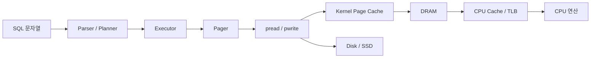

# SQL 엔진 구현을 위한 시스템 관점 가이드

## 1. 이 가이드의 목적

이번 주에 배운 `가상메모리`, `OS 파일 입출력`, `메모리`, `CPU 연산`, `버스`
관점을 따로따로 외우는 것이 목적이 아니다.
핵심은 이 개념들이 이번 과제의 설계 선택으로 어떻게 이어지는지 아는 것이다.

이 문서는 아래 질문에 답하기 위해 만든다.

- 왜 DB를 page 단위로 저장하는가?
- 왜 `WHERE id = ?` 에서 B+ 트리가 빠른가?
- 왜 선형 탐색은 느린가?
- 왜 row를 고정 길이로 잡는가?
- 왜 `pread/pwrite` 기반 pager가 자연스러운가?

## 2. 한 눈에 보는 전체 흐름

이 그림의 핵심은 다음이다.

- SQL은 결국 page read/write 요청으로 바뀐다.
- page 요청은 커널을 통해 파일 I/O로 처리된다.
- 실제 속도는 디스크만이 아니라 page cache, TLB, CPU cache, bus 이동 비용의 영향을 받는다.

## 3. 관점별 핵심 해석

## 3.1 가상메모리 관점

### 핵심 개념

- OS는 메모리를 page 단위로 관리한다.
- 파일도 page cache를 통해 page 단위로 다뤄진다.
- 주소 변환은 TLB와 page table에 의존한다.

### 이번 과제에서의 의미

- DB도 `4096B` page 단위로 저장하는 것이 자연스럽다.
- heap row와 B+ 트리 node를 page 단위로 관리하면 OS의 메모리 모델과 잘 맞는다.
- page를 기본 단위로 잡으면 디스크 I/O와 메모리 관리가 같은 언어로 설명된다.

### 설계 판단으로 이어지는 규칙

- 파일 포맷은 `page_id -> offset` 구조로 설계한다.
- heap page와 index page를 동일한 `PAGE_SIZE` 로 맞춘다.
- B+ 트리 fan-out을 크게 잡아 tree height를 줄인다.

### 발표에서 설명할 수 있는 한 줄

`OS가 page 단위로 메모리와 파일을 다루기 때문에, 우리 DB도 page 단위로 row와 index를 저장하도록 설계했다.`

## 3.2 OS 파일 입출력 관점

### 핵심 개념

- 파일 I/O는 시스템 콜 경계가 있다.
- 작은 읽기/쓰기를 자주 하면 syscall overhead가 커진다.
- 파일은 커널 page cache를 거쳐 읽히고 쓰이는 경우가 많다.

### 이번 과제에서의 의미

- row 하나마다 파일에 바로 쓰면 느리다.
- page 하나를 메모리에 올리고, 수정한 뒤, page 단위로 flush하는 구조가 좋다.
- DB file header, heap page, B+ tree page를 모두 같은 pager로 읽고 쓰는 것이 맞다.

### 추천 구현 선택

- `open` + `pread` + `pwrite` 기반 구현
- `page_id * PAGE_SIZE` 로 offset 계산
- dirty page만 flush
- statement 단위 혹은 종료 시점 flush

### 왜 `mmap` 보다 `pread/pwrite` 를 먼저 추천하는가

- offset 계산과 page read/write 의도가 더 직접적이다.
- 디버깅이 쉽다.
- "우리가 pager를 구현했다"는 설명이 분명하다.

`mmap` 은 나중 확장 주제로 두고, 이번 주는 pager 구조를 명확히 보이는 편이 낫다.

## 3.3 메모리 관점

### 핵심 개념

- 메모리는 무한하지 않다.
- 동적 할당이 많을수록 단편화와 관리 비용이 커진다.
- locality가 좋을수록 캐시 효율이 좋아진다.

### 이번 과제에서의 의미

- row마다 `malloc()` 하는 구조는 피해야 한다.
- 고정 길이 row를 page에 연속 배치하는 편이 좋다.
- B+ 트리 leaf entry도 compact하게 유지해야 한 page에 더 많은 key가 들어간다.

### 추천 규칙

- row는 fixed-size struct 사용
- page 내부는 연속 배열 형태 유지
- 인덱스에는 row 전체가 아니라 `row_ref` 만 저장
- page cache 크기는 상한을 두고 관리

### 실전 효과

- page 하나에서 여러 row를 연속으로 읽을 수 있다.
- table scan 시 메모리 접근 패턴이 예측 가능하다.
- B+ 트리 fan-out이 커져서 height가 낮아진다.

## 3.4 CPU 연산 관점

### 핵심 개념

- CPU는 연산 자체보다 메모리 접근 대기 때문에 느려지는 경우가 많다.
- branch가 복잡하고 pointer chasing이 많으면 느려진다.
- 문자열 비교는 정수 비교보다 비싸다.

### 이번 과제에서의 의미

- `WHERE id = ?` 는 정수 비교 + 적은 page 접근으로 끝난다.
- `WHERE name = ?` 는 많은 row를 순회하고 문자열 비교까지 해서 비싸다.
- B+ 트리는 "비교 횟수 감소"보다 "접근 page 수 감소"에서 더 큰 이득이 난다.

### 구현 규칙

- key는 정수 `id` 로 잡는다.
- leaf/internal entry는 정렬된 배열로 저장한다.
- split 시 `memmove` 는 허용하되 node 크기를 작게 유지한다.
- random pointer 구조보다 page 내부 packed array를 선호한다.

### 발표용 설명

`B+ 트리가 빠른 이유는 단순히 O(log N) 이라서가 아니라, 실제로 CPU가 적은 page와 적은 비교만 하도록 만들기 때문이다.`

## 3.5 버스 관점

### 핵심 개념

- CPU는 데이터를 바로 디스크에서 읽지 못한다.
- 디스크 -> 커널 버퍼/page cache -> DRAM -> CPU cache -> 레지스터 순으로 올라온다.
- 데이터 이동량이 많을수록 bus와 cache hierarchy 비용이 커진다.

### 이번 과제에서의 의미

- 필요한 row 하나를 찾기 위해 많은 page를 이동시키면 느리다.
- B+ 트리는 적은 수의 page만 위 계층으로 올리게 만들어 준다.
- table scan은 많은 page를 순차적으로 읽으므로 bus 사용량이 커진다.

### 구현 규칙

- 가능한 한 한 page 안에 많은 entry를 담는다.
- page 크기와 entry 크기를 계산해서 fan-out을 키운다.
- row payload는 최소 스펙에 맞게 작게 유지한다.

### 짧은 직관

`좋은 인덱스는 CPU를 더 똑똑하게 만드는 것이 아니라, 버스를 덜 바쁘게 만든다.`

## 4. 이번 DB 과제에 그대로 적용되는 설계 규칙

| 관점 | 바로 적용할 규칙 | 구현 선택 |
|------|------------------|-----------|
| 가상메모리 | page 중심 추상화 | `PAGE_SIZE = 4096` |
| 파일 I/O | row 단위가 아니라 page 단위 read/write | pager + dirty page |
| 메모리 | 동적 할당 최소화 | fixed-size row, slotted heap |
| CPU | 비교/분기/포인터 추적 줄이기 | `id` 정수 key, packed page layout |
| 버스 | 이동 데이터량 줄이기 | B+ 트리 fan-out 확대, row_ref 사용 |

## 5. 구현 선택에 대한 구체적 가이드

## 5.1 왜 page size를 4KB로 잡는가

- OS 기본 page 크기와 잘 맞는다.
- 너무 작으면 syscall과 page 개수가 늘어난다.
- 너무 크면 내부 낭비와 overfetch가 커진다.
- 설명하기도 쉽다.

이번 주 과제에서는 `4KB` 가 가장 무난하다.

## 5.2 왜 row를 고정 길이로 잡는가

- offset 계산이 쉬워진다.
- page 내부 slot 계산이 쉬워진다.
- serialization/deserialization 이 단순하다.
- 디버깅이 쉽다.

즉 "성능" 이전에 "구현 안정성" 때문에 고정 길이가 맞다.

## 5.3 왜 B+ 트리 leaf에 row 전체를 넣지 않는가

- leaf가 금방 커진다.
- fan-out이 작아져 tree height가 높아진다.
- 디스크 page 수가 더 많이 필요해진다.

그래서 leaf에는 `key + row_ref` 만 두고, row는 heap page에 둔다.

## 5.4 왜 slotted heap + tombstone이 좋은가

- `DELETE` 를 넣어도 row payload를 즉시 이동하지 않아도 된다.
- `slot_id` 가 유지되므로 `row_ref(page_id, slot_id)` 를 계속 사용할 수 있다.
- free slot 재사용을 통해 공간 낭비를 줄일 수 있다.

즉 이번 방향은 append-only보다 구현이 조금 더 어렵지만,
삭제, 재사용, 메모리 친화성을 함께 설명하기에는 훨씬 좋다.

### 왜 삭제 때마다 파일을 다시 정렬하지 않는가

- row를 이동시키면 인덱스가 가리키는 `row_ref` 를 다시 써야 한다.
- delete 경로에 compaction까지 넣으면 오류 가능성이 크게 올라간다.
- 실제 DBMS도 삭제 즉시 전체 파일을 재정렬하지 않고,
  tombstone, free list, vacuum/reorg 같은 별도 maintenance 경로를 둔다.

## 6. 성능을 읽는 올바른 관점

## 6.1 `WHERE id = ?` 가 빠른 이유

- tree height만큼의 index page
- 최종 row가 있는 heap page

대체로 이 정도만 읽으면 된다.

즉 비용의 대부분은:

- 적은 수의 page 접근
- 적은 수의 정수 비교

## 6.2 `WHERE name = ?` 가 느린 이유

- 모든 heap page 순회
- page마다 여러 row 순회
- 문자열 비교 수행

즉 비용의 대부분은:

- 많은 page 이동
- 많은 메모리 접근
- 많은 비교

## 6.3 insert가 생각보다 비싼 이유

- heap page write
- leaf insert
- split 발생 가능
- parent update 가능
- dirty page flush

따라서 insert benchmark는 `printf` 를 끄고 측정해야 한다.

## 6.4 delete가 생각보다 어려운 이유

- heap slot을 tombstone 처리해야 한다.
- 인덱스 key도 함께 제거해야 한다.
- underflow가 나면 borrow 또는 merge가 필요하다.
- 비게 된 page는 free list로 반환해야 한다.

즉 delete는 "지운다" 가 아니라
"heap, index, allocator를 함께 갱신한다" 에 가깝다.

## 7. 구현 시 흔한 실수

- row마다 `malloc` 하기
- page abstraction 없이 파일 offset을 여기저기서 직접 계산하기
- B+ 트리에 row 전체를 넣기
- parser가 곧바로 storage 함수를 호출하게 만들기
- 프로그램 종료 후 reopen 검증을 빼먹기
- benchmark에서 출력 비용까지 같이 재기

## 8. 팀이 구현 전에 합의할 체크포인트

- page size는 `4096B` 로 갈 것인가
- row schema는 몇 바이트로 고정할 것인가
- flush 시점은 statement 단위인가, 종료 시점인가
- benchmark는 cold start / warm cache 를 둘 다 볼 것인가
- DB file은 단일 파일로 갈 것인가

## 9. 추천 검증 방법

## 9.1 개념 검증

- DB header page가 재시작 후 그대로 읽히는가
- heap page에서 row offset 계산이 맞는가
- B+ 트리 split 후 search가 맞는가

## 9.2 시스템 관점 검증

- 프로그램 재실행 후에도 `id` 가 이어서 증가하는가
- 파일 크기가 page 단위 증가와 맞는가
- row size와 page당 row 수 계산이 맞는가
- 1M insert 후에도 메모리를 과하게 쓰지 않는가

## 9.3 성능 검증

- `id` lookup
- non-id field scan
- insert throughput

이 세 개는 반드시 분리해서 측정한다.

## 10. 발표용 요약 문장

`우리는 이번 주에 배운 가상메모리와 파일 I/O 관점을 그대로 적용해, DB를 4KB page 단위의 바이너리 파일로 설계했고, row는 heap page에, id 인덱스는 B+ 트리 page에 저장해 page 이동량과 비교 횟수를 줄이도록 구현했다.`

이 한 문장이 시스템 관점과 SQL 구현을 가장 잘 이어 준다.
